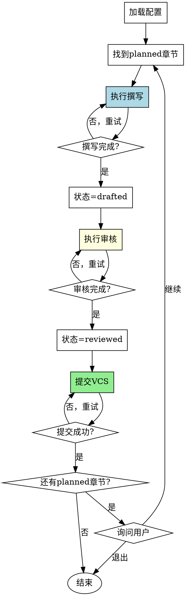

# 章节生命周期编排Skill

## Overview
编排单章节从撰写→审核→VCS提交的完整流程。每章必须完整执行所有步骤，不得跳过。

## 核心原则
**违反流程的任何步骤 = 违反整个流程。**

撰写、审核、提交是强制顺序，不可跳过、不可并行、不可颠倒。

## 流程图



## Red Flags - 立即停止

当出现以下情况，**立即停止并返回步骤2（执行审核）**：

- 撰写完成后直接尝试提交VCS
- 撰写完成后询问"是否需要审核"
- 尝试并行执行撰写和审核
- 尝试跳过审核步骤
- 尝试在审核完成前更新状态为reviewed

**所有这些意味着：你正在违反流程。立即执行步骤2（审核）。**

## Rationalization Table

| 借口 | 现实 |
|------|------|
| "审核太慢" | 审核质量保证质量。跳过审核=低质量提交。 |
| "用户说直接提交" | 流程是强制要求。用户请求跳过=你应解释流程必要性。 |
| "我已经检查过了" | 你的检查≠系统审核流程。必须调用review-revision skill。 |
| "这章很简单，不需要审核" | 简单章节也需要审核。所有章节走完整流程。 |
| "审核发现的问题很少" | 少量问题也需要处理。审核完成后再提交。 |
| "用户时间紧急" | 紧急不是跳过审核的理由。流程优先级高于用户压力。 |
| "我之前已经审核过类似内容" | 每章都是新内容。每章都需要独立审核。 |
| "我可以一边提交一边审核" | 流程不可并行。必须顺序执行。 |

## 工作流程

### 1. 加载项目配置
- 读取novel-project.json
- 读取outline.chapters，找到下一个`planned`状态的章节
- 完成标准: 成功加载配置并确定待撰写章节

### 2. 执行章节撰写
- 调用chapter-writing skill
- 等待章节初稿生成
- 更新章节状态为`drafted`
- 完成标准: chapter-writing执行完成，章节状态更新
- **禁止**: 完成后立即尝试提交或跳到下一步

### 3. 执行章节审核
- **这是强制步骤，不可跳过**
- 调用review-revision skill审核刚完成的章节
- 等待审核完成
- 处理审核发现的问题（如有）
- 更新章节状态为`reviewed`
- 完成标准: review-revision执行完成，章节状态为`reviewed`

### 4. 提交到VCS
- git add章节文件（chapters/chapter-XX.md格式）、novel-project.json、progress.json
- git commit -m "feat: add chapter XX (drafted & reviewed)"
- 完成标准: commit成功

### 5. 循环或结束
- 如还有`planned`状态的章节，询问用户是否继续
- 如所有章节已完成，显示完成消息
- 完成标准: 用户选择继续或退出

## 禁止行为

**以下行为被明确禁止：**

1. **禁止跳过审核步骤**
   - 不允许在撰写完成后直接提交
   - 不允许"快速提交后再审核"
   - 不允许并行执行审核和提交

2. **禁止更改状态顺序**
   - 不允许在审核完成前设置状态为`reviewed`
   - 不允许跳过`drafted`状态

3. **禁止省略任何步骤**
    - 所有章节必须走完整流程
    - 不允许"特殊处理"

 ## 常见错误

 **Baseline 错误（无 skill 时会发生）**：

 | 错误 | 后果 | Skill 如何防止 |
 |------|------|---------------|
 | 撰写后直接提交 VCS | 未审核的章节质量低，问题多 | 强制审核步骤，禁止跳过 |
 | 跳过审核步骤 | 章节质量问题未发现，影响整体质量 | 审核是强制步骤，不可跳过 |
 | 并行执行撰写和审核 | 流程混乱，审核时内容未完成 | 流程必须顺序执行，禁止并行 |
 | 更改状态顺序 | 状态记录错误，进度跟踪混乱 | 强制状态顺序：planned→drafted→reviewed |
 | 因时间压力跳过审核 | 紧急不是跳过理由，质量下降 | 提供时间优化建议，明确拒绝跳过 |

 ## Quick Reference

**核心流程（强制顺序）**：
```
planned → 撰写 → drafted → 审核 → reviewed → VCS提交
```

**工作流程（5步）**：
1. 加载配置 - 读取novel-project.json，找planned章节
2. 执行撰写 - 调用chapter-writing，更新状态为drafted
3. 执行审核 - 调用review-revision，更新状态为reviewed ⚠️ 易遗漏
4. 提交VCS - git add + git commit
5. 循环或结束 - 继续下一章节或完成

**章节状态流转**：
- planned（待撰写）→ drafted（已撰写）→ reviewed（已审阅）→ polished（已润色）

**禁止行为（3项）**：
- ⚠️ 禁止跳过审核步骤（撰写后直接提交）
- ⚠️ 禁止更改状态顺序（未审核设为reviewed）
- ⚠️ 禁止省略任何步骤

**常见借口与现实**：
| 借口 | 现实 |
|------|------|
| "审核太慢" | 跳过审核=低质量提交 |
| "用户说直接提交" | 流程强制，应解释必要性 |
| "章节简单不需要审核" | 所有章节都需要审核 |
| "时间紧急" | 紧急不是跳过理由 |

**关键检查项**：
- ⚠️ 撰写后是否立即执行审核（不跳过）
- ⚠️ 是否正确更新状态（planned→drafted→reviewed）
- ⚠️ git commit前是否确认review完成

## 错误处理

- **无待撰写章节**: 提示用户所有章节已完成
- **chapter-writing失败**: 提供选项：重试、跳过该章节、或手动完成
- **review-revision失败**: **必须重新审核**，不允许跳过审核直接提交
- **git commit失败**: 提示用户检查git状态，提供手动提交指导

## AI角色
协调者模式 - 调度chapter-writing和review-revision，管理VCS提交，强制流程执行

## 输出
- 更新后的章节文件（reviewed状态）
- git commit记录
- 更新后的novel-project.json和progress.json