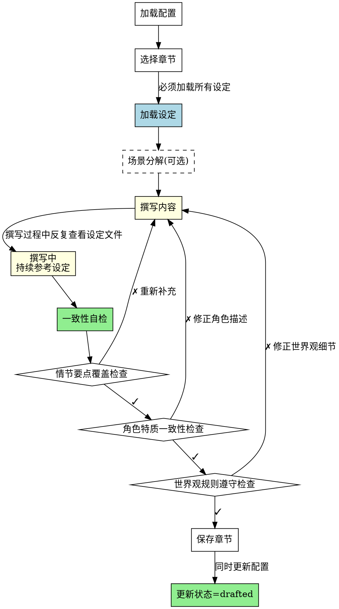

# 章节撰写Skill

## Overview
执行具体章节内容创作，生成章节初稿。系统化撰写流程，确保设定连续参考、一致性验证、状态管理。

## 核心原则
**撰写质量 = 设定遵守 + 一致性检查 + 系统化流程。**

不系统化的撰写会导致角色特质漂移、世界观细节遗漏、情节要点缺失。

## 流程图

## 工作流程

### 1. 加载项目配置
- 读取novel-project.json
- 确认outline.status为"completed"
- 读取chapters部分状态
- 完成标准: 成功读取配置并确认前置条件满足

### 2. 选择要撰写的章节
- 列出所有planned状态的章节
- 用户选择要撰写的章节（指定章节编号）
- 完成标准: 用户选择一个章节

### 3. 加载相关设定（必须全部加载）
- **必须读取以下文件**（防止遗漏）：
  - outline.chapters[章节编号].purpose（章节目的）
  - outline.chapters[章节编号].plot_points（情节点列表）
  - character_profile.json（角色设定）
  - world_building.json（世界观规则）
- **禁止**: 只读取部分设定
- **完成标准**: 所有设定文件成功加载

### 4. 场景分解（可选但推荐）
- 将情节要点分解为具体场景
- 每个情节点对应至少一个场景
- 标注每个场景涉及的角色和世界观要素
- **完成标准**: 场景分解完成（可选步骤）

### 5. 撰写内容（持续参考设定）
- **关键**: 撰写过程中必须反复查看设定文件
- **具体做法**：
  - 撰写某个角色时，查看character_profile.json中该角色的详细设定
  - 撰写世界观场景时，查看world_building.json中相关规则
  - 完成一个情节要点后，检查是否覆盖了下一个情节要点
- **禁止**: 只在开始时读取一次设定，撰写过程中不参考
- **完成标准**: 章节初稿完成

### 6. 一致性自检（必须执行）
- **必须检查以下 3 项**：
  
  **6.1 情节要点覆盖检查**
  - 检查所有plot_points是否在章节中出现
  - 标注每个plot_points的具体位置（段落号）
  - **禁止**: 遗漏任何plot_points
  - 完成标准: 所有plot_points已覆盖
  
  **6.2 角色特质一致性检查**
  - 检查章节中角色的外貌、性格、行为是否与设定一致
  - 具体检查：眼睛颜色、性格表现、职业身份
  - **禁止**: 角色特质漂移（如"黑色眼睛"写成"深色眼睛"、"冷静"变成"惊慌"）
  - 完成标准: 所有角色特质与设定一致
  
  **6.3 世界观规则遵守检查**
  - 检查章节中是否遵守世界观规则
  - 具体检查：是否违反禁止的要素（如禁止魔法、科技等级）
  - **禁止**: 遗漏世界观规则（如无魔法设定中出现魔法）
  - 完成标准: 所有世界观规则遵守

- **禁止**: 跳过自检步骤
- **完成标准**: 所有 3 项检查完成并通过

### 7. 保存章节
- 保存到chapters/chapter-XX.md（两位数字格式，如chapter-01）
- **同时更新配置**：
  - 将章节编号添加到chapters.drafted列表
  - 设置章节状态为drafted
- **禁止**: 只保存章节文件，不更新配置
- **完成标准**: 文件保存成功且配置文件更新

## 章节文件格式

章节文件包含：标题、状态、情节要点覆盖表、正文、自检清单。详见reference.md。

## Red Flags - 撰写质量警告

当出现以下情况，**停止并修正**：

- 只读取部分设定（遗漏角色或世界观）
- 撰写过程中不参考设定（只在开始时读取一次）
- 遗漏情节要点（某个plot_points未在章节中出现）
- 角色特质漂移（"黑色眼睛"→"深色眼睛"，"冷静"→"惊慌"）
- 遗漏世界观规则（无魔法设定中出现魔法）
- 只保存章节文件，不更新配置文件

**所有这些意味着：撰写不够系统化，会导致质量问题。**

## 禁止行为

**以下行为被明确禁止**：

1. **禁止只读取部分设定** - 必须读取所有角色和世界观设定
2. **禁止撰写过程中不参考设定** - 必须在撰写每个角色/场景时参考设定文件
3. **禁止跳过自检步骤** - 必须执行3个自检（情节、角色、世界观）
4. **禁止只保存章节文件** - 必须同时更新novel-project.json配置

**所有禁止行为意味着：撰写不够系统化，会导致质量问题。**

## 常见错误

| 错误 | 现实 | 修正 |
|------|------|------|
| 只读取设定一次 | 撰写过程中遗忘细节 | 持续参考设定文件（每写一个角色时查看其设定） |
| 遗漏情节要点 | plot_points未完全覆盖 | 完成后逐项检查是否所有plot_points出现 |
| 角色特质漂移 | "黑色眼睛"写成"深色眼睛" | 撰写角色时立即查看character_profile.json |
| 遗漏世界观规则 | 无魔法设定中出现魔法 | 撰写世界观场景时查看world_building.json |
| 只保存文件 | 配置文件未更新 | 保存章节同时更新novel-project.json |

## Quick Reference

**工作流程（7步）**：
1. 加载配置 - 读取novel-project.json
2. 选择章节 - 列出planned章节，用户选择
3. 加载设定 - outline + character + world-building ⚠️ 必须全部加载
4. 场景分解（可选）- 情节点分解为场景
5. 撰写内容 - 持续参考设定文件 ⚠️ 易遗漏
6. 一致性自检 - 3项检查 ⚠️ 易遗漏
7. 保存章节 - 同时更新配置文件 ⚠️ 易遗漏

**必须加载的设定（3类）**：
- outline.chapters[编号].purpose（章节目的）
- outline.chapters[编号].plot_points（情节点列表）
- character_profile.json（角色设定）
- world_building.json（世界观规则）

**一致性自检（3项，必须全部执行）**：
1. 情节要点覆盖检查 - 所有plot_points是否出现 ⚠️
2. 角色特质一致性检查 - 外貌/性格/行为是否一致 ⚠️
3. 世界观规则遵守检查 - 是否违反规则 ⚠️

**禁止行为（4项）**：
- ⚠️ 禁止只读取部分设定
- ⚠️ 禁止只在开始时读取设定（撰写过程中不参考）
- ⚠️ 禁止跳过自检步骤
- ⚠️ 禁止只保存章节文件（不更新配置）

**常见错误与修正**：
| 错误 | 修正 |
|------|------|
| 遗漏情节要点 | 逐项检查plot_points是否出现 |
| 角色特质漂移 | 撰写时查看character_profile.json |
| 世界观规则违反 | 撰写场景时查看world_building.json |
| 只保存文件不更新配置 | 同时更新novel-project.json |

**关键检查项**：
- ⚠️ 是否加载所有设定文件
- ⚠️ 撰写过程中是否持续参考设定
- ⚠️ 3项自检是否全部执行
- ⚠️ 是否同时更新配置文件

## 错误处理
- **配置文件不存在**: 提示用户先运行novel-project skill创建项目
- **前置条件不满足**: 如果outline.status不是completed，提示用户先完成大纲设计阶段
- **设定文件读取失败**: 提示用户检查文件是否存在且格式正确
- **章节文件写入失败**: 提示用户检查目录权限或手动创建chapters目录