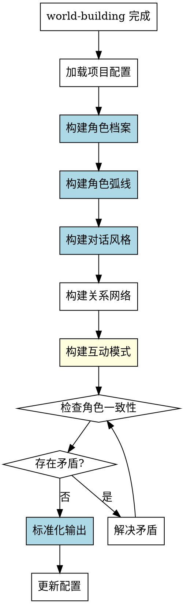

# 角色构建Skill

## Overview
深度开发小说角色体系，建立完整的角色档案、关系网络、角色弧线和对话风格，为后续创作提供基础。

**核心原则: 角色构建 = 标准化档案 + 明确弧线阶段 + 具体对话示例 + 互动模式 + 验证机制。**

## Pattern Recognition

**使用此skill的场景**：
- 用户说"我想详细设定一下角色，比如主角..." → **启动角色构建**
- 用户说"我想设计角色的成长弧线" → **启动角色构建**
- 用户说"我想定义角色的对话风格" → **启动角色构建**
- 用户说"我想梳理角色之间的关系" → **启动角色构建**

**Red Flags - 必须使用此skill**：
- 尝试随意提问，没有结构化角色维度（禁止）
- 尝试创建角色档案但没有标准化模板（禁止）
- 尝试定义角色弧线但没有明确阶段划分（禁止）
- 尝试定义对话风格但没有具体示例（禁止）
- 尝试在 world-building 未完成时构建角色（禁止）

## 流程图

## 工作流程

### 1. 加载项目配置
- 读取 novel-project.json，确认 world-building 已完成

### 2. 构建角色档案
详见 reference/character-templates.md

**禁止非标准化角色档案！必须使用标准化模板（15个字段）。**

**构建顺序**：主角 → 反派 → 主要配角（2-3个）

### 3. 构建角色弧线
详见 reference/character-templates.md（角色弧线模板详细定义）

**禁止粗糙弧线定义！必须明确4个阶段：starting_point, challenges, turning_point, ending_point。**

### 4. 构建对话风格
详见 reference/character-templates.md（对话风格模板详细定义）

**禁止抽象对话风格！必须包含具体示例（至少4个场景）。**

### 5. 构建关系网络
详见 reference/relationships.md

### 6. 构建互动模式
详见 reference/relationships.md（互动模式模板）

**禁止遗漏互动模式！必须定义主要角色之间的互动模式。**

### 7. 一致性检查
详见 reference/consistency-checks.md

**禁止没有验证机制！必须检查一致性。**

### 8. 标准化输出
详见 reference/output-format.md

## 禁止行为

1. **禁止非标准化角色档案** - 必须包含所有15个字段
2. **禁止粗糙弧线定义** - 必须明确4个阶段
3. **禁止抽象对话风格** - 必须包含至少4个场景示例
4. **禁止遗漏互动模式** - 必须定义互动模式
5. **禁止没有验证机制** - 必须检查一致性
6. **禁止在 world-building 未完成时构建角色** - world-building.status 必须为 completed

## 常见错误

| 错误 | 后果 | Skill 如何防止 |
|------|------|---------------|
| 没有结构化模板 | 角色档案不完整 | 强制使用标准化角色档案模板（15个字段） |
| 弧线定义粗糙 | 成长不合理 | 强制明确4阶段弧线 |
| 对话风格抽象 | 难以应用 | 强制包含具体示例（至少4个场景） |
| 没有验证机制 | 不知道是否自洽 | 强制一致性检查 |

## Quick Reference

**角色档案字段（15个）**：
- name, role, age, gender, appearance
- personality, background, motivation, weakness
- expertise, family_status, important_person
- internal_conflict, external_conflict, role_in_story

**角色弧线阶段（4个）**：
1. starting_point（起点状态）
2. challenges（挑战列表）
3. turning_point（转折事件）
4. ending_point（终点状态）

**对话风格维度（7个）**：
1. tone（语言基调）
2. rhythm（说话节奏）
3. vocabulary（专属词汇）
4. catchphrase（口头禅）
5. emotional_expression（情绪表达）
6. examples（具体示例，至少4个场景）
7. differences（对不同人的风格差异）

**互动模式维度（4个）**：
1. 权力动态（谁主导）
2. 情感动态（信任/敌意）
3. 沟通模式（直白/含蓄）
4. 冲突模式（回避/对抗）

**一致性检查（3个）**：
1. 角色内部一致性
2. 角色间一致性
3. 角色与世界一致性

## 错误处理

- **配置文件不存在**: 提示用户先运行 novel-project skill 创建项目
- **前置条件不满足**: 如果 world-building.status 不是 completed，提示用户先完成世界观构建