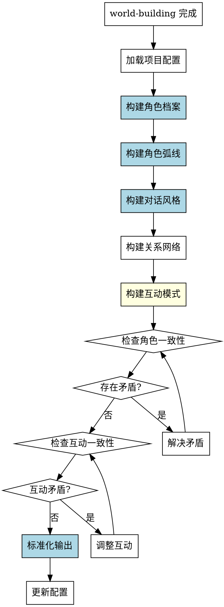

# 角色构建Skill

## Overview
深度开发小说角色体系，建立完整的角色档案、关系网络、角色弧线和对话风格，为后续创作提供基础。

**核心原则: 角色构建 = 标准化档案 + 明确弧线阶段 + 具体对话示例 + 互动模式 + 验证机制。**

部分系统化方法有档案、弧线、风格，但缺乏结构化模板，容易遗漏维度，弧线粗糙，风格抽象，无验证机制。系统化方法确保完整性和一致性。

## Pattern Recognition - 何时使用此skill

**使用此skill的场景**：
- 用户说"我想详细设定一下角色，比如主角..." → **启动角色构建**
- 用户说"我想设计角色的成长弧线" → **启动角色构建**
- 用户说"我想定义角色的对话风格" → **启动角色构建**
- 用户说"我想梳理角色之间的关系" → **启动角色构建**
- 用户说"我完成了世界观构建，接下来做什么？" → **建议使用此skill**

**Red Flags - 必须使用此skill**：
- 尝试随意提问，没有结构化角色维度
- 尝试创建角色档案但没有标准化模板
- 尝试定义角色弧线但没有明确阶段划分
- 尝试定义对话风格但没有具体示例
- 尝试没有验证机制（角色设定自洽性检查）
- 尝试没有角色互动模式分析
- 尝试在 world-building 未完成时构建角色

**所有这些意味着：用户需要系统化的角色构建过程，必须使用此skill。**

## 流程图



## 工作流程

### 1. 加载项目配置
- 读取 novel-project.yaml
- 确认 world-building 已完成
- 检查 characters 部分的状态
- **完成标准**: 成功加载配置并确认前置条件满足

### 2. 构建角色档案（强制使用标准化模板）

**禁止非标准化角色档案！必须使用以下模板：**

```yaml
characters:
  - name: "角色名称"
    role: "protagonist/antagonist/supporting"
    age: "年龄"
    gender: "性别"
    appearance: "外貌特征（具体描述）"
    personality:
      - "性格特征1"
      - "性格特征2"
      - "性格特征3"
    background: "背景故事（成长经历、重要事件）"
    motivation: "核心动机（表层动机 + 深层动机）"
    weakness: "性格缺陷/成长空间"
    expertise: "专业技能/特殊能力"
    family_status: "家庭状况"
    important_person: "重要人物（家人/爱人/导师）"
    internal_conflict: "内心冲突"
    external_conflict: "外部冲突"
    role_in_story: "在故事中的作用"
```

**每个主角必须有完整档案！**

**构建顺序**：
1. 主角（protagonist）
2. 反派（antagonist，如有）
3. 主要配角（supporting，2-3个关键配角）

**完成标准**: 主要角色档案完整，包含所有字段

### 3. 构建角色弧线（明确阶段划分）

**禁止粗糙弧线定义！必须明确以下阶段：**

```yaml
arc:
  starting_point:
    state: "起点状态（信念、能力、关系）"
    belief: "初始信念"
    ability: "初始能力"
    relationships: "初始关系"
  
  challenges:
    - "挑战1：外部事件触发变化"
    - "挑战2：内心冲突激化"
    - "挑战3：关键转折点"
  
  turning_point:
    event: "转折事件"
    realization: "角色顿悟/觉醒"
    decision: "角色做出关键决定"
  
  ending_point:
    state: "终点状态（信念、能力、关系）"
    belief: "最终信念"
    ability: "最终能力"
    relationships: "最终关系"
    growth: "角色成长总结"
```

**完成标准**: 主要角色弧线完整，包含 4 个阶段

### 4. 构建对话风格（具体示例）

**禁止抽象对话风格！必须包含具体示例：**

```yaml
dialogue_style:
  tone: "语言基调（正式/随意/冷漠/热情）"
  rhythm: "说话节奏（短句为主/长句为主/快节奏/慢节奏）"
  vocabulary:
    - "专属词汇1"
    - "专属词汇2"
    - "专属词汇3"
  catchphrase: "口头禅"
  emotional_expression: "情绪表达方式（含蓄/直白/幽默掩饰/防御性）"
  
  examples:
    - context: "场景1：紧张时"
      dialogue: "具体对话示例1"
    - context: "场景2：放松时"
      dialogue: "具体对话示例2"
    - context: "场景3：与亲近的人"
      dialogue: "具体对话示例3"
    - context: "场景4：与陌生人"
      dialogue: "具体对话示例4"
  
  differences:
    with_protagonist: "与主角对话时的风格差异"
    with_antagonist: "与反派对话时的风格差异"
    with_family: "与家人对话时的风格差异"
```

**完成标准**: 主要角色对话风格完整，包含具体示例

### 5. 构建关系网络

**定义角色之间的关系：**

```yaml
relationships:
  - character_a: "角色A"
    character_b: "角色B"
    relationship_type: "关系类型（师徒/战友/对立/暧昧/亲情）"
    intensity: "关系强度（强/中/弱）"
    description: "关系描述"
    evolution: "关系演变（开始→结束）"
```

**关系网络包括：**
- 权力关系（谁领导谁）
- 情感关系（爱/恨/友情/敌意）
- 利益关系（合作/竞争/冲突）

**完成标准**: 主要角色关系网络清晰

### 6. 构建互动模式（易遗漏！）

**禁止遗漏互动模式！必须定义：**

```yaml
interaction_patterns:
  - characters: ["角色A", "角色B"]
    pattern: "互动模式（如：A主导，B顺从；或：A试探，B防御）"
    example: "具体互动示例"
  
  - characters: ["角色A", "角色C"]
    pattern: "互动模式"
    example: "具体互动示例"
```

**互动模式维度：**
- 权力动态（谁主导）
- 情感动态（信任/敌意）
- 沟通模式（直白/含蓄）
- 冲突模式（回避/对抗）

**完成标准**: 主要角色互动模式清晰

### 7. 一致性检查（验证机制）

**必须检查的一致性：**

**角色内部一致性**：
- 角色特征是否自洽（性格、动机、缺陷）
- 角色弧线是否合理（起点→挑战→转折→终点）
- 对话风格是否符合角色特征

**角色间一致性**：
- 关系网络是否自洽（无矛盾）
- 互动模式是否符合关系定义
- 不同角色对话风格是否有区分度

**角色与世界一致性**：
- 角色专业是否符合时代背景
- 角色动机是否符合世界观
- 角色关系是否符合社会体系

**如果存在矛盾**: 解决矛盾，然后重新检查

### 8. 标准化输出

**禁止非标准化输出！必须使用以下格式：**

```yaml
character_building:
  characters:
    - name: "角色名"
      role: "protagonist/antagonist/supporting"
      age: "年龄"
      gender: "性别"
      appearance: "外貌特征"
      personality: ["性格特征"]
      background: "背景故事"
      motivation: "核心动机"
      weakness: "性格缺陷"
      expertise: "专业技能"
      family_status: "家庭状况"
      important_person: "重要人物"
      internal_conflict: "内心冲突"
      external_conflict: "外部冲突"
      role_in_story: "故事作用"
      arc:
        starting_point:
          state: "起点状态"
          belief: "初始信念"
          ability: "初始能力"
          relationships: "初始关系"
        challenges:
          - "挑战1"
          - "挑战2"
          - "挑战3"
        turning_point:
          event: "转折事件"
          realization: "角色顿悟"
          decision: "关键决定"
        ending_point:
          state: "终点状态"
          belief: "最终信念"
          ability: "最终能力"
          relationships: "最终关系"
          growth: "成长总结"
      dialogue_style:
        tone: "语言基调"
        rhythm: "说话节奏"
        vocabulary: ["专属词汇"]
        catchphrase: "口头禅"
        emotional_expression: "情绪表达方式"
        examples:
          - context: "场景"
            dialogue: "示例"
        differences:
          with_protagonist: "风格差异"
          with_antagonist: "风格差异"
  
  relationships:
    - character_a: "角色A"
      character_b: "角色B"
      relationship_type: "关系类型"
      intensity: "关系强度"
      description: "关系描述"
      evolution: "关系演变"
  
  interaction_patterns:
    - characters: ["角色A", "角色B"]
      pattern: "互动模式"
      example: "互动示例"
  
  status: "completed"
```

### 9. 更新配置
- 将以上内容写入 novel-project.yaml 的 characters 部分
- 设置 character-building.status 为 "completed"
- **完成标准**: 配置文件成功更新

## 禁止行为

**以下行为被明确禁止：**

1. **禁止非标准化角色档案**
   - 不允许使用非标准格式的角色档案
   - 必须包含所有字段（appearance, personality, background, motivation, weakness, expertise, family_status, important_person, internal_conflict, external_conflict, role_in_story）

2. **禁止粗糙弧线定义**
   - 不允许只定义"起点→终点"，必须包含 challenges 和 turning_point
   - 必须明确 4 个阶段：starting_point, challenges, turning_point, ending_point

3. **禁止抽象对话风格**
   - 不允许只定义"语言风格"而无具体示例
   - 必须包含至少 4 个场景的具体对话示例

4. **禁止遗漏互动模式**
   - 不允许只定义关系网络而不定义互动模式
   - 必须定义主要角色之间的互动模式

5. **禁止没有验证机制**
   - 不允许不检查角色一致性
   - 必须检查角色内部、角色间、角色与世界的一致性

6. **禁止在 world-building 未完成时构建角色**
   - world-building.status 必须为 "completed"
   - 否则提示用户先完成世界观构建

## 常见错误

**Baseline 错误（无 skill 时会发生）**：

| 错误 | 后果 | Skill 如何防止 |
|------|------|---------------|
| 没有结构化模板 | 角色档案不完整，遗漏关键字段 | 强制使用标准化角色档案模板（15个字段） |
| 问题零散 | 不够系统性，遗漏维度 | 系统化构建流程（9个步骤） |
| 弧线定义粗糙 | 没有明确阶段，成长不合理 | 强制明确 4 阶段弧线（起点/挑战/转折/终点） |
| 对话风格抽象 | 没有具体示例，难以应用 | 强制包含具体示例（至少 4 个场景） |
| 没有验证机制 | 不知道角色设定是否自洽 | 强制一致性检查（角色内部/角色间/角色与世界） |
| 没有互动模式 | 未定义角色互动方式 | 强制定义互动模式（4个维度） |
| 部分系统化 | 质量不稳定，遗漏关键信息 | 系统化方法确保完整性和一致性 |

## Quick Reference

**角色档案字段（15个）**：
- name, role, age, gender, appearance
- personality, background, motivation, weakness
- expertise, family_status, important_person
- internal_conflict, external_conflict, role_in_story

**角色弧线阶段（4个）**：
1. starting_point（起点状态）
2. challenges（挑战列表）
3. turning_point（转折事件）
4. ending_point（终点状态）

**对话风格维度（7个）**：
1. tone（语言基调）
2. rhythm（说话节奏）
3. vocabulary（专属词汇）
4. catchphrase（口头禅）
5. emotional_expression（情绪表达）
6. examples（具体示例，至少4个场景）
7. differences（对不同人的风格差异）

**互动模式维度（4个）**：
1. 权力动态（谁主导）
2. 情感动态（信任/敌意）
3. 沟通模式（直白/含蓄）
4. 冲突模式（回避/对抗）

**一致性检查（3个）**：
1. 角色内部一致性（特征、弧线、风格自洽）
2. 角色间一致性（关系、互动自洽）
3. 角色与世界一致性（专业、动机、关系符合世界观）

## AI角色
协作伙伴模式 - 建议角色设定、提醒矛盾、帮助设计角色弧线

## 注意事项
- 角色构建阶段在世界观构建之后执行，是对角色的深度开发，世界观构建中的角色设定为基础参考
- 角色设定要具体，避免模糊描述
- 角色弧线要与故事主题呼应
- 对话风格要区分不同角色
- 如需修改已完成的角色构建，可将 status 改为 "in_progress" 后重新执行

## 错误处理

- **配置文件不存在**: 提示用户先运行 novel-project skill 创建项目
- **前置条件不满足**: 如果 world-building.status 不是 completed，提示用户先完成世界观构建阶段
- **角色设定冲突**: 发现角色特征矛盾时，提醒用户澄清
- **对话风格重复**: 发现不同角色对话风格相似时，提醒用户区分