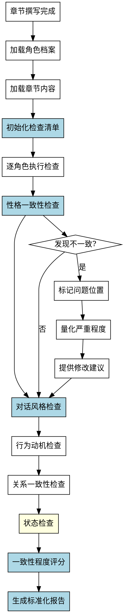

# 角色一致性检查Skill

## Overview
检查章节内容中角色设定的一致性，包括性格、对话风格、行为、动机、关系和状态，生成标准化的检查报告。

**核心原则: 角色一致性检查 = 标准化检查清单 + 系统化检查流程 + 标准化报告格式 + 一致性程度量化。**

手工检查方法会对比角色档案和章节内容，但缺乏结构化工具，无法量化一致性程度，没有标准化报告格式，对微妙不一致可能遗漏，每次检查可能不一致。系统化方法确保完整性和可重复性。

## Pattern Recognition - 何时使用此skill

**使用此skill的场景**：
- 用户说"我想检查一下章节里角色设定是否一致..." → **启动角色一致性检查**
- 用户说"我想检查角色性格、对话风格是否有问题" → **启动角色一致性检查**
- 用户说"我想检查是否有角色错误出现（如已死亡角色）" → **启动角色一致性检查**
- 用户说"我完成了章节撰写，需要做什么检查？" → **建议使用此skill（以及其他 check-* skills）**

**Red Flags - 必须使用此skill**：
- 尝试手工逐项检查，没有预定义检查清单（禁止）
- 尝试依赖人工判断"一致性程度"，无法量化（禁止）
- 尝试没有标准化报告格式（禁止）
- 尝试对微妙不一致不敏感（禁止）
- 尝试每次检查不一致（禁止）

**所有这些意味着：用户需要系统化的角色一致性检查过程，必须使用此skill。**

## 流程图



## 工作流程

### 1. 加载角色档案
- 读取 novel-project.yaml 中的 character-building 部分
- 提取每个角色的完整档案（15个字段）
- 特别关注：personality, dialogue_style, motivation, relationships, role_in_story
- **完成标准**: 成功加载所有主要角色档案

### 2. 加载章节内容
- 读取指定章节的 Markdown 文件
- 标记每个角色的对话、行为、心理描写位置
- **完成标准**: 章节内容加载成功，角色出现位置已标记

### 3. 初始化检查清单（强制使用标准化清单）

**禁止手工逐项检查！必须使用以下检查清单：**

```yaml
check_list:
  character_dimensions:
    - dimension: "性格一致性"
      check_items:
        - "外在行为是否符合 personality 特征"
        - "内心独白是否符合 personality 特征"
        - "决策是否符合 personality 特征"
        - "对压力反应是否符合 personality 特征"
      severity_threshold: "明显偏离设定"
    
    - dimension: "对话风格一致性"
      check_items:
        - "语气是否符合 tone 特征"
        - "节奏是否符合 rhythm 特征"
        - "是否使用 catchphrase（口头禅）"
        - "词汇是否符合 vocabulary 特征"
        - "情绪表达是否符合 emotional_expression 特征"
        - "对不同人的风格是否有差异（differences）"
      severity_threshold: "缺少口头禅或风格偏离"
    
    - dimension: "行为动机一致性"
      check_items:
        - "行为是否符合 motivation（核心动机）"
        - "决策是否符合 internal_conflict（内心冲突）"
        - "关键行为是否符合 role_in_story（故事作用）"
        - "行为是否符合 weakness（性格缺陷）"
      severity_threshold: "行为与动机矛盾"
    
    - dimension: "关系一致性"
      check_items:
        - "角色间互动是否符合 relationships 定义"
        - "称呼是否统一（全名/昵称）"
        - "情感表达是否符合 relationship_type"
        - "权力动态是否符合关系设定"
      severity_threshold: "关系表现与设定矛盾"
    
    - dimension: "状态检查"
      check_items:
        - "已死亡角色是否错误出现"
        - "已离开角色是否错误出现"
        - "角色状态是否符合当前情节位置"
      severity_threshold: "角色状态错误"
    
    - dimension: "弧线进展一致性"
      check_items:
        - "角色行为是否符合当前弧线阶段（starting_point/midpoint/ending_point）"
        - "角色成长是否符合 arc 定义"
        - "关键转折是否符合 turning_point"
      severity_threshold: "弧线进展不合理"
```

**完成标准**: 初始化完整的检查清单（6个维度）

### 4. 逐角色执行检查（系统化流程）

**禁止依赖人工判断！必须使用以下检查方法：**

**检查方法：**

**Step 1: 识别角色出现位置**
- 扫描章节内容，标记每个角色的每次出现
- 分类标记：对话、行为、心理描写、其他角色提及
- 生成角色出现位置列表

**Step 2: 对比角色档案**
- 将每次角色表现与角色档案对比
- 使用检查清单逐项检查
- 标记不符合项的位置

**Step 3: 识别不一致类型**
- **明显不一致**: 直接与角色档案矛盾
- **微妙不一致**: 偏离角色档案但程度较轻
- **潜在问题**: 可能不一致，需人工确认

**Step 4: 量化一致性程度**

**禁止无法量化！必须使用以下评分标准：**

```yaml
consistency_score:
  - level: 5
    label: "完全一致"
    criteria: "所有表现与角色档案完全匹配"
  
  - level: 4
    label: "基本一致"
    criteria: "个别细微偏差，不影响整体一致性"
  
  - level: 3
    label: "部分一致"
    criteria: "有明显偏差，但核心特征保持"
  
  - level: 2
    label: "明显不一致"
    criteria: "多项偏差，角色表现偏离设定"
  
  - level: 1
    label: "严重不一致"
    criteria: "角色表现与档案矛盾，需重写"
```

**每个角色维度评分后计算总分：**
- 性格一致性：权重 25%
- 对话风格：权重 25%
- 行为动机：权重 20%
- 关系一致性：权重 15%
- 状态检查：权重 10%
- 弧线进展：权重 5%

**总分计算公式：**
```
总分 = Σ(维度评分 × 权重)
```

**完成标准**: 每个角色的一致性程度已量化（1-5分）

### 5. 性格一致性检查（详细）

**检查 personality 特征是否一致：**

**检查方法：**
1. 提取角色档案中的 personality 特征列表
2. 识别章节中角色的外在行为、内心独白、决策、压力反应
3. 对比每个行为是否符合 personality 特征

**不一致识别标准：**
- **明显不一致**: 行为直接与 personality 特征矛盾
  - 例：档案说"冷静理性"，但章节中角色"情绪崩溃，大哭大喊"
- **微妙不一致**: 行为偏离但程度较轻
  - 例：档案说"简短冷静"，但章节中角色"解释过多（10句话解释一个决定）"
- **潜在问题**: 可能不一致，需确认
  - 例：档案说"有冷幽默感"，但章节中未见幽默表现（可能因情节不适合）

**评分标准：**
- 5分：所有行为完全符合 personality 特征
- 4分：个别细微偏差（如一次解释过多）
- 3分：有明显偏差但核心特征保持（如一次情绪失控但其他场景冷静）
- 2分：多项偏差（如多次行为偏离）
- 1分：行为与 personality 矛盾

### 6. 对话风格检查（详细）

**检查 dialogue_style 是否一致：**

**检查方法：**
1. 提取角色档案中的 dialogue_style（tone, rhythm, vocabulary, catchphrase, emotional_expression, differences）
2. 识别章节中角色的每次对话
3. 对比每次对话是否符合 dialogue_style 特征

**关键检查项（易遗漏）**：
- ⚠️ **catchphrase（口头禅）**: 检查是否出现（至少一次）
- ⚠️ **differences**: 检查对不同人是否有风格差异

**不一致识别标准：**
- **明显不一致**: 对话风格直接与 dialogue_style 矛盾
  - 例：档案说"简短冷静，陈述句多"，但章节中角色"冗长解释，感叹句多"
- **微妙不一致**: 缺少口头禅或风格轻微偏离
  - 例：档案说口头禅是"数据显示——"，但整章未出现
- **潜在问题**: 可能不一致，需确认
  - 例：档案说"对不同人有风格差异"，但章节中未见差异表现

**评分标准：**
- 5分：所有对话完全符合 dialogue_style，包含口头禅
- 4分：个别对话偏离或缺少口头禅
- 3分：有明显偏离但核心风格保持
- 2分：多项偏离或缺少关键特征（口头禅、风格差异）
- 1分：对话风格与档案矛盾

### 7. 行为动机检查

**检查行为是否符合 motivation, internal_conflict, role_in_story：**

**检查方法：**
1. 提取角色档案中的 motivation, internal_conflict, role_in_story, weakness
2. 识别章节中角色的关键行为、决策
3. 对比行为是否符合动机和冲突设定

**不一致识别标准：**
- **明显不一致**: 行为与 motivation 矛盾
  - 例：档案说动机是"守护意识自由"，但行为是"强制控制AI"
- **微妙不一致**: 行为与 internal_conflict 不匹配
  - 例：档案说内心冲突是"害怕变成控制者"，但行为中未见此冲突表现

**评分标准：**
- 5分：所有行为完全符合动机
- 4分：个别行为轻微偏离
- 3分：有偏离但核心动机保持
- 2分：多项行为偏离
- 1分：行为与动机矛盾

### 8. 关系一致性检查

**检查角色间互动是否符合 relationships 定义：**

**检查方法：**
1. 提取角色档案中的 relationships 定义
2. 识别章节中角色间的互动、称呼、情感表达
3. 对比互动是否符合关系设定

**不一致识别标准：**
- **明显不一致**: 互动与 relationships 矛盾
  - 例：档案说关系是"信任"，但章节中"怀疑、敌意"
- **微妙不一致**: 称呼不统一
  - 例：档案说称呼是"林深"，但章节中"李寻"（错误）
- **潜在问题**: 权力动态不明确
  - 例：档案说权力动态是"A主导"，但章节中未见

**评分标准：**
- 5分：所有互动完全符合关系设定
- 4分：个别称呼不统一或轻微偏离
- 3分：有偏离但核心关系保持
- 2分：多项互动偏离
- 1分：互动与关系矛盾

### 9. 状态检查（易遗漏）

**检查角色状态是否正确：**

**检查项：**
- ⚠️ **已死亡角色**: 是否错误出现
- ⚠️ **已离开角色**: 是否错误出现
- ⚠️ **角色状态**: 是否符合当前情节位置

**检查方法：**
1. 读取项目配置中的角色状态（如死亡、离开）
2. 检查章节中是否出现这些角色的对话、行为、提及
3. 标记错误出现的位置

**不一致识别标准：**
- **明显不一致**: 已死亡角色错误出现
  - 例：角色在第5章死亡，但第10章仍有对话
- **微妙不一致**: 角色状态与情节位置不匹配
  - 例：角色应该"失踪"，但章节中"正常出现"

**评分标准：**
- 5分：所有角色状态正确
- 4分：个别状态轻微不匹配
- 3分：有状态问题
- 2分：已死亡角色错误出现
- 1分：严重状态错误（多个角色状态问题）

### 10. 弧线进展检查

**检查角色行为是否符合当前弧线阶段：**

**检查方法：**
1. 提取角色档案中的 arc（starting_point, challenges, turning_point, ending_point）
2. 确定当前章节在弧线中的位置（开始/中点/终点）
3. 对比行为是否符合当前弧线阶段

**不一致识别标准：**
- **明显不一致**: 行为与弧线阶段矛盾
  - 例：弧线终点是"学会信任"，但当前章节（中点）角色"完全信任他人"（提前完成弧线）
- **微妙不一致**: 弧线进展过快或过慢

**评分标准：**
- 5分：弧线进展完全合理
- 4分：轻微进展过快或过慢
- 3分：弧线进展有问题
- 2分：弧线进展明显不合理
- 1分：弧线与行为严重矛盾

### 11. 生成标准化报告（强制格式）

**禁止没有标准化报告格式！必须使用以下格式：**

```markdown
# 角色一致性检查报告 - 第X章

## 检查摘要

**检查范围**: 第X章（标题）
**角色数量**: N 个主要角色
**检查维度**: 6个维度（性格、对话风格、行为动机、关系、状态、弧线）
**检查时间**: YYYY-MM-DD HH:MM

## 一致性程度评分

| 角色 | 性格 | 对话风格 | 行为动机 | 关系 | 状态 | 弧线 | 总分 | 评级 |
|------|------|---------|---------|------|------|------|------|------|
| 李寻 | 5 | 4 | 5 | 5 | 5 | 4 | 4.6 | 基本一致 |
| 苏晚 | 5 | 5 | 5 | 4 | 5 | 5 | 4.85 | 基本一致 |
| 周航 | 3 | 4 | 4 | 5 | 5 | 3 | 3.95 | 部分一致 |

**评分标准**: 5分=完全一致, 4分=基本一致, 3分=部分一致, 2分=明显不一致, 1分=严重不一致

## 发现的问题

### 错误（严重程度：高）

| 位置 | 角色 | 问题类型 | 问题描述 | 建议 |
|------|------|---------|---------|------|
| 第5段 | 李寻 | 性格不一致 | 角色档案"简短冷静"，但对话"解释过多（10句话）" | 减少解释，保持简短风格 |
| 第12段 | 周航 | 状态错误 | 角色已死亡，但此处仍有对话 | 删除此对话，改为其他角色提及 |

### 警告（严重程度：中）

| 位置 | 角色 | 问题类型 | 问题描述 | 建议 |
|------|------|---------|---------|------|
| 第3段 | 苏晚 | 对话风格 | 缺少口头禅"数据显示——" | 在关键对话中添加口头禅 |
| 第8段 | 李寻 | 弧线进展 | 当前为中点，但行为类似终点状态 | 调整行为，保持弧线进展合理 |

### 提示（严重程度：低）

| 位置 | 角色 | 问题类型 | 问题描述 | 建议 |
|------|------|---------|---------|------|
| 第15段 | 李寻 | 潜在问题 | 档案说"对不同人有风格差异"，但未见差异表现 | 确认是否需要在本章体现差异 |

## 详细检查记录

### 角色：李寻

**性格一致性检查（评分：5/5）**
- 外在行为：符合"冷静理性" ✓
- 内心独白：符合"有冷幽默感" ✓
- 决策：符合"对选择权有偏执坚持" ✓
- 压力反应：符合"简短冷静" ✓

**对话风格检查（评分：4/5）**
- 语气：符合"简短冷静" ✓
- 节奏：符合"短句为主" ✓
- catchphrase：（沉默） - 未在本章出现 ⚠️
- vocabulary：符合"陈述句多" ✓
- differences：未见对不同人的差异表现 ⚠️

**问题列表**:
- 第5段：对话解释过多（10句话），偏离"简短冷静"风格 → 建议：减少解释
- catchphrase 未出现 → 建议：在关键对话中添加沉默表现

### 角色：苏晚

**性格一致性检查（评分：5/5）**
- 外在行为：符合"理性中带着温柔" ✓
- 技术自信：符合"对数字有直觉理解" ✓
- 情绪表达：符合"不擅表达但行动力强" ✓

**对话风格检查（评分：5/5）**
- 语气：符合"技术感强" ✓
- rhythm：符合"中速，思考时停顿" ✓
- catchphrase："数据显示——" ✓（第3段出现）
- vocabulary：符合"用术语但会解释" ✓
- differences：对林深技术性强，对其他角色简洁 ✓

**无问题发现**

...

## 建议

**优先修改**:
1. 第12段周航状态错误（已死亡角色错误出现） → 严重问题
2. 第5段李寻对话解释过多 → 明显不一致

**次要修改**:
3. 第3段苏晚缺少口头禅 → 微妙不一致
4. 第8段李寻弧线进展问题 → 潜在问题

**整体建议**:
- 本章角色设定一致性整体良好（平均分 4.47）
- 主要问题是李寻对话风格和周航状态错误
- 建议修改上述问题后重新检查
```

### 12. 输出结果
- 生成标准化检查报告
- 按严重程度排序（错误 > 警告 > 提示）
- 提供具体修改建议
- **完成标准**: 检查报告已生成，包含评分和问题列表

## 禁止行为

**以下行为被明确禁止：**

1. **禁止手工逐项检查**
   - 不允许没有预定义检查清单
   - 必须使用标准化检查清单（6个维度）

2. **禁止无法量化一致性程度**
   - 不允许依赖人工判断"一致性程度"
   - 必须使用评分标准（1-5分）量化

3. **禁止没有标准化报告格式**
   - 不允许随意报告格式
   - 必须使用标准化报告格式（摘要、评分、问题列表、详细记录、建议）

4. **禁止遗漏关键检查项**
   - 不允许不检查口头禅（catchphrase）
   - 不允许不检查风格差异（differences）
   - 不允许不检查状态（已死亡角色）
   - 不允许不检查弧线进展

5. **禁止检查不一致**
   - 不允许每次检查方法不一致
   - 必须使用系统化检查流程

## 常见错误

**Baseline 错误（无 skill 时会发生）**：

| 错误 | 后果 | Skill 如何防止 |
|------|------|---------------|
| 没有预定义检查清单 | 检查项遗漏，不完整 | 强制使用标准化检查清单（6个维度） |
| 无法量化一致性程度 | 判断主观，无法衡量 | 强制使用评分标准（1-5分）量化 |
| 没有标准化报告格式 | 报告随意，难以使用 | 强制使用标准化报告格式 |
| 手工标记角色出现 | 效率低，遗漏标记 | 系统化检查流程（自动标记位置） |
| 对微妙不一致不敏感 | 遗漏问题 | 明确不一致识别标准（明显/微妙/潜在） |
| 每次检查不一致 | 可重复性低 | 系统化方法确保可重复性 |

## Quick Reference

**检查维度（6个）**：
1. 性格一致性（personality）
2. 对话风格一致性（dialogue_style）
3. 行为动机一致性（motivation, internal_conflict）
4. 关系一致性（relationships）
5. 状态检查（已死亡/已离开角色）⚠️ 易遗漏
6. 弧线进展一致性（arc）⚠️ 易遗漏

**评分标准（5级）**：
- 5分：完全一致
- 4分：基本一致（个别细微偏差）
- 3分：部分一致（明显偏差但核心保持）
- 2分：明显不一致（多项偏差）
- 1分：严重不一致（矛盾）

**权重分配**：
- 性格：25%
- 对话风格：25%
- 行为动机：20%
- 关系：15%
- 状态：10%
- 弧线：5%

**不一致类型（3种）**：
- 明显不一致：直接与档案矛盾
- 微妙不一致：偏离但程度较轻
- 潜在问题：可能不一致，需确认

**关键检查项（易遗漏）**：
- ⚠️ catchphrase（口头禅）是否出现
- ⚠️ differences（对不同人的风格差异）
- ⚠️ 已死亡/已离开角色是否错误出现
- ⚠️ 弧线进展是否合理

**报告格式（5部分）**：
1. 检查摘要
2. 一致性程度评分（表格）
3. 发现的问题（错误/警告/提示）
4. 详细检查记录（逐角色）
5. 建议

## AI角色
检查助手模式 - 系统化检查、量化评分、标准化报告

## 注意事项
- 检查要系统化，不能手工逐项
- 评分要量化，不能依赖主观判断
- 报告要标准化，便于用户理解和修改
- 易遗漏的检查项要特别关注（口头禅、状态、弧线）
- 对微妙不一致要敏感

## 错误处理

- **配置文件不存在**: 提示用户先运行 novel-project skill 创建项目
- **无角色档案**: 提示用户先完成 character-building 阶段
- **章节内容为空**: 提示用户先完成章节撰写
- **角色档案不完整**: 提示用户补充角色档案字段（特别是 dialogue_style）