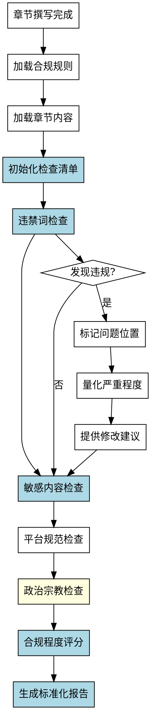

# 内容合规检查Skill

## Overview
检查章节内容是否合规，包括违禁词、敏感内容、平台规范和政治宗教内容，生成标准化的检查报告。

**核心原则: 内容合规检查 = 标准化检查清单 + 系统化检查流程 + 标准化报告格式 + 合规程度量化。**

手工检查方法会识别敏感内容并人工判断，但缺乏标准化流程，无法量化合规程度，没有标准化报告格式，对隐性问题不敏感，每次检查可能不一致。系统化方法确保完整性和可重复性。

## Pattern Recognition - 何时使用此skill

**使用此skill的场景**：
- 用户说"我想检查一下章节内容是否合规..." → **启动内容合规检查**
- 用户说"我想检查是否有违禁词或敏感内容" → **启动内容合规检查**
- 用户说"我完成了章节撰写，需要做什么检查？" → **建议使用此skill（以及其他 check-* skills）**

**Red Flags - 必须使用此skill**：
- 尝试手工检查，没有预定义检查清单（禁止）
- 尝试依赖经验判断"合规程度"，无法量化（禁止）
- 尝试没有标准化报告格式（禁止）
- 尝试对隐性问题不敏感（禁止）
- 尝试每次检查不一致（禁止）

## 流程图

## 工作流程

### 1. 加载合规规则
- 读取 novel-project.json 中的 consistency_rules 部分（违禁词列表）
- 加载默认合规规则（敏感内容、平台规范）
- **完成标准**: 成功加载合规规则

### 2. 加载章节内容
- 读取指定章节的 Markdown 文件
- 标记每个潜在违规内容
- **完成标准**: 章节内容加载成功

### 3. 初始化检查清单（强制使用标准化清单）

**禁止手工检查！使用标准化检查清单（4个维度：违禁词、敏感内容、平台规范、政治宗教）。详见reference.md。**

**完成标准**: 初始化完整的检查清单（4个维度）

### 4. 逐维度执行检查（系统化流程）

**检查方法：**

**Step 1: 识别潜在违规内容**
- 扫描章节内容，标记所有潜在违规内容
- 分类标记：违禁词、敏感内容、平台规范、政治宗教

**Step 2: 对比合规规则**
- 将章节内容与合规规则对比
- 检查是否违反规则

**Step 3: 识别违规类型**
- **明显违规**: 直接违反合规规则
- **微妙违规**: 可能违规，需人工确认
- **潜在问题**: 临近违规边界

**Step 4: 量化合规程度**

使用5级评分（5=完全合规, 4=基本合规, 3=部分合规, 2=明显违规, 1=严重违规）。详见reference.md。

**每个维度评分后计算总分：**
- 违禁词：权重 35%
- 敏感内容：权重 30%
- 平台规范：权重 20%
- 政治宗教：权重 15%

**完成标准**: 每个维度的合规程度已量化（1-5分）

### 5. 违禁词检查（核心）

**检查是否包含违禁词：**

**检查方法：**
1. 加载用户定义的违禁词列表
2. 扫描章节内容，标记所有违禁词
3. 记录违禁词位置和频率

**不一致识别标准：**
- **明显违规**: 包含违禁词
  - 例：包含用户定义的违禁词
- **微妙违规**: 包含类似违禁词的表达
  - 例：表达方式类似违禁词
- **潜在问题**: 临近违禁词边界

**评分标准：**
- 5分：无违禁词
- 4分：个别潜在类似表达
- 3分：有类似违禁词表达
- 2分：包含违禁词（1-3次）
- 1分：严重包含违禁词（多次）

### 6-9. 其他维度检查（敏感内容、平台规范、政治宗教）

**检查方法与违禁词类似，详见完整 SKILL.md**

### 10. 生成标准化报告（强制格式）

报告包含：检查摘要、合规程度评分、发现的问题、建议。详见reference.md。

## 禁止行为

 1. **禁止手工检查**
 2. **禁止无法量化合规程度**
 3. **禁止没有标准化报告格式**
 4. **禁止遗漏关键检查项（违禁词、敏感内容）**
 5. **禁止检查不一致**

 ## 常见错误

 **Baseline 错误（无 skill 时会发生）**：

 | 错误 | 后果 | Skill 如何防止 |
 |------|------|---------------|
 | 没有预定义检查清单 | 检查项遗漏，不完整 | 强制使用标准化检查清单（4个维度） |
 | 无法量化合规程度 | 判断主观，无法衡量 | 强制使用评分标准（1-5分）量化 |
 | 没有标准化报告格式 | 报告随意，难以使用 | 强制使用标准化报告格式 |
 | 对隐性违规不敏感 | 遗漏违禁词或敏感内容 | 明确易遗漏项（违禁词、敏感内容） |
 | 每次检查不一致 | 可重复性低 | 系统化方法确保可重复性 |

 ## Quick Reference

**检查维度（4个）**：
1. 违禁词（权重35%）⚠️ 核心
2. 敏感内容（权重30%）
3. 平台规范（权重20%）
4. 政治宗教（权重15%）

**评分标准（5级）**: 5=完全合规, 4=基本合规, 3=部分合规, 2=明显违规, 1=严重违规

**关键检查项（核心）**: ⚠️ 违禁词、⚠️ 敏感内容

**报告格式（5部分）**: 检查摘要、合规程度评分、发现的问题、详细检查记录、建议

## 错误处理

- **配置文件不存在**: 提示用户先运行 novel-project skill 创建项目
- **章节内容为空**: 提示用户先完成章节撰写
- **无违禁词列表**: 使用默认合规规则