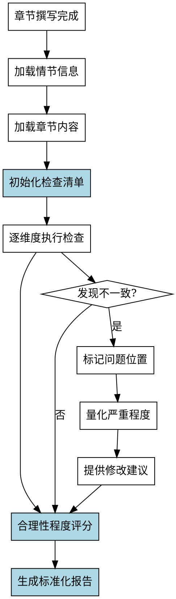

# 情节逻辑检查Skill

## Overview
检查章节内容中情节逻辑的合理性，包括因果关系、情节线完整性、人物动机、情节漏洞和伏笔揭示，生成标准化的检查报告。

**核心原则: 情节逻辑检查 = 标准化检查清单 + 系统化检查流程 + 标准化报告格式 + 合理性程度量化。**

## Pattern Recognition

**使用此skill的场景**：
- 用户说"我想检查一下章节里情节逻辑是否合理..." → **启动情节逻辑检查**
- 用户说"我想检查因果关系、情节漏洞是否有问题" → **启动情节逻辑检查**
- 用户说"我想检查人物动机是否充分" → **启动情节逻辑检查**

**Red Flags - 必须使用此skill**：
- 尝试手工检查，没有预定义检查清单（禁止）
- 尝试依赖经验判断"合理性程度"，无法量化（禁止）
- 尝试没有标准化报告格式（禁止）

## 流程图

## 工作流程

### 1. 加载情节信息
- 读取 novel-project.yaml 中的 outline.chapters 部分
- 读取角色档案中的动机信息

### 2. 加载章节内容
- 读取指定章节的 Markdown 文件
- 标记每个情节节点（事件、冲突、伏笔）

### 3. 初始化检查清单
详见 reference.md 第1节

**禁止手工检查！必须使用标准化检查清单（5个维度）。**

### 4. 逐维度执行检查
详见 reference.md 第3节

### 5. 量化合理性程度
详见 reference.md 第2节

**禁止无法量化！必须使用评分标准（1-5分）量化。**

**权重分配**：详见 Quick Reference 表格

### 6. 生成标准化报告
详见 reference.md 第4节

**禁止没有标准化报告格式！必须使用标准化报告格式。**

## 禁止行为

1. **禁止手工检查** - 必须使用标准化检查清单（5个维度）
2. **禁止无法量化合理性程度** - 必须使用评分标准（1-5分）量化
3. **禁止没有标准化报告格式** - 必须使用标准化报告格式
4. **禁止遗漏关键检查项** - 情节线完整性、伏笔揭示
5. **禁止检查不一致** - 必须使用系统化检查流程

## 常见错误

| 错误 | 后果 | Skill 如何防止 |
|------|------|---------------|
| 没有预定义检查清单 | 检查项遗漏 | 强制使用标准化检查清单（5个维度） |
| 无法量化合理性程度 | 判断主观 | 强制使用评分标准（1-5分）量化 |
| 对情节漏洞和伏笔不敏感 | 遗漏问题 | 明确易遗漏项 |

## Quick Reference

**检查维度（5个）**：
1. 因果关系 30% ⚠️ 核心
2. 情节线完整性 25% ⚠️ 易遗漏
3. 人物动机 20%
4. 情节漏洞 15% ⚠️ 核心
5. 伏笔揭示 10% ⚠️ 易遗漏

**评分标准（5级）**：
- 5分：完全合理
- 4分：基本合理（个别因果关系弱）
- 3分：部分合理（有逻辑问题）
- 2分：明显不合理（多项问题）
- 1分：严重不合理（矛盾）

**不一致类型（3种）**：
- 明显不合理：情节逻辑直接矛盾
- 微妙不合理：因果关系弱或动机不足
- 潜在问题：情节线不完整或伏笔遗漏

**关键检查项（易遗漏）**：
- ⚠️ 情节线完整性
- ⚠️ 伏笔揭示

**报告格式（5部分）**：
1. 检查摘要
2. 合理性程度评分（表格）
3. 发现的问题（错误/警告/提示）
4. 详细检查记录（逐维度）
5. 建议

## 错误处理

- **配置文件不存在**: 提示用户先运行 novel-project skill 创建项目
- **无大纲信息**: 提示用户先完成 outline-design 阶段
- **章节内容为空**: 提示用户先完成章节撰写