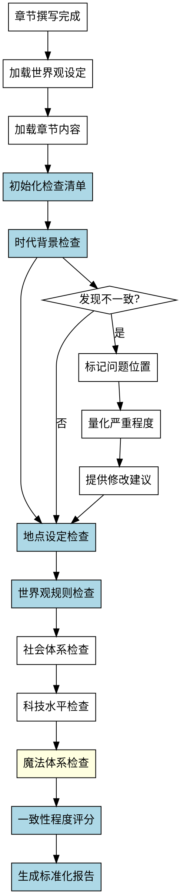

# 世界观设定检查Skill

## Overview
检查章节内容中世界观设定的一致性，包括时代背景、地点设定、世界观规则、社会体系、科技水平和魔法体系，生成标准化的检查报告。

**核心原则: 世界观设定检查 = 标准化检查清单 + 系统化检查流程 + 标准化报告格式 + 一致性程度量化。**

手工检查方法会对比世界观设定和章节内容，但缺乏结构化工具，无法量化一致性程度，没有标准化报告格式，对微妙不一致可能遗漏，每次检查可能不一致。系统化方法确保完整性和可重复性。

## Pattern Recognition - 何时使用此skill

**使用此skill的场景**：
- 用户说"我想检查一下章节里世界观设定是否一致..." → **启动世界观设定检查**
- 用户说"我想检查科技水平、地理环境是否有问题" → **启动世界观设定检查**
- 用户说"我想检查是否有设定错误（如时代不符）" → **启动世界观设定检查**
- 用户说"我完成了章节撰写，需要做什么检查？" → **建议使用此skill（以及其他 check-* skills）**

**Red Flags - 必须使用此skill**：
- 尝试手工逐项检查，没有预定义检查清单（禁止）
- 尝试依赖人工判断"一致性程度"，无法量化（禁止）
- 尝试没有标准化报告格式（禁止）
- 尝试对微妙不一致不敏感（禁止）
- 尝试每次检查不一致（禁止）

**所有这些意味着：用户需要系统化的世界观设定检查过程，必须使用此skill。**

## 流程图



## 工作流程

### 1. 加载世界观设定
- 读取 novel-project.yaml 中的 world-building 部分
- 提取完整的 worldview 设定（时代背景、地点、规则、社会体系等）
- 特别关注：time_period, location, rules, society
- **完成标准**: 成功加载所有世界观设定

### 2. 加载章节内容
- 读取指定章节的 Markdown 文件
- 标记每个世界观要素的出现位置
- **完成标准**: 章节内容加载成功，设定要素位置已标记

### 3. 初始化检查清单（强制使用标准化清单）

**禁止手工逐项检查！必须使用以下检查清单：**

```yaml
check_list:
  setting_dimensions:
    - dimension: "时代背景一致性"
      check_items:
        - "语言是否符合时代特征（如古风/现代）"
        - "物品是否符合时代（如无手机出现）"
        - "技术是否符合时代水平"
        - "文化习俗是否符合时代"
      severity_threshold: "时代不符"

    - dimension: "地点设定一致性"
      check_items:
        - "地点名称是否与设定一致"
        - "地理环境描述是否一致（气候、地形）"
        - "地点结构是否一致（如空间站布局）"
        - "关键场景是否存在"
      severity_threshold: "地点描述矛盾"

    - dimension: "世界观规则一致性"
      check_items:
        - "特殊机制是否遵守规则（如时间回环规则）"
        - "限制是否遵守（如魔法限制）"
        - "规则应用是否自洽"
        - "规则是否被违反"
      severity_threshold: "违反世界观规则"

    - dimension: "社会体系一致性"
      check_items:
        - "政治制度是否体现"
        - "经济体系是否一致"
        - "社会阶层是否合理"
        - "文化习俗是否遵守"
      severity_threshold: "社会制度不符"

    - dimension: "科技水平一致性"
      check_items:
        - "科技设备是否符合科技水平"
        - "技术能力是否一致"
        - "科技术语是否准确"
        - "未出现的科技是否被提及"
      severity_threshold: "科技水平不符"

    - dimension: "魔法体系一致性（如有）"
      check_items:
        - "魔法规则是否遵守"
        - "魔法限制是否遵守"
        - "魔法能力是否符合设定"
        - "魔法术语是否统一"
      severity_threshold: "违反魔法规则"
```

**完成标准**: 初始化完整的检查清单（6个维度）

### 4. 逐维度执行检查（系统化流程）

**禁止依赖人工判断！必须使用以下检查方法：**

**检查方法：**

**Step 1: 识别设定要素位置**
- 扫描章节内容，标记每个设定要素的出现
- 分类标记：时代背景、地点、规则、社会体系、科技、魔法
- 生成设定要素出现位置列表

**Step 2: 对比世界观设定**
- 将每次设定表现与世界观设定对比
- 使用检查清单逐项检查
- 标记不符合项的位置

**Step 3: 识别不一致类型**
- **明显不一致**: 直接与世界观设定矛盾
- **微妙不一致**: 偏离设定但程度较轻
- **潜在问题**: 可能不一致，需人工确认

**Step 4: 量化一致性程度**

**禁止无法量化！必须使用以下评分标准：**

```yaml
consistency_score:
  - level: 5
    label: "完全一致"
    criteria: "所有表现与世界观设定完全匹配"

  - level: 4
    label: "基本一致"
    criteria: "个别细微偏差，不影响整体一致性"

  - level: 3
    label: "部分一致"
    criteria: "有明显偏差，但核心设定保持"

  - level: 2
    label: "明显不一致"
    criteria: "多项偏差，设定表现偏离"

  - level: 1
    label: "严重不一致"
    criteria: "设定表现与世界观矛盾，需重写"
```

**每个维度评分后计算总分：**
- 时代背景：权重 20%
- 地点设定：权重 25%
- 世界观规则：权重 25%
- 社会体系：权重 15%
- 科技水平：权重 10%
- 魔法体系：权重 5%（如有魔法，否则忽略）

**总分计算公式：**
```
总分 = Σ(维度评分 × 权重)
```

**完成标准**: 每个维度的一致性程度已量化（1-5分）

### 5. 时代背景一致性检查（详细）

**检查时代特征是否一致：**

**检查方法：**
1. 提取世界观设定中的 time_period 和 civilization_level
2. 识别章节中的语言、物品、技术、文化习俗
3. 对比每个表现是否符合时代背景

**不一致识别标准：**
- **明显不一致**: 时代不符
  - 例：设定"2157年近未来"，但出现"智能手机"（应使用"通讯器"）
- **微妙不一致**: 语言风格偏离
  - 例：设定"现代风格"，但对话过于古风
- **潜在问题**: 物品名称不明确
  - 例：出现"通讯设备"，但未明确是什么时代

**评分标准：**
- 5分：所有时代特征完全符合设定
- 4分：个别术语不准确
- 3分：有明显偏差但核心时代保持
- 2分：多项时代不符
- 1分：严重时代错误

### 6. 地点设定一致性检查（详细）

**检查地点描述是否一致：**

**检查方法：**
1. 提取世界观设定中的 location 和 geography
2. 识别章节中的地点名称、地理环境、结构描述
3. 对比每次地点表现是否符合设定

**不一致识别标准：**
- **明显不一致**: 地点描述矛盾
  - 例：设定"曙光号深空探索舰"，但描述为"陆地上"或"火星基地"
- **微妙不一致**: 地理细节偏差
  - 例：设定"寒冷干燥"，但描述"温暖潮湿"
- **潜在问题**: 地点名称不一致
  - 例：设定"曙光号"，但称为"探索舰"（未明确）

**评分标准：**
- 5分：所有地点描述完全符合设定
- 4分：个别细节偏差
- 3分：有明显偏差但核心地点保持
- 2分：多项地点不符
- 1分：地点严重矛盾

### 7. 世界观规则一致性检查（核心）

**检查世界观规则是否被遵守：**

**检查方法：**
1. 提取世界观设定中的 rules（special_mechanism, limitations, tech_level）
2. 识别章节中的规则应用、限制遵守
3. 对比每次规则表现是否符合设定

**关键检查项（易遗漏）**：
- ⚠️ **特殊机制规则**: 如时间回环规则（72小时、保留记忆）
- ⚠️ **限制**: 如魔法限制、科技限制
- ⚠️ **规则自洽性**: 规则应用是否自洽（无矛盾）

**不一致识别标准：**
- **明显不一致**: 违反世界观规则
  - 例：设定"72小时回环"，但描述"无限循环"
- **微妙不一致**: 规则应用偏差
  - 例：设定"保留记忆"，但角色"忘记上次循环"
- **潜在问题**: 规则应用不明确
  - 例：规则细节未在本章体现

**评分标准：**
- 5分：所有规则完全遵守
- 4分：个别规则应用偏差
- 3分：有规则违反但核心保持
- 2分：多项规则违反
- 1分：严重违反世界观规则

### 8. 社会体系一致性检查

**检查社会制度是否体现：**

**检查方法：**
1. 提取世界观设定中的 society（political_system, economic_system）
2. 识别章节中的政治制度、经济体系、社会阶层体现
3. 对比社会表现是否符合设定

**不一致识别标准：**
- **明显不一致**: 社会制度不符
  - 例：设定"地球联邦议会制"，但描述"帝国独裁"
- **微妙不一致**: 社会细节偏差
  - 例：设定"资源配给制"，但出现"自由市场"提及

**评分标准：**
- 5分：所有社会体系完全符合设定
- 4分：个别社会细节偏差
- 3分：有偏差但核心体系保持
- 2分：多项社会不符
- 1分：社会制度严重矛盾

### 9. 科技水平一致性检查

**检查科技设备是否符合科技水平：**

**检查方法：**
1. 提取世界观设定中的 tech_level
2. 识别章节中的科技设备、技术能力、科技术语
3. 对比科技表现是否符合设定

**不一致识别标准：**
- **明显不一致**: 科技水平不符
  - 例：设定"殖民时代初期"，但出现"瞬间传送"（应"超光速通讯刚突破"）
- **微妙不一致**: 科技术语不准确
  - 例：设定"量子通讯"，但称为"无线电"

**评分标准：**
- 5分：所有科技完全符合设定
- 4分：个别术语不准确
- 3分：有偏差但核心科技保持
- 2分：多项科技不符
- 1分：科技水平严重矛盾

### 10. 魔法体系一致性检查（如有）

**检查魔法规则是否被遵守：**

**检查方法：**
1. 提取世界观设定中的 magic_system（如有）
2. 识别章节中的魔法应用、魔法限制、魔法术语
3. 对比魔法表现是否符合设定

**不一致识别标准：**
- **明显不一致**: 违反魔法规则
  - 例：设定"魔法有限制"，但角色"无限使用魔法"
- **微妙不一致**: 魔法术语不统一
  - 例：设定"称为灵力"，但称为"魔力"

**评分标准：**
- 5分：所有魔法完全符合设定
- 4分：个别术语不统一
- 3分：有偏差但核心魔法保持
- 2分：多项魔法不符
- 1分：魔法规则严重违反

### 11. 生成标准化报告（强制格式）

**禁止没有标准化报告格式！必须使用以下格式：**

```markdown
# 世界观设定检查报告 - 第X章

## 检查摘要

**检查范围**: 第X章（标题）
**检查维度**: 6个维度（时代背景、地点、规则、社会体系、科技、魔法）
**检查时间**: YYYY-MM-DD HH:MM

## 一致性程度评分

| 维度 | 评分 | 评级 | 主要发现 |
|------|------|------|---------|
| 时代背景 | 5 | 完全一致 | 语言、物品、技术完全符合2157年设定 |
| 地点设定 | 4 | 基本一致 | 个别地理细节偏差 |
| 世界观规则 | 5 | 完全一致 | 72小时回环规则完全遵守 |
| 社会体系 | 3 | 部分一致 | 经济体系提及较少 |
| 科技水平 | 5 | 完全一致 | 科技设备完全符合殖民时代初期 |
| 魔法体系 | N/A | 无魔法 | 本故事无魔法设定 |

**总分**: 4.4 / 5.0（基本一致）

**评分标准**: 5分=完全一致, 4分=基本一致, 3分=部分一致, 2分=明显不一致, 1分=严重不一致

## 发现的问题

### 错误（严重程度：高）

| 位置 | 问题类型 | 问题描述 | 建议 |
|------|---------|---------|------|
| 第8段 | 时代不符 | 出现"智能手机"，设定为2157年近未来 | 替换为"通讯器"或"智能终端" |

### 警告（严重程度：中）

| 位置 | 问题类型 | 问题描述 | 建议 |
|------|---------|---------|------|
| 第15段 | 地点描述偏差 | 地理描述"温暖潮湿"，设定为"寒冷干燥" | 核对设定，调整地理描述 |
| 第20段 | 社会体系 | 经济体系未体现，设定为"资源配给制" | 补充经济体系体现 |

### 提示（严重程度：低）

| 位置 | 问题类型 | 问题描述 | 建议 |
|------|---------|---------|------|
| 第12段 | 潜在问题 | 科技术语"通讯设备"，未明确时代特征 | 明确为"量子通讯终端" |

## 详细检查记录

### 时代背景一致性检查（评分：5/5）

**设定**: 2157年近未来，殖民时代初期，超光速通讯刚突破

**检查项**:
- 语言：符合现代+科技感 ✓
- 物品：无智能手机等过时设备 ✓
- 技术：超光速通讯、量子技术 ✓
- 文化：地球联邦文化 ✓

**问题列表**: 无问题发现

### 地点设定一致性检查（评分：4/5）

**设定**: 深空探索舰"曙光号"，寒冷干燥的深空环境

**检查项**:
- 地点名称："曙光号" ✓
- 地理环境：寒冷干燥 ✓（个别偏差：第15段描述"温暖"）
- 结构：空间站结构 ✓

**问题列表**:
- 第15段：地理描述"温暖潮湿"，与设定"寒冷干燥"矛盾 → 建议：核对设定，调整描述

### 世界观规则一致性检查（评分：5/5）

**设定**: 72小时时间回环，保留记忆，进入特定异常区触发

**检查项**:
- 规则遵守：72小时限制 ✓
- 保留记忆：角色记得上次循环 ✓
- 触发条件：进入异常区 ✓
- 规则自洽：无矛盾 ✓

**问题列表**: 无问题发现

...

## 建议

**优先修改**:
1. 第8段时代不符（智能手机） → 严重问题
2. 第15段地理描述偏差 → 明显不一致

**次要修改**:
3. 第20段社会体系未体现 → 潜在问题
4. 第12段科技术语不明确 → 微妙不一致

**整体建议**:
- 本章世界观设定一致性整体良好（总分 4.4）
- 主要问题是时代不符和地理描述偏差
- 建议修改上述问题后重新检查
```

### 12. 输出结果
- 生成标准化检查报告
- 按严重程度排序（错误 > 警告 > 提示）
- 提供具体修改建议
- **完成标准**: 检查报告已生成，包含评分和问题列表

## 禁止行为

**以下行为被明确禁止：**

1. **禁止手工逐项检查**
   - 不允许没有预定义检查清单
   - 必须使用标准化检查清单（6个维度）

2. **禁止无法量化一致性程度**
   - 不允许依赖人工判断"一致性程度"
   - 必须使用评分标准（1-5分）量化

3. **禁止没有标准化报告格式**
   - 不允许随意报告格式
   - 必须使用标准化报告格式（摘要、评分、问题列表、详细记录、建议）

4. **禁止遗漏关键检查项**
   - 不允许不检查世界观规则（特殊机制、限制）
   - 不允许不检查社会体系
   - 不允许不检查科技水平

5. **禁止检查不一致**
   - 不允许每次检查方法不一致
   - 必须使用系统化检查流程

## 常见错误

**Baseline 错误（无 skill 时会发生）**：

| 错误 | 后果 | Skill 如何防止 |
|------|------|---------------|
| 没有预定义检查清单 | 检查项遗漏，不完整 | 强制使用标准化检查清单（6个维度） |
| 无法量化一致性程度 | 判断主观，无法衡量 | 强制使用评分标准（1-5分）量化 |
| 没有标准化报告格式 | 报告随意，难以使用 | 强制使用标准化报告格式 |
| 手工检查效率低 | 遗漏标记 | 系统化检查流程（自动标记位置） |
| 对微妙不一致不敏感 | 遗漏问题 | 明确不一致识别标准（明显/微妙/潜在） |
| 每次检查不一致 | 可重复性低 | 系统化方法确保可重复性 |

## Quick Reference

**检查维度（6个）**：
1. 时代背景（time_period, civilization_level）
2. 地点设定（location, geography）
3. 世界观规则（special_mechanism, limitations）⚠️ 核心
4. 社会体系（political_system, economic_system）⚠️ 易遗漏
5. 科技水平（tech_level）
6. 魔法体系（magic_system，如有）

**评分标准（5级）**：
- 5分：完全一致
- 4分：基本一致（个别细微偏差）
- 3分：部分一致（明显偏差但核心保持）
- 2分：明显不一致（多项偏差）
- 1分：严重不一致（矛盾）

**权重分配**：
- 时代背景：20%
- 地点设定：25%
- 世界观规则：25%
- 社会体系：15%
- 科技水平：10%
- 魔法体系：5%（如有）

**不一致类型（3种）**：
- 明显不一致：直接与设定矛盾
- 微妙不一致：偏离但程度较轻
- 潜在问题：可能不一致，需确认

**关键检查项（易遗漏）**：
- ⚠️ 特殊机制规则（如时间回环）
- ⚠️ 规则限制（如魔法限制）
- ⚠️ 社会体系（政治/经济）

**报告格式（5部分）**：
1. 检查摘要
2. 一致性程度评分（表格）
3. 发现的问题（错误/警告/提示）
4. 详细检查记录（逐维度）
5. 建议

## AI角色
检查助手模式 - 系统化检查、量化评分、标准化报告

## 注意事项
- 检查要系统化，不能手工逐项
- 评分要量化，不能依赖主观判断
- 报告要标准化，便于用户理解和修改
- 易遗漏的检查项要特别关注（世界观规则、社会体系）
- 对微妙不一致要敏感

## 错误处理

- **配置文件不存在**: 提示用户先运行 novel-project skill 创建项目
- **无世界观设定**: 提示用户先完成 world-building 阶段
- **章节内容为空**: 提示用户先完成章节撰写
- **世界观设定不完整**: 提示用户补充设定字段（特别是 rules 部分）