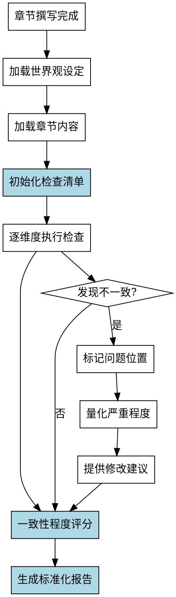

# 世界观设定检查Skill

## Overview
检查章节内容中世界观设定的一致性，包括时代背景、地点设定、世界观规则、社会体系、科技水平和魔法体系，生成标准化的检查报告。

**核心原则: 世界观设定检查 = 标准化检查清单 + 系统化检查流程 + 标准化报告格式 + 一致性程度量化。**

## Pattern Recognition

**使用此skill的场景**：
- 用户说"我想检查一下章节里世界观设定是否一致..." → **启动世界观设定检查**
- 用户说"我想检查科技水平、地理环境是否有问题" → **启动世界观设定检查**
- 用户说"我想检查是否有设定错误（如时代不符）" → **启动世界观设定检查**

**Red Flags - 必须使用此skill**：
- 尝试手工逐项检查，没有预定义检查清单（禁止）
- 尝试依赖人工判断"一致性程度"，无法量化（禁止）
- 尝试没有标准化报告格式（禁止）

## 流程图

## 工作流程

### 1. 加载世界观设定
- 读取 novel-project.yaml 中的 world-building 部分
- 特别关注：time_period, location, rules, society

### 2. 加载章节内容
- 读取指定章节的 Markdown 文件
- 标记每个世界观要素的出现位置

### 3. 初始化检查清单
详见 reference.md 第1节

**禁止手工逐项检查！必须使用标准化检查清单（6个维度）。**

### 4. 逐维度执行检查
详见 reference.md 第3节

**禁止依赖人工判断！必须使用系统化检查方法。**

### 5. 量化一致性程度
详见 reference.md 第2节

**禁止无法量化！必须使用评分标准（1-5分）量化。**

**权重分配**：详见 Quick Reference 表格

### 6. 生成标准化报告
详见 reference.md 第4节

**禁止没有标准化报告格式！必须使用标准化报告格式。**

## 禁止行为

1. **禁止手工逐项检查** - 必须使用标准化检查清单（6个维度）
2. **禁止无法量化一致性程度** - 必须使用评分标准（1-5分）量化
3. **禁止没有标准化报告格式** - 必须使用标准化报告格式
4. **禁止遗漏关键检查项** - 世界观规则、社会体系、科技水平
5. **禁止检查不一致** - 必须使用系统化检查流程

## 常见错误

| 错误 | 后果 | Skill 如何防止 |
|------|------|---------------|
| 没有预定义检查清单 | 检查项遗漏 | 强制使用标准化检查清单（6个维度） |
| 无法量化一致性程度 | 判断主观 | 强制使用评分标准（1-5分）量化 |
| 没有标准化报告格式 | 报告随意 | 强制使用标准化报告格式 |
| 对微妙不一致不敏感 | 遗漏问题 | 明确不一致识别标准 |

## Quick Reference

**检查维度（6个）**：
1. 时代背景（time_period）20%
2. 地点设定（location）25%
3. 世界观规则（rules）25% ⚠️ 核心
4. 社会体系（society）15% ⚠️ 易遗漏
5. 科技水平（tech_level）10%
6. 魔法体系（magic）5%（如有）

**评分标准（5级）**：
- 5分：完全一致
- 4分：基本一致（个别细微偏差）
- 3分：部分一致（明显偏差但核心保持）
- 2分：明显不一致（多项偏差）
- 1分：严重不一致（矛盾）

**不一致类型（3种）**：
- 明显不一致：直接与设定矛盾
- 微妙不一致：偏离但程度较轻
- 潜在问题：可能不一致，需确认

**关键检查项（易遗漏）**：
- ⚠️ 特殊机制规则（如时间回环）
- ⚠️ 规则限制（如魔法限制）
- ⚠️ 社会体系（政治/经济）

**报告格式（5部分）**：
1. 检查摘要
2. 一致性程度评分（表格）
3. 发现的问题（错误/警告/提示）
4. 详细检查记录（逐维度）
5. 建议

## 错误处理

- **配置文件不存在**: 提示用户先运行 novel-project skill 创建项目
- **无世界观设定**: 提示用户先完成 world-building 阶段
- **章节内容为空**: 提示用户先完成章节撰写