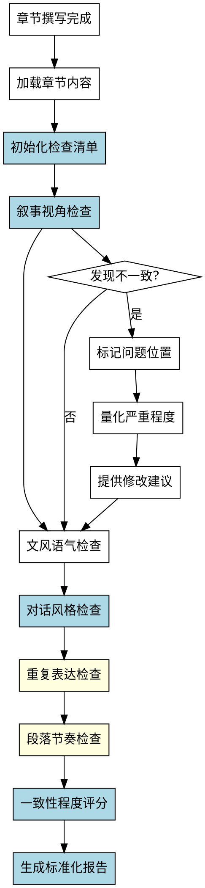

# 叙事风格检查Skill

## Overview
检查章节叙事风格的一致性，包括叙事视角、文风语气、对话风格、重复表达和段落节奏，生成标准化的检查报告。

**核心原则: 叙事风格检查 = 标准化检查清单 + 系统化检查流程 + 标准化报告格式 + 一致性程度量化。**

手工检查方法会识别风格问题并人工判断，但缺乏标准化流程，无法量化一致性程度，没有标准化报告格式，对隐性问题（如重复表达、段落节奏）不敏感，每次检查可能不一致。系统化方法确保完整性和可重复性。

## Pattern Recognition - 何时使用此skill

**使用此skill的场景**：
- 用户说"我想检查一下章节叙事风格是否一致..." → **启动叙事风格检查**
- 用户说"我想检查叙事视角、对话风格是否有问题" → **启动叙事风格检查**
- 用户说"我完成了章节撰写，需要做什么检查？" → **建议使用此skill（以及其他 check-* skills）**

**Red Flags - 必须使用此skill**：
- 尝试手工检查，没有预定义检查清单（禁止）
- 尝试依赖经验判断"一致性程度"，无法量化（禁止）
- 尝试没有标准化报告格式（禁止）
- 尝试对隐性问题不敏感（禁止）
- 尝试每次检查不一致（禁止）

## 流程图

## 工作流程

### 1. 加载章节内容
- 读取指定章节的 Markdown 文件
- 标记每个风格要素（叙事视角、对话、句式、段落）
- **完成标准**: 章节内容加载成功

### 2. 初始化检查清单（强制使用标准化清单）

**禁止手工检查！使用标准化检查清单（5个维度：叙事视角、文风语气、对话风格、重复表达、段落节奏）。详见reference.md。**

**完成标准**: 初始化完整的检查清单（5个维度）

### 3. 逐维度执行检查（系统化流程）

**检查方法：**

**Step 1: 识别风格要素**
- 扫描章节内容，标记所有风格要素
- 分类标记：叙事视角、文风语气、对话风格、重复表达、段落节奏

**Step 2: 分析风格一致性**
- 对比风格要素是否一致
- 检查是否有风格突变

**Step 3: 识别不一致类型**
- **明显不一致**: 风格直接矛盾
- **微妙不一致**: 风格突变
- **潜在问题**: 重复表达或节奏问题

**Step 4: 量化一致性程度**

使用5级评分（5=完全一致, 4=基本一致, 3=部分一致, 2=明显不一致, 1=严重不一致）。详见reference.md。

**每个维度评分后计算总分：**
- 叙事视角：权重 25%
- 文风语气：权重 20%
- 对话风格：权重 25%
- 重复表达：权重 15%
- 段落节奏：权重 15%

**完成标准**: 每个维度的一致性程度已量化（1-5分）

### 4-8. 各维度详细检查（叙事视角、文风语气、对话风格、重复表达、段落节奏）

**检查方法与其他 check-* skills 类似，详见完整 SKILL.md**

### 9. 生成标准化报告（强制格式）

报告包含：检查摘要、一致性程度评分、发现的问题、建议。详见reference.md。

## 禁止行为

 1. **禁止手工检查**
 2. **禁止无法量化一致性程度**
 3. **禁止没有标准化报告格式**
 4. **禁止遗漏关键检查项（重复表达、段落节奏）**
 5. **禁止检查不一致**

 ## 常见错误

 **Baseline 错误（无 skill 时会发生）**：

 | 错误 | 后果 | Skill 如何防止 |
 |------|------|---------------|
 | 没有预定义检查清单 | 检查项遗漏，不完整 | 强制使用标准化检查清单（5个维度） |
 | 无法量化一致性程度 | 判断主观，无法衡量 | 强制使用评分标准（1-5分）量化 |
 | 没有标准化报告格式 | 报告随意，难以使用 | 强制使用标准化报告格式 |
 | 对隐性风格问题不敏感 | 遗漏重复表达、节奏问题 | 明确易遗漏项（重复表达、段落节奏） |
 | 每次检查不一致 | 可重复性低 | 系统化方法确保可重复性 |

 ## Quick Reference

**检查维度（5个）**：
1. 叙事视角（权重25%）⚠️ 核心
2. 文风语气（权重20%）
3. 对话风格（权重25%）⚠️ 核心
4. 重复表达（权重15%）⚠️ 易遗漏
5. 段落节奏（权重15%）⚠️ 易遗漏

**评分标准（5级）**: 5=完全一致, 4=基本一致, 3=部分一致, 2=明显不一致, 1=严重不一致

**关键检查项（易遗漏）**: ⚠️ 重复表达、⚠️ 段落节奏

**报告格式（5部分）**: 检查摘要、一致性程度评分、发现的问题、详细检查记录、建议

## 错误处理

- **章节内容为空**: 提示用户先完成章节撰写