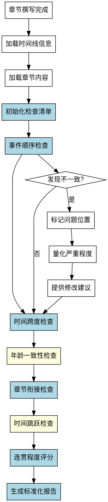

# 时间线连贯检查Skill

## Overview
检查章节内容中时间线的连贯性，包括事件顺序、时间跨度、年龄一致性、章节衔接和时间跳跃处理，生成标准化的检查报告。

**核心原则: 时间线连贯检查 = 标准化检查清单 + 系统化检查流程 + 标准化报告格式 + 连贯程度量化。**

手工检查方法会识别时间标记并人工检查逻辑，但缺乏标准化流程，无法量化连贯程度，没有标准化报告格式，对隐性问题（如时间跳跃、年龄不一致）不敏感，每次检查可能不一致。系统化方法确保完整性和可重复性。

## Pattern Recognition - 何时使用此skill

**使用此skill的场景**：
- 用户说"我想检查一下章节里时间线是否连贯..." → **启动时间线连贯检查**
- 用户说"我想检查事件顺序、时间跨度是否有问题" → **启动时间线连贯检查**
- 用户说"我想检查人物年龄是否一致" → **启动时间线连贯检查**
- 用户说"我完成了章节撰写，需要做什么检查？" → **建议使用此skill（以及其他 check-* skills）**

**Red Flags - 必须使用此skill**：
- 尝试手工检查，没有预定义检查清单（禁止）
- 尝试依赖经验判断"连贯程度"，无法量化（禁止）
- 尝试没有标准化报告格式（禁止）
- 尝试对隐性问题不敏感（禁止）
- 尝试每次检查不一致（禁止）

**所有这些意味着：用户需要系统化的时间线检查过程，必须使用此skill。**

## 流程图



## 工作流程

### 1. 加载时间线信息
- 读取 novel-project.yaml 中的 outline.chapters 部分
- 提取每个章节的时间设定和事件顺序
- 读取 world-building 部分的角色年龄信息
- **完成标准**: 成功加载时间线相关信息

### 2. 加载章节内容
- 读取指定章节的 Markdown 文件
- 标记每个时间标记（日期、时间跨度、事件顺序）
- **完成标准**: 章节内容加载成功，时间标记已标记

### 3. 初始化检查清单（强制使用标准化清单）

**禁止手工检查！必须使用以下检查清单：**

```yaml
check_list:
  timeline_dimensions:
    - dimension: "事件顺序合理性"
      check_items:
        - "事件A是否应在事件B之前"
        - "因果关系是否合理"
        - "事件顺序是否自洽"
        - "是否有事件顺序矛盾"
      severity_threshold: "事件顺序矛盾"

    - dimension: "时间跨度合理性"
      check_items:
        - "时间跨度（如'三天后'）是否与事件复杂度匹配"
        - "时间跨度是否合理"
        - "是否有时间跨度过长或过短"
        - "季节变化是否合理"
      severity_threshold: "时间跨度不合理"

    - dimension: "年龄一致性"
      check_items:
        - "人物年龄是否符合设定"
        - "成长时间是否一致"
        - "年龄变化是否合理"
        - "是否有年龄矛盾"
      severity_threshold: "年龄不一致"

    - dimension: "章节衔接时间"
      check_items:
        - "前章结尾时间是否与本章开头衔接"
        - "章节间时间跨度是否合理"
        - "是否有章节间时间跳跃未说明"
        - "季节变化是否衔接"
      severity_threshold: "章节间时间矛盾"

    - dimension: "时间跳跃处理"
      check_items:
        - "时间跳跃是否有过渡说明"
        - "跳跃是否合理"
        - "跳跃后是否有背景交代"
        - "跳跃是否影响连贯性"
      severity_threshold: "时间跳跃处理不当"
```

**完成标准**: 初始化完整的检查清单（5个维度）

### 4. 逐维度执行检查（系统化流程）

**禁止依赖经验判断！必须使用以下检查方法：**

**检查方法：**

**Step 1: 识别时间标记**
- 扫描章节内容，标记所有时间标记（日期、时间跨度、季节、事件顺序）
- 分类标记：事件顺序、时间跨度、年龄提及、章节衔接、时间跳跃

**Step 2: 对比大纲时间设定**
- 将章节中的时间表现与大纲中的 chapter 时间设定对比
- 检查事件顺序是否与大纲一致
- 检查时间跨度是否合理

**Step 3: 识别不一致类型**
- **明显不一致**: 时间线直接矛盾
- **微妙不一致**: 时间跳跃处理不当
- **潜在问题**: 时间跨度可能不合理

**Step 4: 量化连贯程度**

**禁止无法量化！必须使用以下评分标准：**

```yaml
coherence_score:
  - level: 5
    label: "完全连贯"
    criteria: "所有时间线完全合理，无矛盾"

  - level: 4
    label: "基本连贯"
    criteria: "个别细微跳跃，不影响整体连贯性"

  - level: 3
    label: "部分连贯"
    criteria: "有跳跃或跨度问题，但核心时间线保持"

  - level: 2
    label: "明显不连贯"
    criteria: "多项跳跃或跨度问题"

  - level: 1
    label: "严重不连贯"
    criteria: "时间线矛盾，需重写"
```

**每个维度评分后计算总分：**
- 事件顺序：权重 30%
- 时间跨度：权重 25%
- 年龄一致性：权重 20%
- 章节衔接：权重 15%
- 时间跳跃处理：权重 10%

**总分计算公式：**
```
总分 = Σ(维度评分 × 权重)
```

**完成标准**: 每个维度的连贯程度已量化（1-5分）

### 5. 事件顺序合理性检查（详细）

**检查事件顺序是否合理：**

**检查方法：**
1. 提取章节中的事件列表（按出现顺序）
2. 分析事件之间的因果关系
3. 检查事件顺序是否自洽（无矛盾）

**不一致识别标准：**
- **明显不一致**: 事件顺序矛盾
  - 例：先出现"结果"，后出现"原因"
- **微妙不一致**: 事件顺序不明确
  - 例：两事件先后顺序不清晰
- **潜在问题**: 因果关系弱
  - 例：事件间因果关系不明显

**评分标准：**
- 5分：事件顺序完全合理，因果关系清晰
- 4分：个别事件顺序不明确
- 3分：有顺序问题但核心保持
- 2分：多项顺序问题
- 1分：事件顺序严重矛盾

### 6. 时间跨度合理性检查（详细）

**检查时间跨度是否合理：**

**检查方法：**
1. 提取章节中的时间跨度标记（如"三天后"、"一周后"）
2. 分析时间跨度与事件复杂度是否匹配
3. 检查季节变化是否合理

**不一致识别标准：**
- **明显不一致**: 时间跨度不合理
  - 例："三天后"完成复杂任务（不现实）
- **微妙不一致**: 时间跨度不明确
  - 例："一段时间后"无具体说明
- **潜在问题**: 季节变化不合理
  - 例：前章"春天"，本章"大雪纷飞"无过渡

**评分标准：**
- 5分：所有时间跨度完全合理
- 4分：个别跨度不明确
- 3分：有跨度问题但核心保持
- 2分：多项跨度问题
- 1分：时间跨度严重不合理

### 7. 年龄一致性检查（易遗漏）

**检查人物年龄是否一致：**

**检查方法：**
1. 提取角色档案中的 age 信息
2. 识别章节中的年龄提及
3. 对比年龄是否符合设定

**不一致识别标准：**
- **明显不一致**: 年龄矛盾
  - 例：设定"32岁"，但章节"25岁"
- **微妙不一致**: 年龄变化不合理
  - 例：时间跨度"一年"，但年龄未增加
- **潜在问题**: 年龄未明确提及
  - 例：年龄信息缺失

**评分标准：**
- 5分：所有年龄完全一致
- 4分：个别年龄不明确
- 3分：有年龄问题但核心保持
- 2分：多项年龄问题
- 1分：年龄严重不一致

### 8. 章节衔接时间检查（核心）

**检查前后章节时间是否衔接：**

**检查方法：**
1. 读取前一章节的结尾时间
2. 读取当前章节的开头时间
3. 检查时间是否衔接（无跳跃未说明）

**不一致识别标准：**
- **明显不一致**: 章节间时间矛盾
  - 例：前章结尾"春天"，本章开头"冬天"无过渡
- **微妙不一致**: 章节间时间跳跃未说明
  - 例：前章结尾"第5天"，本章开头"第20天"无说明
- **潜在问题**: 章节间时间跨度不明确

**评分标准：**
- 5分：章节间时间完全衔接
- 4分：个别衔接不明确
- 3分：有衔接问题但核心保持
- 2分：多项衔接问题
- 1分：章节间时间严重矛盾

### 9. 时间跳跃处理检查（易遗漏）

**检查时间跳跃是否有过渡说明：**

**检查方法：**
1. 识别章节中的时间跳跃（如突然"一年后"）
2. 检查跳跃是否有过渡说明
3. 检查跳跃后是否有背景交代

**不一致识别标准：**
- **明显不一致**: 时间跳跃处理不当
  - 例：突然跳跃"一年后"，无任何过渡
- **微妙不一致**: 跳跃后背景交代不足
  - 例：跳跃后未交代期间发生的事
- **潜在问题**: 跳跃处理方式不明确

**评分标准：**
- 5分：所有时间跳跃处理完美
- 4分：个别跳跃过渡不足
- 3分：有跳跃问题但核心保持
- 2分：多项跳跃问题
- 1分：时间跳跃严重处理不当

### 10. 生成标准化报告（强制格式）

**禁止没有标准化报告格式！必须使用以下格式：**

```markdown
# 时间线连贯检查报告 - 第X章

## 检查摘要

**检查范围**: 第X章（标题）
**检查维度**: 5个维度（事件顺序、时间跨度、年龄、章节衔接、时间跳跃）
**检查时间**: YYYY-MM-DD HH:MM

## 连贯程度评分

| 维度 | 评分 | 评级 | 主要发现 |
|------|------|------|---------|
| 事件顺序 | 5 | 完全连贯 | 事件顺序合理，因果关系清晰 |
| 时间跨度 | 4 | 基本连贯 | 个别时间跨度不明确 |
| 年龄一致性 | 5 | 完全一致 | 年龄完全符合设定 |
| 章节衔接 | 3 | 部分连贯 | 章节间时间跳跃未说明 |
| 时间跳跃处理 | 2 | 明显问题 | 时间跳跃处理不当 |

**总分**: 3.85 / 5.0（部分连贯）

**评分标准**: 5分=完全连贯, 4分=基本连贯, 3分=部分连贯, 2分=明显问题, 1分=严重不连贯

## 发现的问题

### 错误（严重程度：高）

| 位置 | 问题类型 | 问题描述 | 建议 |
|------|---------|---------|------|
| 第3段 | 章节衔接 | 前章结尾为"春天"，本章开头为"大雪纷飞"，无季节过渡 | 补充季节过渡说明 |

### 警告（严重程度：中）

| 位置 | 问题类型 | 问题描述 | 建议 |
|------|---------|---------|------|
| 第10段 | 时间跨度 | "三天后"时间跨度与事件复杂度不匹配 | 考虑延长为"一周后" |
| 第15段 | 时间跳跃 | 突然跳跃"一年后"，无任何过渡说明 | 添加过渡段落，交代期间发生的事 |

### 提示（严重程度：低）

| 位置 | 问题类型 | 问题描述 | 建议 |
|------|---------|---------|------|
| 第8段 | 时间跨度不明确 | "一段时间后"无具体说明 | 明确为"三天后"或"一周后" |

## 详细检查记录

### 事件顺序合理性检查（评分：5/5）

**事件列表**:
1. 主角起床
2. 收到消息
3. 决定行动
4. 出发
5. 到达目的地

**因果分析**: 顺序合理，因果关系清晰 ✓

**问题列表**: 无问题发现

### 时间跨度合理性检查（评分：4/5）

**时间跨度标记**:
- "三天后" → 事件复杂度：中等 ⚠️（可能不够）
- "一周后" → 事件复杂度：高 ✓
- "一段时间后" → 不明确 ⚠️

**问题列表**:
- 第10段："三天后"完成复杂任务 → 建议：延长为"一周后"
- 第8段："一段时间后"不明确 → 建议：明确时间跨度

### 章节衔接时间检查（评分：3/5）

**前章结尾**: 春天，第5天
**本章开头**: 大雪纷飞，第20天

**问题列表**:
- 季节跳跃（春天→冬天）无过渡 → 严重问题
- 时间跳跃（5天→20天）未说明 → 明显问题

### 时间跳跃处理检查（评分：2/5）

**时间跳跃列表**:
- 第15段："一年后" → 无过渡 ⚠️（严重）
- 第20段："一周后" → 有过渡 ✓

**问题列表**:
- 第15段：突然跳跃"一年后"，无任何过渡 → 建议：添加过渡段落

...

## 建议

**优先修改**:
1. 第3段章节衔接（季节跳跃无过渡） → 严重问题
2. 第15段时间跳跃（无过渡说明） → 明显问题

**次要修改**:
3. 第10段时间跨度（不匹配） → 潜在问题
4. 第8段时间跨度不明确 → 微妙问题

**整体建议**:
- 本章时间线连贯性部分良好（总分 3.85）
- 主要问题是章节衔接和时间跳跃处理
- 建议修改上述问题后重新检查
```

### 11. 输出结果
- 生成标准化检查报告
- 按严重程度排序（错误 > 警告 > 提示）
- 提供具体修改建议
- **完成标准**: 检查报告已生成，包含评分和问题列表

## 禁止行为

**以下行为被明确禁止：**

1. **禁止手工检查**
   - 不允许没有预定义检查清单
   - 必须使用标准化检查清单（5个维度）

2. **禁止无法量化连贯程度**
   - 不允许依赖经验判断"连贯程度"
   - 必须使用评分标准（1-5分）量化

3. **禁止没有标准化报告格式**
   - 不允许随意报告格式
   - 必须使用标准化报告格式（摘要、评分、问题列表、详细记录、建议）

4. **禁止遗漏关键检查项**
   - 不允许不检查年龄一致性（易遗漏）
   - 不允许不检查时间跳跃处理（易遗漏）

5. **禁止检查不一致**
   - 不允许每次检查方法不一致
   - 必须使用系统化检查流程

## 常见错误

**Baseline 错误（无 skill 时会发生）**：

| 错误 | 后果 | Skill 如何防止 |
|------|------|---------------|
| 没有预定义检查清单 | 检查项遗漏，不完整 | 强制使用标准化检查清单（5个维度） |
| 无法量化连贯程度 | 判断主观，无法衡量 | 强制使用评分标准（1-5分）量化 |
| 没有标准化报告格式 | 报告随意，难以使用 | 强制使用标准化报告格式 |
| 对隐性问题不敏感 | 遗漏问题（年龄、跳跃） | 明确易遗漏项（年龄、时间跳跃） |
| 每次检查不一致 | 可重复性低 | 系统化方法确保可重复性 |

## Quick Reference

**检查维度（5个）**：
1. 事件顺序（权重30%）
2. 时间跨度（权重25%）
3. 年龄一致性（权重20%）⚠️ 易遗漏
4. 章节衔接（权重15%）⚠️ 核心
5. 时间跳跃处理（权重10%）⚠️ 易遗漏

**评分标准（5级）**：
- 5分：完全连贯
- 4分：基本连贯（个别细微跳跃）
- 3分：部分连贯（有跳跃或跨度问题）
- 2分：明显不连贯（多项问题）
- 1分：严重不连贯（时间线矛盾）

**不一致类型（3种）**：
- 明显不一致：时间线直接矛盾
- 微妙不一致：时间跳跃处理不当
- 潜在问题：时间跨度可能不合理

**关键检查项（易遗漏）**：
- ⚠️ 年龄一致性
- ⚠️ 时间跳跃处理

**报告格式（5部分）**：
1. 检查摘要
2. 连贯程度评分（表格）
3. 发现的问题（错误/警告/提示）
4. 详细检查记录（逐维度）
5. 建议

## AI角色
检查助手模式 - 系统化检查、量化评分、标准化报告

## 注意事项
- 检查要系统化，不能手工
- 评分要量化，不能依赖经验判断
- 报告要标准化，便于用户理解和修改
- 易遗漏的检查项要特别关注（年龄、时间跳跃）
- 对隐性问题要敏感

## 错误处理

- **配置文件不存在**: 提示用户先运行 novel-project skill 创建项目
- **无大纲信息**: 提示用户先完成 outline-design 阶段
- **章节内容为空**: 提示用户先完成章节撰写
- **无时间设定**: 提示用户补充大纲中的时间信息