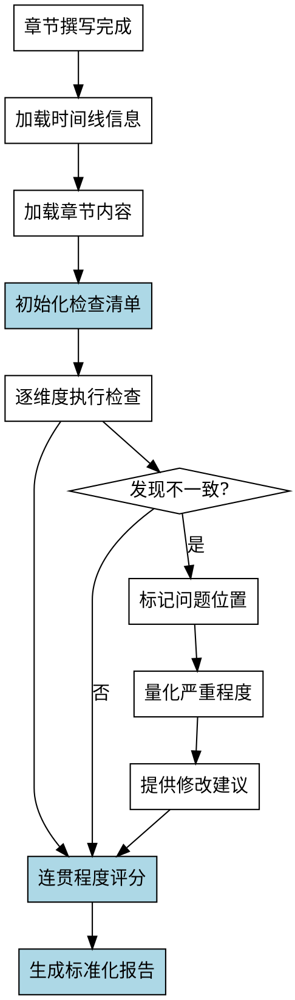

# 时间线连贯检查Skill

## Overview
检查章节内容中时间线的连贯性，包括事件顺序、时间跨度、年龄一致性、章节衔接和时间跳跃处理，生成标准化的检查报告。

**核心原则: 时间线连贯检查 = 标准化检查清单 + 系统化检查流程 + 标准化报告格式 + 连贯程度量化。**

## Pattern Recognition

**使用此skill的场景**：
- 用户说"我想检查一下章节里时间线是否连贯..." → **启动时间线连贯检查**
- 用户说"我想检查事件顺序、时间跨度是否有问题" → **启动时间线连贯检查**
- 用户说"我想检查人物年龄是否一致" → **启动时间线连贯检查**

**Red Flags - 必须使用此skill**：
- 尝试手工检查，没有预定义检查清单（禁止）
- 尝试依赖经验判断"连贯程度"，无法量化（禁止）
- 尝试没有标准化报告格式（禁止）

## 流程图

## 工作流程

### 1. 加载时间线信息
- 读取 novel-project.yaml 中的 outline.chapters 部分
- 读取 world-building 部分的角色年龄信息

### 2. 加载章节内容
- 读取指定章节的 Markdown 文件
- 标记每个时间标记（日期、时间跨度、事件顺序）

### 3. 初始化检查清单
详见 reference/check-dimensions.md

**禁止手工检查！必须使用标准化检查清单（5个维度）。**

### 4. 逐维度执行检查
详见 reference/check-methods.md

**禁止依赖经验判断！必须使用系统化检查方法。**

### 5. 量化连贯程度
详见 reference/scoring-criteria.md

**禁止无法量化！必须使用评分标准（1-5分）量化。**

**权重分配**：详见 Quick Reference 表格

### 6. 生成标准化报告
详见 reference/report-template.md

**禁止没有标准化报告格式！必须使用标准化报告格式。**

## 禁止行为

1. **禁止手工检查** - 必须使用标准化检查清单（5个维度）
2. **禁止无法量化连贯程度** - 必须使用评分标准（1-5分）量化
3. **禁止没有标准化报告格式** - 必须使用标准化报告格式
4. **禁止遗漏关键检查项** - 年龄一致性、时间跳跃处理
5. **禁止检查不一致** - 必须使用系统化检查流程

## 常见错误

| 错误 | 后果 | Skill 如何防止 |
|------|------|---------------|
| 没有预定义检查清单 | 检查项遗漏 | 强制使用标准化检查清单（5个维度） |
| 无法量化连贯程度 | 判断主观 | 强制使用评分标准（1-5分）量化 |
| 对隐性问题不敏感 | 遗漏问题（年龄、跳跃） | 明确易遗漏项 |

## Quick Reference

**检查维度（5个）**：
1. 事件顺序 30%
2. 时间跨度 25%
3. 年龄一致性 20% ⚠️ 易遗漏
4. 章节衔接 15% ⚠️ 核心
5. 时间跳跃处理 10% ⚠️ 易遗漏

**评分标准（5级）**：
- 5分：完全连贯
- 4分：基本连贯（个别细微跳跃）
- 3分：部分连贯（有跳跃或跨度问题）
- 2分：明显不连贯（多项问题）
- 1分：严重不连贯（时间线矛盾）

**不一致类型（3种）**：
- 明显不一致：时间线直接矛盾
- 微妙不一致：时间跳跃处理不当
- 潜在问题：时间跨度可能不合理

**关键检查项（易遗漏）**：
- ⚠️ 年龄一致性
- ⚠️ 时间跳跃处理

**报告格式（5部分）**：
1. 检查摘要
2. 连贯程度评分（表格）
3. 发现的问题（错误/警告/提示）
4. 详细检查记录（逐维度）
5. 建议

## 错误处理

- **配置文件不存在**: 提示用户先运行 novel-project skill 创建项目
- **无大纲信息**: 提示用户先完成 outline-design 阶段
- **章节内容为空**: 提示用户先完成章节撰写