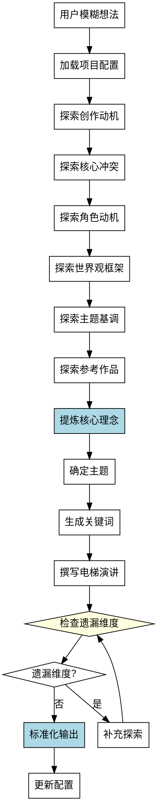

# 创意构思Skill

## Overview
从模糊想法到清晰创意概念，系统化地提炼核心理念、主题、关键词和电梯演讲。

**核心原则: 创意构思 = 系统化探索 + 结构化提炼 + 标准化输出。**

Ad-hoc 提问依赖直觉和经验，容易遗漏重要维度，输出格式不一致。系统化方法确保质量稳定。

## Pattern Recognition - 何时使用此skill

**使用此skill的场景**：
- 用户说"我想写一个小说，但是不知道怎么开始" → **启动创意构思**
- 用户说"我有一个模糊的想法，能不能帮我理清？" → **启动创意构思**
- 用户说"我想写一个关于X的故事" → **启动创意构思**
- 用户说"我刚创建了一个项目，接下来做什么？" → **建议使用此skill**

**Red Flags - 必须使用此skill**：
- 用户只有模糊想法（一句话描述）
- 尝试直接跳到世界观构建或角色创建（跳过创意构思）
- 尝试随意提问，没有系统化的探索维度
- 尝试没有结构化地提炼核心理念
- 尝试没有标准化的输出格式

**所有这些意味着：用户需要系统化的创意构思过程，必须使用此skill。**

## 流程图



## 工作流程

### 1. 加载项目配置
- 读取当前目录的 novel-project.yaml
- 检查 ideation 部分的状态
- **完成标准**: 成功读取配置并确认状态为 pending 或 in_progress

### 2. 系统化探索（7 个维度）

**禁止 ad-hoc 提问！必须按顺序探索以下维度：**

#### 2.1 创作动机
- 询问用户想要写什么类型的故事
- 了解初步想法和灵感来源
- **完成标准**: 用户能清晰描述想要写的故事类型

#### 2.2 核心冲突
- 神秘现象/事件是什么？
- 主角想要达成什么目标？有什么阻碍？
- 如果不解决，后果是什么？
- **完成标准**: 明确故事的冲突驱动力

#### 2.3 角色动机
- 主角为什么是这个角色？有什么个人动机或秘密？
- 主角有什么性格缺陷或成长空间？
- 有没有其他重要角色？
- **完成标准**: 明确主角的核心动机

#### 2.4 世界观框架
- 这是近未来还是遥远未来？科技水平如何？
- 人类文明的范围？地球联邦？星际帝国？
- 这个宇宙有独特的社会/政治结构吗？
- **完成标准**: 明确世界观框架

#### 2.5 主题基调
- 想要探讨什么话题？（孤独、探索、人性、科技伦理……）
- 希望读者读完有什么感受？
- **完成标准**: 确定 1-2 个核心主题

#### 2.6 参考作品
- 有没有类似风格的作品？（《星际穿越》《三体》《银河漫游指南》……）
- 喜欢这些作品的什么？
- **完成标准**: 明确风格/基调参考

#### 2.7 故事节奏（易遗漏维度！）
- 故事节奏偏好？（快节奏/慢节奏）
- 预期篇幅？（短篇/中篇/长篇）
- **完成标准**: 明确节奏和篇幅预期

### 3. 提炼核心理念
- 协助用户用一句话概括故事核心
- **格式**: "[主角]在[情境]中必须[目标]，否则[后果]"
- **完成标准**: 用户认可一句话概括准确表达了故事核心

### 4. 确定主题
- 从探索中提炼 1-2 个核心主题
- **完成标准**: 用户认可主题列表

### 5. 生成关键词
- 提取 3-5 个关键词描述故事
- 用于后续创作的方向指引
- **完成标准**: 用户认可关键词列表

### 6. 撰写电梯演讲
- 100 字内简洁描述故事
- 用于快速推销作品概念
- **完成标准**: 电梯演讲控制在 100 字以内且用户认可

### 7. 检查遗漏维度
**必须检查的维度**（容易遗漏！）：
- □ 故事节奏偏好（快节奏/慢节奏）
- □ 预期篇幅（短篇/中篇/长篇）
- □ 目标读者（年龄段、阅读偏好）
- □ 风格基调（严肃/轻松，硬科幻/软科幻）

**如果有遗漏**: 补充探索该维度，然后重新检查

### 8. 标准化输出

**禁止非标准化输出！必须使用以下格式：**

```yaml
ideation:
  core_idea: "一句话核心理念"
  theme: "主题1, 主题2"
  keywords: ["关键词1", "关键词2", "关键词3"]
  pitch: "电梯演讲（100字内）"
  target_audience: "目标读者"
  pacing_preference: "快节奏/慢节奏"
  expected_length: "短篇/中篇/长篇"
  style_tone: "严肃/轻松，硬科幻/软科幻"
  reference_works: "参考作品"
  status: "completed"
```

### 9. 更新配置
- 将以上内容写入 novel-project.yaml 的 ideation 部分
- 设置 ideation.status 为 "completed"
- **完成标准**: 配置文件成功更新

## 禁止行为

**以下行为被明确禁止：**

1. **禁止 ad-hoc 提问**
   - 不允许随意提问，必须按 7 个维度系统化探索
   - 必须检查遗漏维度

2. **禁止跳过维度**
   - 不允许跳过任何探索维度
   - 特别容易遗漏：故事节奏、预期篇幅、目标读者

3. **禁止非标准化输出**
   - 不允许使用非标准格式
   - 必须包含所有字段（core_idea, theme, keywords, pitch 等）

4. **禁止在核心理念不清时继续**
   - 核心理念必须清晰明确
   - 否则返回探索更多维度

5. **禁止电梯演讲超过 100 字**
   - 电梯演讲必须控制在 100 字以内
   - 否则要求用户精简

## 常见错误

**Baseline 错误（无 skill 时会发生）**：

| 错误 | 后果 | Skill 如何防止 |
|------|------|---------------|
| 问题顺序依赖直觉 | 遗漏重要维度，探索不全面 | 强制 7 个维度系统化探索 |
| 容易遗漏维度 | 缺少故事节奏、篇幅等关键信息 | 检查遗漏维度清单 |
| 提炼过程没有框架 | 核心理念不清晰或遗漏 | 强制使用核心理念格式 |
| 输出格式不一致 | 后续 skill 无法使用 | 标准化输出格式模板 |
| 依赖对话流畅度 | 质量不稳定 | 系统化方法确保质量稳定 |

## Quick Reference

**7 个探索维度**：
1. 创作动机
2. 核心冲突
3. 角色动机
4. 世界观框架
5. 主题基调
6. 参考作品
7. 故事节奏（易遗漏！）

**核心理念格式**：
"[主角]在[情境]中必须[目标]，否则[后果]"

**输出格式**：
```yaml
ideation:
  core_idea: "一句话核心理念"
  theme: "主题"
  keywords: ["关键词"]
  pitch: "电梯演讲（100字内）"
  target_audience: "目标读者"
  pacing_preference: "快慢节奏"
  expected_length: "篇幅"
  style_tone: "风格基调"
  reference_works: "参考作品"
  status: "completed"
```

## AI角色
协作伙伴模式 - 提问、建议、帮助决策

## 注意事项
- 保持提问的节奏，不要一次性问太多
- 如果用户已有明确想法，可以快速通过某些维度，但必须检查
- 核心理念必须清晰明确，否则返回探索更多维度
- 如需修改已完成的 ideation，可将 status 改为 "in_progress" 后重新执行此 skill

## 错误处理

- **配置文件不存在**: 提示用户先运行 novel-project skill 创建项目
- **配置文件格式错误**: 提示用户检查 YAML 格式，或重新初始化项目
- **前置条件不满足**: 如果 ideation.status 不是 pending 或 in_progress，提示用户确认项目状态