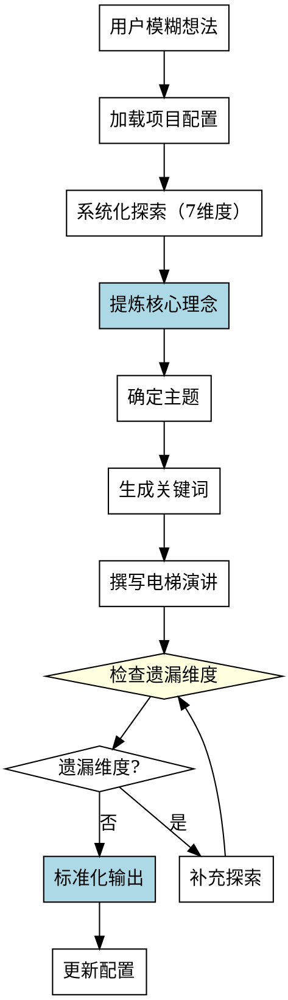

# 创意构思Skill

## Overview
从模糊想法到清晰创意概念，系统化地提炼核心理念、主题、关键词和电梯演讲。

**核心原则: 创意构思 = 系统化探索 + 结构化提炼 + 标准化输出。**

## Pattern Recognition

**使用此skill的场景**：
- 用户说"我想写一个小说，但是不知道怎么开始" → **启动创意构思**
- 用户说"我有一个模糊的想法，能不能帮我理清？" → **启动创意构思**
- 用户说"我想写一个关于X的故事" → **启动创意构思**

**Red Flags - 必须使用此skill**：
- 用户只有模糊想法（一句话描述）
- 尝试直接跳到世界观构建或角色创建（禁止）
- 尝试随意提问，没有系统化的探索维度（禁止）
- 尝试没有结构化地提炼核心理念（禁止）
- 尝试电梯演讲超过100字（禁止）

## 流程图

## 工作流程

### 1. 加载项目配置
- 读取 novel-project.yaml，检查 ideation 状态

### 2. 系统化探索（7个维度）
详见 reference.md 第1节

**禁止 ad-hoc 提问！必须按顺序探索7个维度。**

### 3. 提炼核心理念
详见 Quick Reference（核心理念格式）

**禁止在核心理念不清时继续！**

### 4. 确定主题
- 从探索中提炼1-2个核心主题

### 5. 生成关键词
- 提取3-5个关键词描述故事

### 6. 撰写电梯演讲
- 100字内简洁描述故事

**禁止电梯演讲超过100字！**

### 7. 检查遗漏维度
详见 reference.md 第3节

**如果有遗漏**: 补充探索该维度

### 8. 标准化输出
详见 reference.md 第2节

## 禁止行为

1. **禁止 ad-hoc 提问** - 必须按7个维度系统化探索
2. **禁止跳过维度** - 特别容易遗漏：故事节奏、预期篇幅、目标读者
3. **禁止非标准化输出** - 必须包含所有字段
4. **禁止在核心理念不清时继续** - 必须清晰明确
5. **禁止电梯演讲超过100字** - 必须控制在100字以内

## 常见错误

| 错误 | 后果 | Skill 如何防止 |
|------|------|---------------|
| 问题顺序依赖直觉 | 遗漏重要维度 | 强制7个维度系统化探索 |
| 容易遗漏维度 | 缺少关键信息 | 检查遗漏维度清单 |
| 提炼过程没有框架 | 核心理念不清晰 | 强制使用核心理念格式 |
| 输出格式不一致 | 后续skill无法使用 | 标准化输出格式模板 |

## Quick Reference

**7个探索维度**：
1. 创作动机
2. 核心冲突
3. 角色动机
4. 世界观框架
5. 主题基调
6. 参考作品
7. 故事节奏 ⚠️ 易遗漏

**核心理念格式**：
"[主角]在[情境]中必须[目标]，否则[后果]"

**检查遗漏维度清单**：
- □ 故事节奏偏好
- □ 预期篇幅
- □ 目标读者
- □ 风格基调

## 错误处理

- **配置文件不存在**: 提示用户先运行 novel-project skill 创建项目
- **前置条件不满足**: 如果 ideation.status 不是 pending 或 in_progress，提示用户确认项目状态