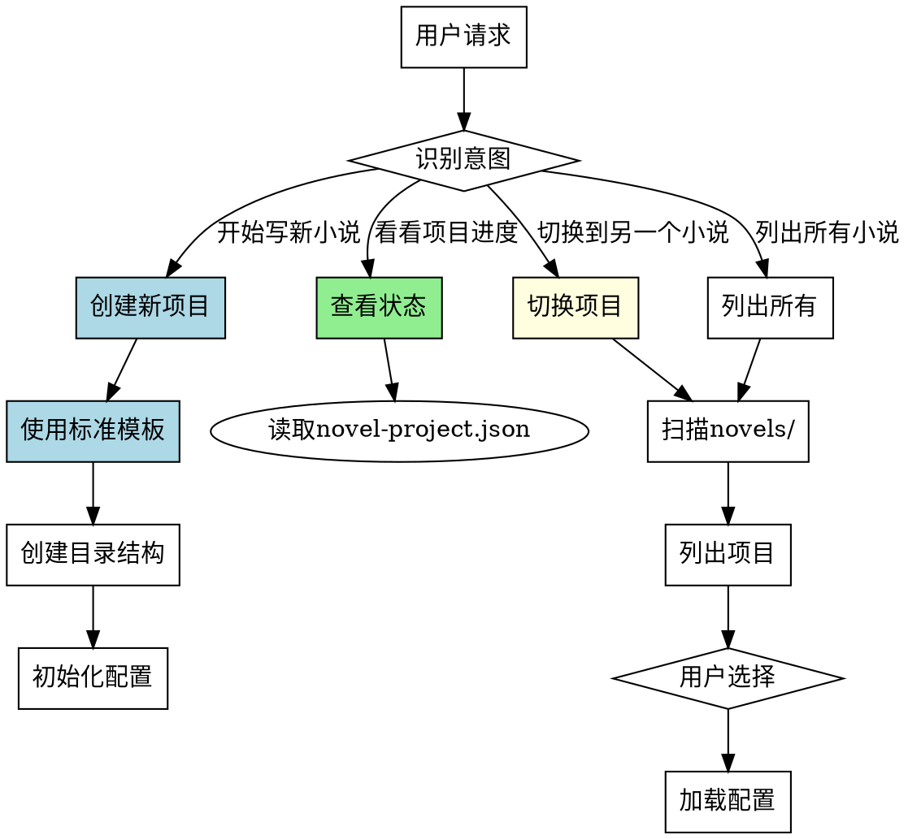

# 项目管理Skill

## Overview
管理多小说项目生命周期，提供项目创建、切换、加载和状态查看功能。标准化项目结构，确保项目间一致性。

## 核心原则
**项目管理 = 标准化结构 + 生命周期管理 + 状态跟踪。**

## Pattern Recognition

**使用此skill的场景**：
- 用户说"我想开始写一个新的小说" → **创建新项目**
- 用户说"我想看看我的项目进度" → **查看项目状态**
- 用户说"我想切换到另一个小说项目" → **切换项目**
- 用户说"列出所有我写的小说" → **列出所有项目**

**Red Flags - 必须使用此skill**：
- 尝试创建项目时使用 ad-hoc 结构（禁止）
- 尝试手动创建项目配置（禁止）
- 尝试在 novels/ 之外创建项目（禁止）
- 尝试在没有项目的情况下执行其他 skill（禁止）

## 流程图



## 使用方式

用户调用此skill后，**必须询问用户想要执行的操作**：

```
请选择操作：
1. 创建新项目
2. 切换到已有项目
3. 查看当前项目状态
4. 列出所有项目
```

## 工作流程

### 1. 创建新项目

详见 reference/directory-structure.md 和 reference/config-templates.md

**禁止**: 使用 ad-hoc 结构、手动创建配置、在 novels/ 之外创建项目

**步骤**：询问基本信息 → 使用标准目录结构 → 初始化配置 → 初始化进度 → 自动切换

### 2. 切换到已有项目

- 扫描 novels/ 目录
- 列出所有项目（名称、类型、创建时间）
- 用户选择项目
- 加载配置并切换工作目录

### 3. 查看当前项目状态

- 读取 novel-project.json
- 显示各阶段完成状态（ideation/world_building/character_building/outline/chapters）
- 显示章节统计信息

### 4. 列出所有项目

- 扫描 novels/ 目录
- 显示项目列表（名称、类型、创建时间、目标字数、当前进度）

## 禁止行为

1. **禁止使用 ad-hoc 结构** - 必须使用标准结构
2. **禁止手动创建配置** - 必须使用标准模板
3. **禁止在 novels/ 之外创建项目** - 项目必须集中管理
4. **禁止直接修改配置文件** - 必须通过其他 skill
5. **禁止在没有项目时执行其他 skill** - 必须先创建或切换

## 常见错误

| 错误 | 后果 | Skill 如何防止 |
|------|------|---------------|
| 使用 ad-hoc 结构 | 项目结构不一致 | 强制使用标准目录结构和配置模板 |
| 手动创建配置文件 | 配置格式错误 | 强制使用标准配置模板初始化 |
| 项目分散在多位置 | 项目难以管理 | 强制项目集中在 novels/ 目录 |
| 没有项目执行其他 skill | 执行失败 | 提示用户先创建或切换项目 |

## Quick Reference

**核心操作（4种）**：
1. 创建新项目 - 询问基本信息，使用标准模板
2. 切换已有项目 - 扫描novels/，列出项目，用户选择
3. 查看当前状态 - 读取配置，显示各阶段进度
4. 列出所有项目 - 扫描novels/，显示项目列表

**创建流程（5步）**：
1. 询问基本信息（名称、类型、目标字数）
2. 使用标准目录结构
3. 初始化配置文件（novel-project.json）
4. 初始化进度文件（progress.json）⚠️ 易遗漏
5. 自动切换到新项目 ⚠️ 易遗漏

**禁止行为（5项）**：
- ⚠️ 禁止使用 ad-hoc 结构
- ⚠️ 禁止手动创建配置
- ⚠️ 禁止在 novels/ 之外创建项目
- ⚠️ 禁止直接修改配置文件
- ⚠️ 禁止在没有项目时执行其他skill

## 错误处理

- **项目名冲突**: 提示用户选择其他名称或覆盖
- **目录缺失**: 自动创建 novels/ 目录
- **配置损坏**: 提示用户检查文件格式或重新初始化