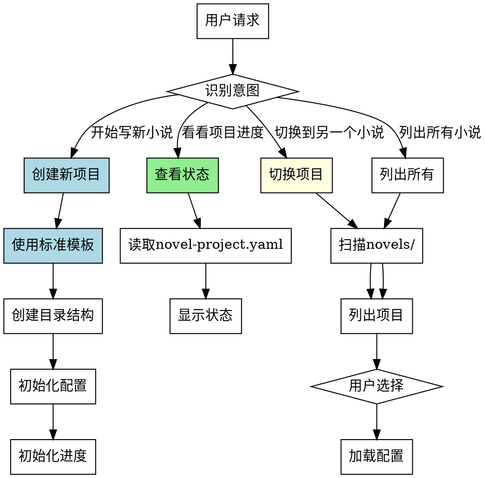

# 项目管理Skill

## Overview
管理多小说项目生命周期，提供项目创建、切换、加载和状态查看功能。标准化项目结构，确保项目间一致性。

## 核心原则
**项目管理 = 标准化结构 + 生命周期管理 + 状态跟踪。**

不标准化的项目管理会导致结构不一致、多项目混乱、进度无法跟踪。

## Pattern Recognition - 何时使用此skill

**使用此skill的场景**：
- 用户说"我想开始写一个新的小说" → **创建新项目**
- 用户说"我想看看我的项目进度" → **查看项目状态**
- 用户说"我想切换到另一个小说项目" → **切换项目**
- 用户说"列出所有我写的小说" → **列出所有项目**
- 用户说"我想加载某个小说的设定" → **加载项目**

**Red Flags - 必须使用此skill**：
- 尝试创建项目时使用 ad-hoc 结构（随机文件/目录）
- 尝试手动创建项目配置（不使用标准模板）
- 尝试在 novels/ 之外创建项目（不遵循项目集中管理）
- 尝试直接修改项目配置（不通过 skill）
- 尝试在没有项目的情况下执行其他 skill

**所有这些意味着：用户正在执行项目管理操作，必须使用此skill确保标准化结构。**

## 流程图



## 使用方式（询问用户意图）

用户调用此skill后，**必须询问用户想要执行的操作**：

```
请选择操作：
1. 创建新项目
2. 切换到已有项目
3. 查看当前项目状态
4. 列出所有项目

您想要执行哪个操作？
```

## 工作流程

### 1. 创建新项目（标准流程）

**必须使用标准结构**（禁止 ad-hoc 创建）：

1. **询问基本信息**
   - 项目名称（如"星尘回响"）
   - 项目类型（如"科幻"、"悬疑"、"言情"）
   - 目标字数（默认100000）

2. **使用标准目录结构**
   ```
   novels/
   └── <项目名称>/
       ├── novel-project.yaml  # 配置文件（必须）
       ├── progress.yaml       # 进度文件（必须）
       ├── chapters/           # 章节目录（必须）
       ├── assets/             # 资源目录（必须）
       ├── character_profile.yaml  # 角色设定（可选）
       └── world_building.yaml     # 世界观设定（可选）
   ```
   **禁止**: 使用 ad-hoc 结构（随机文件/目录名称）

3. **初始化配置文件**（使用标准模板）
   - 使用下方模板初始化 novel-project.yaml
   - **禁止**: 手动创建配置（必须使用模板）

4. **初始化进度文件**
   - 使用下方模板初始化 progress.yaml
   - **禁止**: 不创建进度文件（后续 skill 需要进度跟踪）

5. **创建后自动切换**
   - 创建新项目后，自动切换到该项目目录
   - 后续所有 skill 操作都作用于该项目

**完成标准**: 目录结构创建成功 + 配置文件初始化成功 + 自动切换到新项目

### 2. 切换到已有项目

1. **扫描 novels/ 目录**
   - 扫描 novels/ 下所有包含 novel-project.yaml 的子目录
   - **禁止**: 在 novels/ 之外扫描项目（项目必须集中管理）

2. **列出所有项目**
   - 显示每个项目的名称、类型、创建时间
   - 格式：
     ```
     可用项目：
     1. 星尘回响（科幻） - 创建于 2026-05-09
     2. 迷雾之城（悬疑） - 创建于 2026-05-01
     3. 晨曦微光（言情） - 创建于 2026-04-15
     ```

3. **用户选择项目**
   - 用户输入项目编号或名称
   - **完成标准**: 用户选择一个项目

4. **加载项目配置**
   - 读取选中项目的 novel-project.yaml
   - 切换工作目录到该项目
   - **完成标准**: 配置加载成功 + 工作目录切换成功

### 3. 查看当前项目状态

1. **读取当前项目的 novel-project.yaml**
   - 检查当前工作目录
   - 读取 novel-project.yaml
   - **禁止**: 在没有项目的情况下查看状态（提示用户先创建或切换项目）

2. **显示各阶段完成状态**
   - 显示 ideation/world_building/character_building/outline/chapters 各阶段状态
   - 格式：
     ```
     项目状态: 星尘回响
     
     阶段进度:
     ✓ novel-project: completed
     ✓ novel-ideation: completed
     ✓ world-building: completed
     ✓ character-building: completed
     ✓ outline-design: completed
     ○ chapter-cycle: in_progress (第5章撰写中)
     ⚪ polish-style: pending
     
     章节统计:
     - 总章节: 20
     - 已撰写: 5
     - 已审阅: 4
     - 已润色: 0
     ```

3. **显示章节统计信息**
   - 总章节数、已撰写、已审阅、已润色数量
   - **完成标准**: 状态显示完成

### 4. 列出所有项目

1. **扫描 novels/ 目录**
   - 扫描所有包含 novel-project.yaml 的子目录
   - **禁止**: 在 novels/ 之外扫描项目

2. **列出项目列表**
   - 显示每个项目的名称、类型、创建时间、目标字数
   - 格式：
     ```
     所有项目:
     
     1. 星尘回响
        类型: 科幻
        创建时间: 2026-05-09
        目标字数: 100000
        当前进度: 25%
     
     2. 迷雾之城
        类型: 悬疑
        创建时间: 2026-05-01
        目标字数: 150000
        当前进度: 60%
     ```

**完成标准**: 项目列表显示完成

## 禁止行为

**以下行为被明确禁止：**

1. **禁止使用 ad-hoc 结构**
   - 不允许随机文件/目录名称
   - 必须使用标准结构（novel-project.yaml, progress.yaml, chapters/, assets/）

2. **禁止手动创建配置**
   - 不允许不使用模板创建配置文件
   - 必须使用下方标准模板

3. **禁止在 novels/ 之外创建项目**
   - 所有项目必须在 novels/ 目录下
   - 项目必须集中管理

4. **禁止直接修改配置文件**
   - 不允许用户直接编辑 novel-project.yaml
   - 必须通过其他 skill（novel-ideation, world-building 等）修改

5. **禁止在没有项目的情况下执行其他 skill**
    - 其他 skill（chapter-writing, review-revision 等）需要项目配置
    - 必须先创建或切换项目

 ## 常见错误

 **Baseline 错误（无 skill 时会发生）**：

 | 错误 | 后果 | Skill 如何防止 |
 |------|------|---------------|
 | 使用 ad-hoc 结构 | 项目结构不一致，后续 skill 无法运行 | 强制使用标准目录结构和配置模板 |
 | 手动创建配置文件 | 配置格式错误，字段缺失 | 强制使用标准配置模板初始化 |
 | 项目分散在多位置 | 项目难以管理，容易丢失 | 强制项目集中在 novels/ 目录 |
 | 直接修改配置文件 | 配置损坏，状态不一致 | 禁止直接修改，必须通过其他 skill |
 | 没有项目执行其他 skill | 其他 skill 无法找到配置，执行失败 | 提示用户先创建或切换项目 |

 ## 项目生命周期概念

**项目生命周期**包括：
- **创建**: 创建新项目（使用标准结构）
- **切换**: 在多项目间切换（项目集中管理）
- **加载**: 加载项目配置（后续 skill 依赖）
- **查看**: 查看项目状态（进度跟踪）
- **修改**: 通过其他 skill 修改项目内容
- **完成**: 项目完成（所有阶段 completed）

**这不是一次性目录创建，而是持续的项目生命周期管理。**

## 配置文件模板（强制）

当创建新项目时，**必须使用以下模板**初始化 novel-project.yaml：

```yaml
project:
  name: "<项目名称>"
  genre: "<类型>"
  target_words: 100000
  created: "<YYYY-MM-DD>"
  updated: "<YYYY-MM-DD>"

ideation:
  core_idea: ""
  theme: ""
  keywords: []
  pitch: ""
  status: "pending"

world_building:
  setting:
    time_period: ""
    location: ""
    rules: []
  characters: []
  status: "pending"

character_building:
  characters: []
  status: "pending"

outline:
  structure: ""
  chapters: []
  status: "pending"

chapters:
  current: 1
  drafted: []
  reviewed: []
  polished: []
  status: "pending"
```

**进度文件模板**初始化 progress.yaml：

```yaml
current_stage: "novel-ideation"
stages:
  novel-project:
    status: "completed"
    started: "<YYYY-MM-DD HH:MM:SS>"
    completed: "<YYYY-MM-DD HH:MM:SS>"
  novel-ideation:
    status: "in_progress"
    started: "<YYYY-MM-DD HH:MM:SS>"
  world-building:
    status: "pending"
  character-building:
    status: "pending"
  outline-design:
    status: "pending"
  chapter-cycle:
    status: "pending"
  polish-style:
    status: "pending"
```

## AI角色
工具模式 - 执行项目管理操作（创建目录、初始化配置、扫描项目）

## 输出
- 新项目目录（包含标准文件和目录结构）
- 或当前项目配置状态（查看模式）
- 或项目列表（列出模式）
- 或切换后加载的项目配置（切换模式）

## 项目加载语义

- 所有 skills 通过读取当前工作目录下的 novel-project.yaml 获取项目状态
- 创建新项目后，自动切换到该项目目录
- 切换项目后，后续所有 skill 操作都作用于该项目
- 项目必须集中在 novels/ 目录下管理

## 注意事项
- **必须使用标准结构**（禁止 ad-hoc 创建）
- **必须使用模板初始化配置**（禁止手动创建）
- **项目必须集中在 novels/ 目录**（禁止在其他位置创建）
- **创建后自动切换**（后续 skill 依赖当前项目）
- **多项目管理**（通过切换机制处理）
- **进度跟踪**（progress.yaml 用于后续 skill 跟踪进度）

## Quick Reference

**核心操作（4种）**：
1. 创建新项目 - 询问基本信息，使用标准模板
2. 切换已有项目 - 扫描novels/，列出项目，用户选择
3. 查看当前状态 - 读取配置，显示各阶段进度
4. 列出所有项目 - 扫描novels/，显示项目列表

**标准目录结构（必须）**：
```
novels/
└── <项目名称>/
    ├── novel-project.yaml   # 配置文件（必须）
    ├── progress.yaml        # 进度文件（必须）⚠️ 易遗漏
    ├── chapters/            # 章节目录（必须）
    ├── assets/              # 资源目录（必须）
    ├── character_profile.yaml  # 角色设定（可选）
    └── world_building.yaml     # 世界观设定（可选）
```

**创建流程（5步）**：
1. 询问基本信息（名称、类型、目标字数）
2. 使用标准目录结构
3. 初始化配置文件（novel-project.yaml）
4. 初始化进度文件（progress.yaml）⚠️ 易遗漏
5. 自动切换到新项目 ⚠️ 易遗漏

**禁止行为（5项）**：
- ⚠️ 禁止使用 ad-hoc 结构（随机文件/目录名）
- ⚠️ 禁止手动创建配置（必须使用模板）
- ⚠️ 禁止在 novels/ 之外创建项目
- ⚠️ 禁止直接修改配置文件（必须通过其他skill）
- ⚠️ 禁止在没有项目时执行其他skill

**关键检查项**：
- ⚠️ 创建后是否自动切换到新项目
- ⚠️ progress.yaml 是否正确初始化
- ⚠️ 切换项目后工作目录是否正确

## 错误处理

- **项目名冲突**: 创建项目时如果目录已存在，提示用户选择其他名称或覆盖
- **目录缺失**: 如果 novels/ 目录不存在，自动创建
- **配置损坏**: 如果 novel-project.yaml 无法解析，提示用户检查文件格式或重新初始化
- **没有项目**: 如果用户尝试在没有项目的情况下执行其他 skill，提示先创建或切换项目