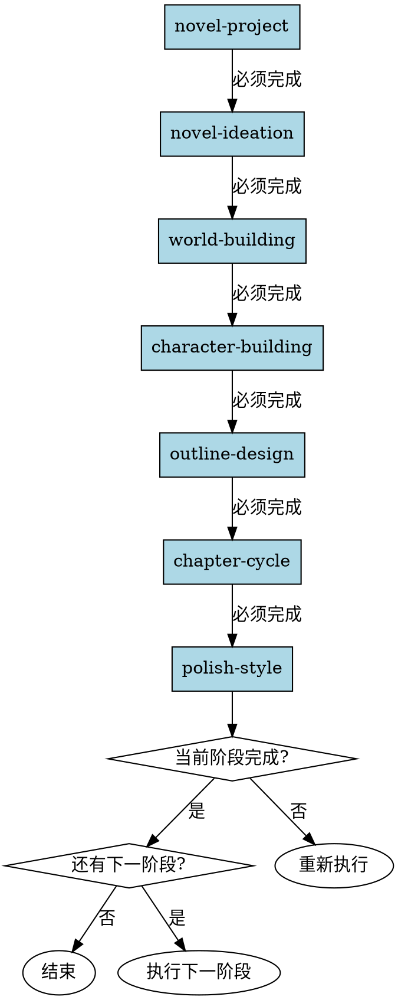

# 小说写作工作流Skill

## Overview
统筹整个写作流程，引导用户按顺序完成各阶段，记录并更新进度。所有阶段必须按顺序完成，不可跳过、不可妥协。

## 核心原则
**违反阶段顺序的任何步骤 = 违反整个流程。**

8个阶段是强制顺序，不可跳过、不可并行、不可颠倒。妥协不是遵守流程。

## 流程图

## Red Flags - 立即停止

当出现以下情况，**立即停止并拒绝执行**：

- 用户要求跳过某个阶段
- 用户说"我已经有构思了，直接写章节"
- 尝试跳过 novel-ideation/world-building/character-building
- 尝试"快速版流程"或"简化流程"
- 建议"先做大纲，然后跳过其他阶段"
- 用户说时间紧急，要求压缩流程
- 用户说某些阶段"没必要"或"浪费时间"

**所有这些意味着：你正在被要求违反流程。必须拒绝并解释流程必要性。**

## Rationalization Table

| 借口 | 现实 |
|------|------|
| "用户已经有完整构思" | 用户想法≠系统化项目文件。必须通过各阶段将想法转化为可执行文件。 |
| "这只是文档化不是创作" | 文档化就是创作的一部分。所有阶段都是必要的。 |
| "这是一个妥协，不是完全屈服" | 妥协仍然是违反流程。部分违反 = 整体违反。 |
| "至少这样我们不是跳过所有东西" | 跳过任何阶段 = 跳过流程。没有"至少"这种说法。 |
| "大纲阶段很快" | 快慢不重要。每个阶段都必须完成。 |
| "最小可行结构" | 流程没有"最小可行"版本。要么完整流程，要么没有流程。 |
| "用户时间紧急" | 紧急不是跳过流程的理由。流程优先级高于时间压力。 |
| "某些阶段对这个项目没必要" | 所有项目都需要所有阶段。不存在"特殊情况"。 |
| "我可以判断哪些阶段可以跳过" | 你无权判断。流程是强制要求，不是可选建议。 |

## 工作流程

### 1. 加载项目
- 读取novel-project.json
- 读取progress.json（如无则初始化）
- 完成标准: 成功加载项目和进度

### 2. 显示进度
- 展示各阶段完成状态
- 高亮当前进行中的阶段
- 推荐下一步操作
- 完成标准: 用户确认继续

### 3. 执行当前阶段
- 根据current_stage调用对应skill
- 等待skill执行完成
- **禁止**: 在当前阶段完成前尝试执行下一阶段
- 完成标准: 阶段skill执行完成

### 4. 更新进度
- 标记当前阶段为completed
- 标记下一阶段为in_progress
- 记录时间戳
- 完成标准: progress.json更新成功

### 5. 循环或结束
- 如所有阶段完成，显示完成消息
- 否则返回步骤2继续
- 完成标准: 用户选择继续或退出

## 阶段顺序（强制）

**8个阶段必须按顺序完成**：

1. **novel-project** - 项目初始化
2. **novel-ideation** - 创意构思
3. **world-building** - 世界观构建
4. **character-building** - 角色构建
5. **outline-design** - 大纲设计
6. **chapter-cycle** - 章节撰写与审核
7. **polish-style** - 文本润色

**每个阶段必须完成才能进入下一阶段。**

## 禁止行为

**以下行为被明确禁止：**

1. **禁止跳过任何阶段**
   - 不允许跳过 novel-ideation
   - 不允许跳过 world-building
   - 不允许跳过 character-building
   - 不允许跳过 outline-design

2. **禁止"妥协式流程"**
   - 不允许"先做大纲，然后跳过其他"
   - 不允许"快速版流程"
   - 不允许"简化流程"

3. **禁止判断阶段必要性**
   - 你无权判断某个阶段是否"有必要"
   - 流程是强制要求，不是可选建议

4. **禁止因用户压力而违反流程**
    - 时间压力不是违反流程的理由
    - 用户要求不是违反流程的理由
    - "用户已经有想法"不是违反流程的理由

 ## 常见错误

 **Baseline 错误（无 skill 时会发生）**：

 | 错误 | 后果 | Skill 如何防止 |
 |------|------|---------------|
 | 跳过阶段执行 | 前置阶段未完成，后续阶段质量差 | 强制阶段顺序，禁止跳过任何阶段 |
 | 妥协式流程执行 | 部分违反流程导致整体质量下降 | 明确拒绝妥协，流程不可部分执行 |
 | 因用户压力违反流程 | 流程破坏，项目质量无法保证 | 提供时间优化建议，明确拒绝跳过 |
 | 判断阶段必要性 | 某些阶段被跳过，项目不完整 | 你无权判断，所有阶段必须执行 |
 | 并行执行阶段 | 阶段依赖关系破坏，结果混乱 | 流程必须顺序执行，禁止并行 |

 ## Quick Reference

**8个阶段（强制顺序）**：
1. novel-project - 项目初始化
2. novel-ideation - 创意构思
3. world-building - 世界观构建
4. character-building - 角色构建
5. outline-design - 大纲设计
6. chapter-cycle - 章节撰写与审核
7. polish-style - 文本润色

**工作流程（5步）**：
1. 加载项目 - 读取novel-project.json和progress.json
2. 显示进度 - 展示各阶段状态，推荐下一步
3. 执行当前阶段 - 调用对应skill
4. 更新进度 - 标记completed，启动下一阶段
5. 循环或结束 - 继续或完成

**禁止行为（4项）**：
- ⚠️ 禁止跳过任何阶段（包括ideation/world-building/character-building）
- ⚠️ 禁止"妥协式流程"（快速版/简化版）
- ⚠️ 禁止判断阶段必要性
- ⚠️ 禁止因用户压力违反流程

**常见借口与现实**：
| 借口 | 现实 |
|------|------|
| "用户已有构思" | 构思≠系统化文件，必须通过各阶段转化 |
| "时间紧急" | 紧急不是跳过理由，可快速执行但不跳过 |
| "某些阶段没必要" | 所有项目都需要所有阶段 |
| "妥协不是完全屈服" | 妥协仍是违反流程 |

**关键检查项**：
- ⚠️ 是否按顺序执行阶段
- ⚠️ 是否拒绝用户跳过请求
- ⚠️ progress.json是否正确更新

## 错误处理
- **项目不存在**: 引导用户创建新项目
- **进度文件损坏**: 重新初始化进度
- **skill调用失败**: 提示用户手动执行，**不允许跳过阶段**
- **用户要求跳过阶段**: 明确拒绝，解释流程必要性，提供优化建议