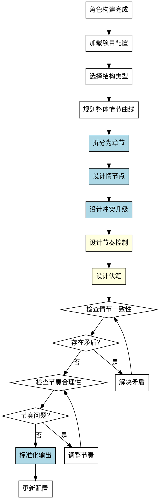

# 大纲设计Skill

## Overview
从世界观到章节级规划，创建完整的小说大纲，包括章节结构、情节点、冲突设计、节奏控制和伏笔设计。

**核心原则: 大纲设计 = 系统性结构选择 + 标准化章节模板 + 起承转合情节节点 + 冲突升级设计 + 节奏控制 + 伏笔设计 + 验证机制。**

部分系统化方法有框架意识，但问题列表较散，结构规划偏向模板套用，情节设计依赖灵感，缺乏系统性方法，容易遗漏关键维度。系统化方法确保完整性和合理性。

## Pattern Recognition - 何时使用此skill

**使用此skill的场景**：
- 用户说"我想规划一下大纲，比如章节结构、情节安排..." → **启动大纲设计**
- 用户说"我想设计章节划分和关键情节点" → **启动大纲设计**
- 用户说"我想规划故事的节奏和高潮位置" → **启动大纲设计**
- 用户说"我完成了角色构建，接下来做什么？" → **建议使用此skill**

**Red Flags - 必须使用此skill**：
- 尝试问题列表较散，缺乏结构化引导（禁止）
- 尝试结构规划偏向模板套用（禁止）
- 尝试情节设计依赖灵感（禁止）
- 尝试遗漏关键维度（如伏笔设计、节奏控制）（禁止）
- 尝试没有明确的验证步骤（禁止）
- 尝试在角色构建未完成时设计大纲（禁止）

**所有这些意味着：用户需要系统化的大纲设计过程，必须使用此skill。**

## 流程图



## 工作流程

### 1. 加载项目配置
- 读取 novel-project.yaml
- 确认角色构建已完成（character-building.status = "completed"）
- 检查 outline 部分的状态
- **完成标准**: 成功加载配置并确认前置条件满足

### 2. 选择结构类型（系统化选择，非模板套用）

**禁止模板套用！必须根据故事特性选择合适结构：**

**结构类型选择指导：**

| 结构类型 | 适用场景 | 核心特征 |
|---------|---------|---------|
| three_act | 经典叙事、单一主线冲突 | 建立→对抗→解决，节奏平稳 |
| four_act | 复杂冲突、双线叙事 | 更细致的阶段划分，适合长篇 |
| hero_journey | 成长故事、冒险叙事 | 12阶段旅程，强调主角成长弧线 |
| custom | 特殊叙事需求（如多视角、非线性） | 根据故事特性定制 |

**选择原则：**
- 单一主角、单一主线冲突 → three_act
- 双主角或多线冲突 → four_act
- 成长冒险故事 → hero_journey
- 特殊叙事需求（如时间循环、多视角） → custom

**完成标准**: 根据故事特性选择合适结构，而非随意套用模板

### 3. 规划整体情节曲线（起承转合）

**禁止依赖灵感！必须使用系统性情节节点设计：**

**情节曲线核心节点（起承转合）：**

```yaml
plot_curve:
  setup: # 起（建立）
    opening: "开篇引入（主角日常、世界观）"
    inciting_incident: "激励事件（打破平衡）"
    first_turning_point: "第一转折点（进入新世界）"
  
  confrontation: # 承（对抗）
    rising_action: "冲突升级（一系列对抗）"
    midpoint: "中点转折（真相揭示或方向改变）"
    low_point: "低点（主角最大挫折）"
  
  resolution: # 转（转折）
    climax: "高潮（关键决战或真相揭露）"
  
  conclusion: # 合（结局）
    falling_action: "后果处理（高潮后的余波）"
    ending: "结局（新平衡或开放式）"
```

**每个节点必须明确：**
- 节点位置（在第几章）
- 节点内容（具体事件）
- 节点作用（推动什么变化）

**完成标准**: 整体情节曲线包含完整的起承转合节点

### 4. 拆分为章节（标准化章节模板）

**禁止非标准化章节定义！必须使用以下模板：**

```yaml
chapters:
  - number: 1
    title: "章节标题"
    purpose: "本章目的（明确功能）"
    plot_points:
      - "情节点1：具体事件"
      - "情节点2：具体事件"
    key_scenes:
      - scene: "关键场景1"
        characters: ["出场角色"]
        location: "场景地点"
        conflict: "场景冲突"
    conflicts:
      - type: "冲突类型（外部/内部/人际关系）"
        participants: ["参与角色"]
        escalation: "冲突升级方式"
    character_appearances:
      - character: "角色名"
        arc_progress: "本章弧线进展"
    foreshadowing:
      - hint: "伏笔内容"
        payoff_chapter: "揭示章节"
        type: "伏笔类型（情节/角色/世界观）"
    tension_level: "张力等级（低/中/高）"
    status: "planned"
```

**每个章节必须包含：**
- purpose（本章目的）
- plot_points（具体情节点）
- key_scenes（关键场景）
- conflicts（冲突设计）
- character_appearances（角色弧线进展）
- foreshadowing（伏笔设计，易遗漏！）
- tension_level（张力等级）

**完成标准**: 所有章节使用标准化模板定义

### 5. 设计情节点（系统性方法）

**禁止依赖灵感！必须使用系统性情节点设计方法：**

**情节点设计维度：**

```yaml
plot_point_design:
  event: "具体事件"
  type: "情节点类型（激励事件/转折点/高潮/伏笔揭示）"
  impact:
    on_plot: "对情节的影响"
    on_character: "对角色的影响"
    on_world: "对世界观的影响"
  setup:
    prerequisites: "前置条件（需要先完成什么）"
    foreshadowing: "伏笔设置（需要提前埋下什么）"
  conflict_level: "冲突强度（1-10）"
  tension_curve: "张力曲线位置（上升/峰值/下降）"
```

**情节点类型：**
- 激励事件：打破平衡，启动故事
- 转折点：改变方向，揭示真相
- 高潮：冲突爆发，关键决战
- 伏笔揭示：揭示提前埋下的线索
- 低点：主角最大挫折
- 结局：问题解决，新平衡

**完成标准**: 每个情节点使用系统性方法设计

### 6. 设计冲突升级（核心）

**禁止笼统冲突设计！必须使用冲突升级设计：**

**冲突升级设计：**

```yaml
conflict_escalation:
  - level: 1
    type: "潜在冲突（矛盾萌芽）"
    example: "角色间的初步分歧"
  
  - level: 2
    type: "显性冲突（矛盾爆发）"
    example: "公开对抗或争论"
  
  - level: 3
    type: "危机冲突（矛盾激化）"
    example: "关键事件触发生死抉择"
  
  - level: 4
    type: "高潮冲突（矛盾决战）"
    example: "最终对决或真相揭露"
```

**冲突升级原则：**
- 每个章节至少有一个冲突事件
- 冲突强度逐步升级（level 1 → level 4）
- 冲突类型多样化（外部/内部/人际关系）

**完成标准**: 冲突升级设计完整，强度逐步递增

### 7. 设计节奏控制（易遗漏！）

**禁止遗漏节奏控制！必须设计张力曲线：**

**张力曲线设计：**

```yaml
tension_curve:
  - chapter_range: "第1-5章"
    tension_level: "中"
    curve_type: "上升"
    description: "建立冲突，张力逐步上升"
  
  - chapter_range: "第6-10章"
    tension_level: "高"
    curve_type: "峰值"
    description: "中点转折，张力达到峰值"
  
  - chapter_range: "第11-12章"
    tension_level: "中"
    curve_type: "下降"
    description: "低点挫折，张力短暂下降"
  
  - chapter_range: "第13-15章"
    tension_level: "极高"
    curve_type: "峰值"
    description: "高潮决战，张力最高峰"
  
  - chapter_range: "第15章结局"
    tension_level: "低"
    curve_type: "下降"
    description: "问题解决，张力回落"
```

**节奏控制原则：**
- 张力曲线应有起伏（不能一直高或一直低）
- 高潮前应有低点（营造反差）
- 结局张力回落（给读者喘息空间）

**完成标准**: 张力曲线设计完整，节奏合理

### 8. 设计伏笔（易遗漏！）

**禁止遗漏伏笔设计！必须使用伏笔设计方法：**

**伏笔设计：**

```yaml
foreshadowing_design:
  - hint_id: 1
    hint_content: "伏笔内容（暗示线索）"
    hint_type: "伏笔类型（情节/角色/世界观）"
    hint_chapter: "埋下章节"
    payoff_content: "揭示内容（真相揭露）"
    payoff_chapter: "揭示章节"
    hint_technique: "伏笔技巧（象征/对话/细节/重复）"
```

**伏笔类型：**
- 情节伏笔：暗示后续情节发展
- 角色伏笔：暗示角色真实身份或动机
- 世界观伏笔：暗示世界观真相

**伏笔技巧：**
-象征：用象征性物品暗示
-对话：通过对话暗示
-细节：通过细节描写暗示
-重复：通过重复出现暗示

**完成标准**: 伏笔设计完整，埋下和揭示对应

### 9. 一致性检查（验证机制）

**必须检查的一致性：**

**情节一致性**：
- 情节点之间是否连贯（无跳跃）
- 情节是否利用了角色特征
- 情节是否符合世界观规则

**冲突一致性**：
- 冲突升级是否合理（强度递增）
- 冲突是否与角色弧线呼应
- 冲突是否推动情节发展

**节奏一致性**：
- 张力曲线是否有起伏
- 高潮位置是否合理
- 低点是否为高潮铺垫

**伏笔一致性**：
- 伏笔是否在揭示章节揭示
- 伏笔是否与真相对应
- 伏笔是否不突兀（读者能回想）

**角色弧线一致性**：
- 角色弧线是否在章节中体现
- 角色成长是否与情节呼应
- 角色出场是否合理

**如果存在矛盾**: 解决矛盾，然后重新检查

### 10. 标准化输出

**禁止非标准化输出！必须使用以下格式：**

```yaml
outline_design:
  structure:
    type: "three_act/four_act/hero_journey/custom"
    reason: "选择原因（根据故事特性）"
  
  plot_curve:
    setup:
      opening: "开篇引入"
      inciting_incident: "激励事件"
      first_turning_point: "第一转折"
    confrontation:
      rising_action: "冲突升级"
      midpoint: "中点转折"
      low_point: "低点"
    resolution:
      climax: "高潮"
    conclusion:
      falling_action: "后果"
      ending: "结局"
  
  chapters:
    - number: 1
      title: "章节标题"
      purpose: "本章目的"
      plot_points: ["情节点"]
      key_scenes:
        - scene: "场景"
          characters: ["角色"]
          location: "地点"
          conflict: "冲突"
      conflicts:
        - type: "冲突类型"
          participants: ["角色"]
          escalation: "升级方式"
      character_appearances:
        - character: "角色"
          arc_progress: "弧线进展"
      foreshadowing:
        - hint: "伏笔"
          payoff_chapter: "揭示章节"
          type: "类型"
      tension_level: "张力等级"
      status: "planned"
  
  conflict_escalation:
    - level: 1
      type: "冲突类型"
      example: "示例"
  
  tension_curve:
    - chapter_range: "章节范围"
      tension_level: "张力等级"
      curve_type: "曲线类型"
      description: "描述"
  
  foreshadowing_design:
    - hint_id: 1
      hint_content: "伏笔内容"
      hint_type: "类型"
      hint_chapter: "埋下章节"
      payoff_content: "揭示内容"
      payoff_chapter: "揭示章节"
      hint_technique: "技巧"
  
  status: "completed"
```

### 11. 更新配置
- 将以上内容写入 novel-project.yaml 的 outline 部分
- 设置 outline.status 为 "completed"
- **完成标准**: 配置文件成功更新

## 禁止行为

**以下行为被明确禁止：**

1. **禁止模板套用**
   - 不允许随意套用三幕结构，必须根据故事特性选择
   - 必须遵循结构选择原则

2. **禁止依赖灵感设计情节**
   - 不允许依赖灵感设计情节点，必须使用系统性方法
   - 必须明确情节点类型、影响、前置条件

3. **禁止遗漏节奏控制**
   - 不允许不设计张力曲线
   - 必须设计张力起伏（高潮、低点）

4. **禁止遗漏伏笔设计**
   - 不允许不设计伏笔，必须使用伏笔设计方法
   - 必须明确埋下章节和揭示章节

5. **禁止没有验证机制**
   - 不允许不检查一致性（情节、冲突、节奏、伏笔、角色弧线）
   - 必须检查 5 个一致性维度

6. **禁止非标准化章节定义**
   - 不允许使用非标准格式的章节定义
   - 必须包含所有字段（purpose, plot_points, key_scenes, conflicts, character_appearances, foreshadowing, tension_level）

7. **禁止在角色构建未完成时设计大纲**
   - character-building.status 必须为 "completed"
   - 否则提示用户先完成角色构建

## 常见错误

**Baseline 错误（无 skill 时会发生）**：

| 错误 | 后果 | Skill 如何防止 |
|------|------|---------------|
| 问题列表较散 | 缺乏结构化引导，遗漏维度 | 系统化流程（11个步骤）+标准化模板 |
| 结构规划偏向模板套用 | 不适应特殊需求 | 根据故事特性选择结构（选择原则） |
| 情节设计依赖灵感 | 设计随机，质量不稳定 | 系统性情节点设计方法（6个维度） |
| 没有验证步骤 | 不知道大纲是否合理 | 强制一致性检查（5个维度） |
| 遗漏节奏控制 | 张力曲线不合理，节奏问题 | 强制张力曲线设计（曲线类型） |
| 遗漏伏笔设计 | 缺少伏笔，真相突兀 | 强制伏笔设计（埋下/揭示对应） |
| 部分系统化 | 质量不稳定，遗漏关键信息 | 系统化方法确保完整性和合理性 |

## Quick Reference

**结构选择原则**：
- 单一主角、单一主线冲突 → three_act
- 双主角或多线冲突 → four_act
- 成长冒险故事 → hero_journey
- 特殊叙事需求 → custom

**情节曲线节点（起承转合）**：
- setup: opening, inciting_incident, first_turning_point
- confrontation: rising_action, midpoint, low_point
- resolution: climax
- conclusion: falling_action, ending

**章节模板字段（7个）**：
1. purpose（本章目的）
2. plot_points（具体情节点）
3. key_scenes（关键场景）
4. conflicts（冲突设计）
5. character_appearances（角色弧线进展）
6. foreshadowing（伏笔设计）⚠️ 易遗漏
7. tension_level（张力等级）⚠️ 易遗漏

**冲突升级等级（4级）**：
1. 潜在冲突（矛盾萌芽）
2. 显性冲突（矛盾爆发）
3. 危机冲突（矛盾激化）
4. 高潮冲突（矛盾决战）

**张力曲线类型（4种）**：
-上升（张力上升）
-峰值（张力最高）
-下降（张力下降）
-回落（张力回归）

**伏笔技巧（4种）**：
-象征、对话、细节、重复

**一致性检查维度（5个）**：
1. 情节一致性
2. 冲突一致性
3. 节奏一致性
4. 伏笔一致性
5. 角色弧线一致性

## AI角色
协作伙伴模式 - 建议结构、质疑逻辑漏洞、帮助设计节奏

## 注意事项
- 章节数量根据目标字数和每章字数估算
- 每章应有明确的目的
- 情节点要具体，不能模糊
- 张力曲线应有起伏，不能一直高或一直低
- 伏笔设计要隐蔽，不能太明显
- 如需修改已完成的 outline，可将 status 改为 "in_progress" 后重新执行

## 错误处理

- **配置文件不存在**: 提示用户先运行 novel-project skill 创建项目
- **前置条件不满足**: 如果 character-building.status 不是 completed，提示用户先完成角色构建阶段
- **章节规划冲突**: 发现情节点矛盾时，提醒用户澄清
- **节奏问题**: 发现张力曲线不合理时（如一直高），提醒用户调整