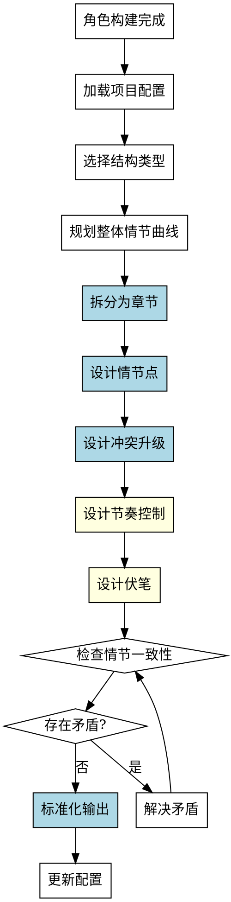

# 大纲设计Skill

## Overview
从世界观到章节级规划，创建完整的小说大纲，包括章节结构、情节点、冲突设计、节奏控制和伏笔设计。

**核心原则: 大纲设计 = 系统性结构选择 + 标准化章节模板 + 起承转合情节节点 + 冲突升级设计 + 节奏控制 + 伏笔设计 + 验证机制。**

## Pattern Recognition

**使用此skill的场景**：
- 用户说"我想规划一下大纲，比如章节结构、情节安排..." → **启动大纲设计**
- 用户说"我想设计章节划分和关键情节点" → **启动大纲设计**
- 用户说"我想规划故事的节奏和高潮位置" → **启动大纲设计**

**Red Flags - 必须使用此skill**：
- 尝试问题列表较散，缺乏结构化引导（禁止）
- 尝试结构规划偏向模板套用（禁止）
- 尝试遗漏关键维度（如伏笔设计、节奏控制）（禁止）
- 尝试在角色构建未完成时设计大纲（禁止）

## 流程图

## 工作流程

### 1. 加载项目配置
- 读取 novel-project.yaml，确认角色构建已完成

### 2. 选择结构类型
详见 reference/structure-guidance.md

**禁止模板套用！必须根据故事特性选择合适结构。**

### 3. 规划整体情节曲线
详见 reference/plot-design.md（情节曲线核心节点）

**禁止依赖灵感！必须使用系统性情节节点设计。**

### 4. 拆分为章节
详见 reference/chapter-template.md

**禁止非标准化章节定义！必须使用标准化模板。**

### 5. 设计情节点
详见 reference/plot-design.md（情节点设计维度）

### 6. 设计冲突升级
详见 reference/plot-design.md（冲突升级设计）

### 7. 设计节奏控制
详见 reference/plot-design.md（张力曲线设计）

**禁止遗漏节奏控制！必须设计张力曲线。**

### 8. 设计伏笔
详见 reference/plot-design.md（伏笔设计）

**禁止遗漏伏笔设计！必须使用伏笔设计方法。**

### 9. 一致性检查
详见 Quick Reference（一致性检查维度）

### 10. 标准化输出
详见 reference/output-format.md

## 禁止行为

1. **禁止模板套用** - 必须根据故事特性选择结构
2. **禁止依赖灵感设计情节** - 必须使用系统性方法
3. **禁止遗漏节奏控制** - 必须设计张力曲线
4. **禁止遗漏伏笔设计** - 必须明确埋下和揭示章节
5. **禁止没有验证机制** - 必须检查一致性（5个维度）
6. **禁止非标准化章节定义** - 必须包含所有字段
7. **禁止在角色构建未完成时设计大纲** - character-building.status 必须为 completed

## 常见错误

| 错误 | 后果 | Skill 如何防止 |
|------|------|---------------|
| 问题列表较散 | 遗漏维度 | 系统化流程（11个步骤）+标准化模板 |
| 结构规划偏向模板套用 | 不适应特殊需求 | 根据故事特性选择结构 |
| 情节设计依赖灵感 | 设计随机 | 系统性情节点设计方法 |
| 遗漏节奏控制 | 张力曲线不合理 | 强制张力曲线设计 |
| 遗漏伏笔设计 | 真相突兀 | 强制伏笔设计 |

## Quick Reference

**结构选择原则**：
- 单一主角、单一主线冲突 → three_act
- 双主角或多线冲突 → four_act
- 成长冒险故事 → hero_journey
- 特殊叙事需求 → custom

**章节模板字段（7个）**：
1. purpose（本章目的）
2. plot_points（具体情节点）
3. key_scenes（关键场景）
4. conflicts（冲突设计）
5. character_appearances（角色弧线进展）
6. foreshadowing（伏笔设计）⚠️ 易遗漏
7. tension_level（张力等级）⚠️ 易遗漏

**冲突升级等级（4级）**：
1. 潜在冲突（矛盾萌芽）
2. 显性冲突（矛盾爆发）
3. 危机冲突（矛盾激化）
4. 高潮冲突（矛盾决战）

**一致性检查维度（5个）**：
1. 情节一致性
2. 冲突一致性
3. 节奏一致性
4. 伏笔一致性
5. 角色弧线一致性

## 错误处理

- **配置文件不存在**: 提示用户先运行 novel-project skill 创建项目
- **前置条件不满足**: 如果 character-building.status 不是 completed，提示用户先完成角色构建