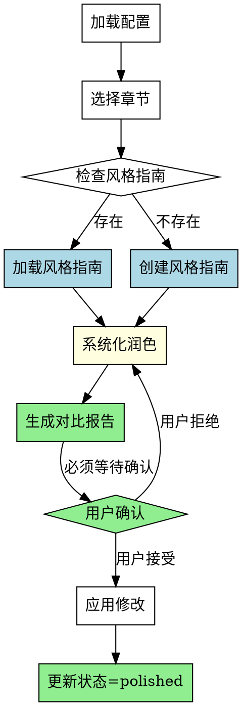

# 文本润色Skill

## Overview
文字润色、风格统一，提升章节文本质量。系统化润色流程，确保风格指南参考、对比报告生成、用户确认等待。

## 核心原则
**润色质量 = 风格指南遵守 + 对比报告生成 + 用户确认流程。**

## 流程图

## 工作流程

### 1. 加载项目配置
- 读取novel-project.yaml，确认存在reviewed状态的章节

### 2. 选择要润色的章节
- 列出所有reviewed状态的章节，用户选择

### 3. 读取/创建风格指南（必须）
详见 reference/style-guide.md

**禁止**: 在没有风格指南的情况下直接润色

### 4. 执行系统化润色（4个类别）
详见 reference/polish-categories.md

**禁止**: 只做部分润色（必须执行4个类别）

### 5. 生成对比报告（必须）
详见 reference/report-format.md

**禁止**: 不生成对比报告、不说明修改理由（Rationale）

### 6. 用户确认（必须等待）
详见 reference/report-format.md（用户确认部分）

**禁止**: 不调用question工具、使用markdown checkbox代替question工具

### 7. 应用修改并更新状态
- 应用用户接受的修改
- 更新chapters.polished列表

## Red Flags

- 在没有风格指南的情况下直接润色 → 停止
- 只做部分润色（遗漏类别） → 停止
- 不生成对比报告 → 停止
- 不调用question工具等待用户确认 → 停止
- 使用markdown checkbox列表代替question工具 → 停止
- 不说明修改理由 → 停止

## 禁止行为

**以下行为被明确禁止**：

1. **禁止没有风格指南直接润色** - 必须先检查或创建风格指南
2. **禁止只做部分润色** - 必须执行所有4个类别（句式/词汇/节奏/风格）
3. **禁止不生成对比报告** - 必须生成Before/After + Rationale
4. **禁止不调用question工具** - 必须使用question工具等待用户确认
5. **禁止使用markdown checkbox代替question工具** - 必须调用question工具
6. **禁止不说明修改理由** - 必须为每个修改提供Rationale

**所有禁止行为意味着：润色不够系统化，会导致质量问题。**

## 常见错误

| 错误 | 修正 |
|------|------|
| 没有风格指南直接润色 | 必须先创建风格指南 |
| 只做部分润色 | 执行所有4个类别 |
| 不生成对比报告 | 必须生成 Before/After + Rationale |
| 使用checkbox列表确认 | 必须使用question工具，设置multiple: true |
| 不调用question工具直接改 | 必须等待question工具返回结果 |

## Quick Reference

**核心流程**：检查风格指南 → 4类润色 → 生成对比报告 → question工具确认 → 应用修改

**工作流程（7步）**：
1. 加载配置
2. 选择章节
3. 读取/创建风格指南 ⚠️ 易遗漏
4. 执行润色（4个类别）⚠️ 必须全部执行
5. 生成对比报告 ⚠️ 易遗漏
6. 用户确认（question工具）⚠️ 必须使用question工具
7. 应用修改

**4个润色类别**：
1. 句式优化 - 长句拆分/短句合并/句式多样化
2. 节奏调整 - 段落节奏/情节推进速度
3. 风格统一 - 视角/语言/对话一致性
4. 用词改进 - 重复词汇替换/用词精准化

**禁止行为（6项）**：
- ⚠️ 禁止没有风格指南直接润色
- ⚠️ 禁止只做部分润色
- ⚠️ 禁止不生成对比报告
- ⚠️ 禁止不调用question工具
- ⚠️ 禁止使用markdown checkbox代替question工具
- ⚠️ 禁止不说明修改理由

## 错误处理

- **配置文件不存在**: 提示用户先运行novel-project skill创建项目
- **无reviewed章节**: 提示用户先完成审阅修订阶段