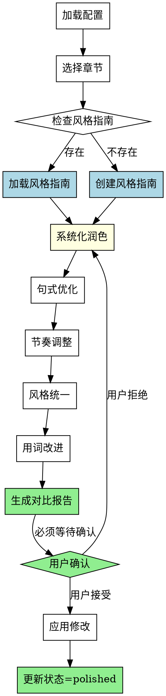

# 文本润色Skill

## Overview
文字润色、风格统一，提升章节文本质量。系统化润色流程，确保风格指南参考、对比报告生成、用户确认等待。

## 核心原则
**润色质量 = 风格指南遵守 + 对比报告生成 + 用户确认流程。**

不系统化的润色会导致风格不一致、用户无法审阅修改、改进理由不透明。

## 流程图



## 工作流程

### 1. 加载项目配置
- 读取novel-project.yaml
- 确认存在reviewed状态的章节
- 完成标准: 成功读取配置

### 2. 选择要润色的章节
- 列出所有reviewed状态的章节
- 用户选择要润色的章节
- 完成标准: 用户选择一个章节

### 3. 读取/创建风格指南（必须）
- **必须检查风格指南是否存在**：
  - 如果存在：加载作为参考
  - 如果不存在：**必须协助用户创建风格指南**
- **风格指南内容**：
  - 叙事视角（第一人称/第三人称）
  - 语言风格（口语化/书面化）
  - 节奏偏好（快节奏/慢节奏）
  - 常用词汇库（避免重复用词）
- **禁止**: 在没有风格指南的情况下直接润色（会导致风格不一致）
- **完成标准**: 风格指南可用（已加载或已创建）

### 4. 执行系统化润色（4个类别）
- **必须执行以下 4 个润色类别**：
  
  **4.1 句式优化**
  - 长句拆分（提高可读性）
  - 短句合并（提高连贯性）
  - 句式多样化（避免单调）
  - **完成标准**: 句式结构优化
  
  **4.2 节奏调整**
  - 段落节奏（快速场景 vs 慢节奏场景）
  - 情节推进速度（关键情节放慢，过渡情节加快）
  - **完成标准**: 节奏与情节匹配
  
  **4.3 风格统一**
  - 叙事视角一致性
  - 语言风格一致性（符合风格指南）
  - 角色对话风格一致性
  - **完成标准**: 风格与指南一致
  
  **4.4 用词改进**
  - 重复词汇替换（避免同一词汇反复出现）
  - 用词精准化（更准确的动词/形容词）
  - **完成标准**: 用词精准且多样

- **禁止**: 只做部分润色（必须执行 4 个类别）
- **完成标准**: 所有 4 个类别执行完成

### 5. 生成对比报告（必须）
- **必须生成以下对比报告**：
  - Before: 原文片段
  - After: 润色后片段
  - Category: 属于哪个润色类别（句式/节奏/风格/用词）
  - Rationale: **修改理由**（必须说明）
- **禁止**: 不生成对比报告（用户无法审阅修改）
- **完成标准**: 对比报告生成

### 6. 用户确认（必须等待）
- **必须使用 `question` 工具等待用户确认修改**：
  - 生成对比报告后，**必须调用 `question` 工具**，将每一项修改作为一个可选项列出
  - 使用 `multiple: true` 允许用户选择接受哪些项
  - 标签格式：`"接受项 #N: [类别] [简述]"` — 清晰标注每项对应哪个修改
  - 未被选中的项视为拒绝，不应用
  - **严禁** 使用 markdown checkbox 列表（`- [ ]`），因为用户无法在终端中勾选
- **禁止**: 直接修改文件（不等待用户确认）
- **禁止**: 不调用 question 工具而假设用户接受全部修改
- **完成标准**: question 工具返回用户选择结果

### 7. 应用修改并更新状态
- 应用用户接受的修改
- 保存润色后版本
- 更新chapters.polished列表
- **同时更新配置文件**（novel-project.yaml）
- **完成标准**: 文件保存成功且配置更新

## 对比报告格式（强制）

```markdown
# 润色对比报告 - 第X章

## 总览
- 润色项数: X
- 句式优化: X项
- 节奏调整: X项
- 风格统一: X项
- 用词改进: X项

## 详细对比

### 项 #1: 句式优化
**位置**: 第2段
**Before**: "张三走了走，看了一下，觉得很奇怪。"
**After**: "张三漫步在街道上，目光扫过周围的景象，心头涌起一丝异样。"
**Rationale**: 原句动词重复（"走了走"、"看了一下"），句式单调。改为更精准的动词（"漫步"、"扫过"），增加情感描写（"心头涌起一丝异样"），使动作和情感更生动。

### 项 #2: 节奏调整
**位置**: 第5段
**Before**: "他觉得这个案子有点难度，不过应该能解决。"
**After**: "他凝视着案件材料，眉头微皱。这个案子确实棘手，但并非无解。"
**Rationale**: 原句节奏过快，心理活动一笔带过。改为慢节奏，加入动作描写（"凝视"、"眉头微皱"），增加思考过程的呈现，使节奏与关键情节匹配。

### 项 #3: 风格统一
**位置**: 第10段
**Before**: "他思考了一会儿，然后做出了决定。"
**After**: "侦探张三沉吟片刻，随即拍板定案。"
**Rationale**: 原句用词过于通用，不符合角色身份。改为符合侦探身份的用词（"沉吟"、"拍板定案"），保持与角色设定一致的风格。

### 项 #4: 用词改进
**位置**: 第12段
**Before**: "他觉得..."
**After**: "他感到..."
**Rationale**: 第12段中"觉得"已是第5次出现，词汇重复。改为"感到"以增加用词多样性，避免读者疲劳。

---

## 用户确认

**必须调用 `question` 工具**，将每一项修改作为选项列出。格式示例：

```json
{
  "questions": [{
    "question": "以下润色修改请选择要应用的项，未选中的项将被跳过：",
    "header": "润色确认",
    "multiple": true,
    "options": [
      {"label": "接受项 #1: 用词 · 闪烁→明灭", "description": "Ch2/Ch5/Ch10 中替换重复的'闪烁'为'明灭/频率'"},
      {"label": "接受项 #2: 节奏 · 拾壹开口停顿", "description": "Ch11 在拾壹变深蓝和发言之间加入'深蓝了整整三秒'停顿"},
      {"label": "接受项 #3: 用词 · 指示灯描写", "description": "Ch9行16 增加'不紧不慢'赋予拾壹状态以节奏感"},
      {"label": "接受项 #4: 用词 · 保留核心意象", "description": "Ch10/Ch11 拾壹情感关键时刻的'闪烁'保留不作替换"}
    ]
  }]
}
```

**严禁** 使用 markdown checkbox 列表 `- [ ] 项 #X`——用户在终端中无法勾选。
**严禁** 在不调用 question 工具的情况下直接假设用户接受全部修改。

## Red Flags - 润色质量警告

当出现以下情况，**停止并拒绝执行**：

- 在没有风格指南的情况下直接润色
- 只做部分润色（遗漏句式/节奏/风格/用词中的某些类别）
- 不生成对比报告（用户无法审阅修改）
- 不调用 `question` 工具等待用户确认（直接修改文件）
- 使用 markdown checkbox 列表代替 `question` 工具
- 不说明修改理由（用户不知道为什么这样改）
- 假设用户接受全部修改（未使用 question 工具获取用户选择）

**所有这些意味着：润色不够系统化，会导致风格不一致、用户无法审阅、改进理由不透明。**

## 常见错误

| 错误 | 现实 | 修正 |
|------|------|------|
| 没有风格指南直接润色 | 风格不一致，各章节风格各异 | 必须先创建风格指南，确保一致性 |
| 只做部分润色 | 遗漏某些改进维度 | 执行所有 4 个类别（句式/节奏/风格/用词） |
| 不生成对比报告 | 用户无法审阅修改 | 必须生成 Before/After + Rationale |
| 使用 checkbox 列表确认 | 用户在终端中无法勾选 | 必须使用 `question` 工具，设置 `multiple: true` |
| 不说明修改理由 | 用户不知道为什么这样改 | 每个修改项必须包含 Rationale |
| 不调用 question 工具直接改 | 用户失去控制权 | 必须等待 question 工具返回结果后再应用 |

## AI角色
内容生成器模式 - 系统化润色，生成对比报告，等待用户确认

## 输出
- 对比报告（Before/After + Rationale）
- 润色后的章节文件（用户确认接受的修改）
- 更新后的chapters.polished列表
- 更新后的配置文件（novel-project.yaml）

## 注意事项
- **必须先检查/创建风格指南**（润色的基准）
- **必须执行所有 4 个润色类别**（句式/节奏/风格/用词）
- **必须生成对比报告**（Before/After + Rationale）
- **必须等待用户逐项确认**（不直接修改）
- **必须说明修改理由**（每个修改项的 Rationale）
- **同时更新配置文件**（保存章节同时更新 novel-project.yaml）
- 如需重新润色已完成的章节，可将其从chapters.polished中移回chapters.reviewed后重新执行

## 错误处理
- **配置文件不存在**: 提示用户先运行novel-project skill创建项目
- **无reviewed章节**: 提示用户先完成审阅修订阶段
- **章节文件读取失败**: 提示用户检查文件是否存在且格式正确
- **风格指南创建失败**: 提示用户手动创建或提供示例