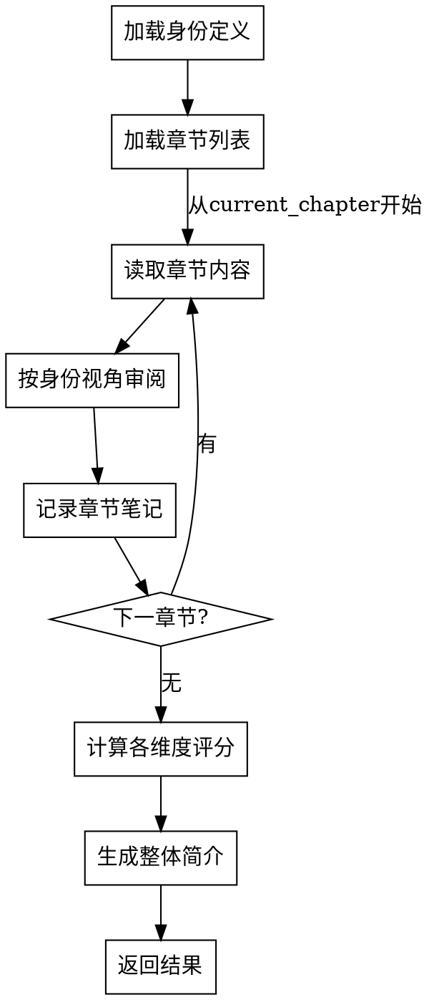

# 单身份读者审阅 Skill

## Overview
执行单个读者身份的完整审阅流程：按章节阅读、记录笔记、计算评分、生成简介。

## 核心原则
**每章必读、每维度必评、权重必应用。**

## 流程图



## 工作流程

### 1. 加载身份定义
- 从 `reader-profiles.json` 读取指定身份
- 提取 `focus`（关注点）和 `scoring_bias`（权重）
- 完成标准：身份信息成功加载

### 2. 加载章节列表
- 读取 `novel-project.json` 的 `outline.chapters`
- 读取 `review-progress.json` 的 `current_chapter`（断点续读）
- 完成标准：章节列表和起始位置确定

### 3. 逐章审阅（循环）
- 读取章节文件 `chapters/chapter-XX.md`
- 按身份 `focus` 关注点审阅
- 记录内部笔记（不输出）
- 更新 `current_chapter`
- 完成标准：所有章节审阅完成

### 4. 计算评分
- 汇总所有章节笔记
- 按4维度评分（1-10分）
- 应用 `scoring_bias` 权重计算 overall_score
- 完成标准：评分计算完成

### 5. 生成简介
- 根据评分和笔记生成 50-100 字简介
- 确定 rating（强烈推荐/推荐/中性/不推荐）
- 完成标准：简介和评级生成

### 6. 返回结果
- 返回 JSON 格式结果给 reader-review
- 完成标准：结果成功返回

## 禁止行为

**以下行为被明确禁止：**

1. **禁止跳过章节** - 必须从第一章读到最后一章
2. **禁止省略维度** - 必须对所有4维度评分
3. **禁止忽略权重** - 必须应用 scoring_bias 计算 overall_score
4. **禁止直接输出** - 笔记仅供内部汇总，不输出给用户

## Red Flags

- 尝试跳过某章节 → STOP，必须完整阅读
- 尝试只评部分维度 → STOP，必须对所有维度评分
- 尝试直接输出笔记 → STOP，笔记仅供内部记录

## Quick Reference

| 步骤 | 输入 | 输出 |
|------|------|------|
| 加载身份 | persona_id | focus, scoring_bias |
| 加载章节 | novel-project.json | chapters[], current_chapter |
| 逐章审阅 | chapter-XX.md | 内部笔记 |
| 计算评分 | 所有笔记 | scores{}, overall_score |
| 生成简介 | scores + 笔记 | summary, rating |

## 输出格式

```json
{
  "persona_id": "casual-reader",
  "persona_name": "休闲读者",
  "scores": {
    "情节设计": 7.5,
    "角色塑造": 6.8,
    "世界观设定": 7.0,
    "语言风格": 6.5
  },
  "overall_score": 6.29,
  "summary": "轻松有趣的科幻小说...",
  "rating": "推荐"
}