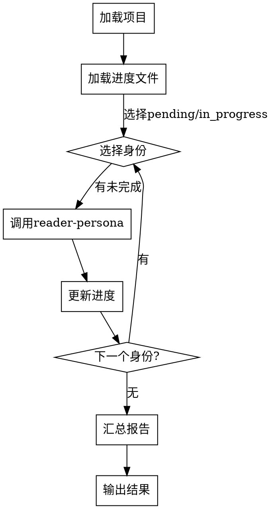

# 读者视角审阅 Skill

## Overview
以多种读者身份审阅小说，调度 reader-persona 执行每个身份的审阅，汇总生成评分报告。支持进度记录和断点续读。

## 核心原则
**所有身份必审阅、进度必记录、报告必汇总。**

5个身份必须顺序完成，不可跳过。进度自动保存，支持断点续读和重置。

## Pattern Recognition

**使用此 skill 的场景**：
- 用户说"我想以读者角度审阅我的小说" → **启动审阅**
- 用户说"继续上次未完成的审阅" → **断点续读**
- 用户说"重新开始审阅" → **重置进度**
- 用户说"查看审阅进度" → **查看状态**

**Red Flags - 必须使用此 skill**：
- 尝试手动审阅小说（禁止，必须用此 skill）
- 尝试跳过某个身份（禁止，必须顺序完成）
- 尝试不记录进度（禁止，必须自动保存）

## 流程图



## 工作流程

### 1. 加载项目
- 读取 `novel-project.json`
- 读取 `outline.chapters` 确定总章节数
- 完成标准：项目信息成功加载

### 2. 加载进度文件
- 检查 `review-progress.json` 是否存在
- 如不存在，创建初始进度文件（所有身份 pending）
- 完成标准：进度文件成功加载或创建

### 3. 选择身份（循环）
- 从进度文件读取身份状态
- 选择第一个 pending 或 in_progress 身份
- 完成标准：身份选择完成

### 4. 调用 reader-persona
- 调用 `reader-persona` skill，传入 persona_id
- 等待审阅完成
- 接收返回结果
- 完成标准：reader-persona 返回结果

### 5. 更新进度
- 更新 `review-progress.json`：
  - status → completed
  - completed_at → 当前时间
  - result → 保存评分结果
- 完成标准：进度文件更新成功

### 6. 循环或结束
- 检查是否还有未完成身份
- 如有，返回步骤 3 继续
- 如无，进入汇总报告
- 完成标准：所有身份完成或继续下一身份

### 7. 汇总报告
- 汇总所有身份的 scores、summary、rating
- 计算平均 overall_score
- 确定整体评级和适合读者群
- 完成标准：汇总报告生成

### 8. 输出结果
- 输出 Markdown 格式汇总报告
- 保存到 `reader-review-report.md`
- 完成标准：报告输出和保存成功

## 功能入口

### 继续审阅（默认）
- 自动检测进度文件
- 从未完成身份继续
- 命令：`reader-review`

### 重置进度
- 清除 `review-progress.json`
- 从第一个身份重新开始
- 命令：`reader-review --reset`

### 查看进度
- 显示各身份状态和已完成结果
- 不执行审阅
- 命令：`reader-review --status`

## 禁止行为

**以下行为被明确禁止：**

1. **禁止跳过身份** - 必须顺序完成所有5个身份
2. **禁止并行执行** - 必须逐个身份顺序执行
3. **禁止不保存进度** - 每完成一个身份必须立即保存
4. **禁止省略报告** - 所有身份完成后必须输出汇总报告

## Red Flags

- 尝试跳过某个身份 → STOP，必须顺序完成
- 尝试不保存进度 → STOP，必须立即保存
- 尝试并行执行多个身份 → STOP，必须顺序执行

## Quick Reference

| 命令 | 功能 | 输出 |
|------|------|------|
| reader-review | 继续审阅 | 审阅结果 |
| reader-review --reset | 重置进度 | 从头开始 |
| reader-review --status | 查看进度 | 进度状态 |

## 进度文件格式

```json
{
  "project_name": "星尘回声",
  "total_chapters": 22,
  "reviews": {
    "casual-reader": {
      "status": "completed",
      "current_chapter": 22,
      "started_at": "2026-05-09T10:00:00",
      "completed_at": "2026-05-09T12:00:00",
      "result": {
        "scores": {...},
        "overall_score": 6.95,
        "summary": "...",
        "rating": "推荐"
      }
    }
  }
}
```

## 输出报告格式

```markdown
# 《小说名》读者审阅报告

## 项目信息
- 类型：[类型]
- 总章节：[章节数]
- 审阅身份：5位

## 身份审阅结果

### [身份名称]
- **评分**：[overall_score]/10
- **评级**：[评级]
- **简介**：[summary]

## 综合评价
- **平均评分**：[平均值]/10
- **整体评级**：[评级]
- **适合读者**：[适合人群]
- **不适合读者**：[不适合人群]
```