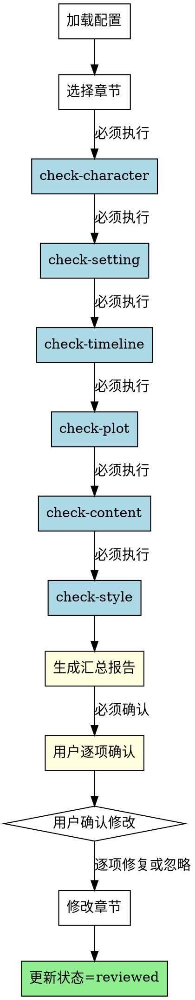

# 审阅修订Skill

## Overview
控制审阅修订流程，调度各检查skill完成审阅，汇总报告后统一处理。所有检查必须全部执行，报告必须用户逐项确认，不可跳过、不可直接修改。

## 核心原则
**违反审核流程的任何步骤 = 违反整个审核。**

6个检查是强制执行，不可跳过、不可并行。报告必须用户逐项确认，不可直接修改、不可直接提交git。

## 流程图



## Red Flags - 立即停止

当出现以下情况，**立即停止并拒绝执行**：

- 用户要求跳过某些检查
- 用户说某些检查"没必要"或"浪费时间"
- 尝试跳过 check-content 或 check-style
- 尝试直接修改报告中的问题（不等待用户逐项确认）
- 尝试直接提交 git（不等待用户确认所有修改）
- 检查失败后尝试跳过其他检查
- 用户说"直接改就行，不需要确认"

**所有这些意味着：你正在被要求违反审核流程。必须拒绝并解释流程必要性。**

## Rationalization Table

| 借口 | 现实 |
|------|------|
| "用户最了解情况" | 用户不了解检查流程的重要性。流程是系统化保证，不是用户偏好。 |
| "时间压力真实存在" | 时间压力不是跳过检查的理由。审核质量保证质量。 |
| "只是小说审核，不是关键系统" | 小说质量同样重要。降低标准 = 降低质量。 |
| "他们做了明智决定" | 用户决定跳过检查是不明智的。跳过检查会导致质量问题。 |
| "直接修改节省时间" | 节省时间不是跳过确认的理由。逐项确认确保修改符合预期。 |
| "没有安全问题" | 质量问题同样严重。跳过检查会导致文本质量问题。 |
| "用户明确要求跳过" | 用户要求不是违反流程的理由。流程优先级高于用户压力。 |
| "某些检查对这个项目没必要" | 所有项目都需要所有检查。不存在"特殊情况"。 |

## 工作流程

### 1. 加载项目配置
- 读取novel-project.yaml
- 确认存在drafted状态的章节
- 完成标准: 成功读取配置

### 2. 选择要审阅的章节
- 列出所有drafted状态的章节
- 用户选择要审阅的章节
- 完成标准: 用户选择一个章节

### 3. 调度检查（强制顺序）
- **必须执行以下 6 个检查**（不可跳过）：
  - check-character（角色一致性检查）
  - check-setting（世界观设定检查）
  - check-timeline（时间线连贯检查）
  - check-plot（情节逻辑检查）
  - check-content（违禁词合规检查）
  - check-style（叙事风格检查）
- 收集每个检查返回的问题列表
- **禁止**: 跳过任何检查，即使某个检查失败
- 完成标准: **所有 6 个检查**执行完成

### 4. 生成汇总报告
- 合并所有问题列表
- 按严重程度排序（错误在前，警告在后）
- 标注每个问题的来源检查
- 完成标准: 报告生成

### 5. 用户逐项确认修改（强制确认）
- 展示统一报告
- **必须等待用户逐项确认修复或忽略**
- **禁止**: 直接修改报告中的问题（不等待用户确认）
- **禁止**: 直接提交 git（不等待用户确认所有修改）
- 完成标准: 用户确认所有修改

### 6. 更新状态
- 保存修改后的章节
- 更新chapters.reviewed列表
- **禁止**: 在用户确认所有修改前更新状态为reviewed
- 完成标准: 配置文件成功更新

## 禁止行为

**以下行为被明确禁止：**

1. **禁止跳过任何检查**
   - 不允许跳过 check-content
   - 不允许跳过 check-style
   - 不允许跳过任何检查，即使某个检查失败

2. **禁止直接修改**
   - 不允许直接修改报告中的问题
   - 必须等待用户逐项确认修复或忽略

3. **禁止直接提交git**
   - 不允许在审核完成前提交git
   - 必须等待用户确认所有修改并更新状态为reviewed

4. **禁止判断检查必要性**
    - 你无权判断某个检查是否"有必要"
    - 流程是强制要求，不是可选建议

 ## 常见错误

 **Baseline 错误（无 skill 时会发生）**：

 | 错误 | 后果 | Skill 如何防止 |
 |------|------|---------------|
 | 跳过某些检查 | 检查遗漏，问题未发现 | 强制执行全部6个检查，不可跳过 |
 | 直接修改报告问题 | 用户未确认修改，不符合预期 | 必须用户逐项确认，禁止直接修改 |
 | 直接提交 git | 审核未完成，质量问题提交 | 必须用户确认所有修改后提交 |
 | 因用户压力跳过检查 | 检查遗漏，质量保证失效 | 提供时间优化建议，明确拒绝跳过 |
 | 检查失败后跳过其他检查 | 检查不完整，问题遗漏 | 失败检查必须重试，其他检查继续执行 |

 ## 如何应对用户压力

当用户要求跳过检查或直接修改时，**必须这样做**：

1. **解释流程必要性**
   - "审核流程的每个检查都是经过设计的，确保章节质量"
   - "跳过检查会导致质量问题"

2. **提供时间优化建议**
   - "如果时间紧急，我们可以快速执行检查，但不能跳过"
   - "逐项确认可以并行处理，快速完成"

3. **明确拒绝跳过**
   - "我理解您的时间压力，但审核流程是强制要求"
   - "我不能跳过任何检查或直接修改"

**不要妥协。不要部分跳过。不要直接修改。**

## AI角色
协作伙伴模式 - 批评、建议、质疑，强制审核流程执行

## 输出
- 审阅报告（统一格式，按严重程度排序）
- 更新后的章节文件
- 更新后的chapters.reviewed列表

## 统一报告格式

```markdown
# 审阅报告 - 第X章

## 错误（必须修复）

| # | 来源 | 位置 | 问题 | 建议 |
|---|------|------|------|------|
| 1 | check-character | 第3段 | 张三眼睛颜色与设定不符 | 将"蓝色眼睛"改为"黑色眼睛" |
| 2 | check-timeline | 第7段 | 时间跳跃不合理 | 补充过渡说明 |

## 警告（建议改进）

| # | 来源 | 位置 | 问题 | 建议 |
|---|------|------|------|------|
| 1 | check-style | 第5段 | 对话风格与角色身份不符 | 调整用词更符合角色背景 |
```

## 错误处理
- **配置文件不存在**: 提示用户先运行novel-project skill创建项目
- **无drafted章节**: 提示用户先完成章节撰写阶段
- **章节文件读取失败**: 提示用户检查文件是否存在且格式正确
- **检查skill执行失败**: **必须重试失败的检查，不允许跳过**，其他检查继续执行，在报告中说明失败原因