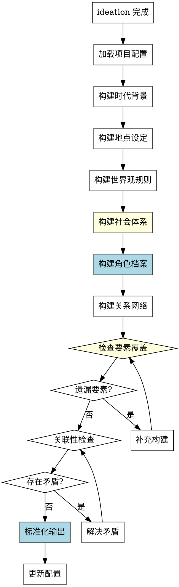

# 世界观构建Skill

## Overview
构建小说的世界观、时代背景、地点设定、世界观规则和角色档案，为后续创作提供基础。

**核心原则: 世界观构建 = 系统化要素覆盖 + 标准化角色档案 + 关联性检查。**

## Pattern Recognition

**使用此skill的场景**：
- 用户说"我想设定一下这个世界，比如时代背景、地点..." → **启动世界观构建**
- 用户说"我想创建一些角色档案" → **启动世界观构建**
- 用户说"我想定义一下魔法体系或科技水平" → **启动世界观构建**

**Red Flags - 必须使用此skill**：
- 尝试随意提问，没有系统化的世界观维度（禁止）
- 尝试创建角色档案但没有标准化模板（禁止）
- 尝试跳过某些世界观要素（如经济体系、政治背景）（禁止）
- 尝试在 ideation 未完成时构建世界观（禁止）

## 流程图

## 工作流程

### 1. 加载项目配置
- 读取 novel-project.yaml，确认 ideation 已完成

### 2. 系统化构建（7个要素）

**禁止半系统化构建！必须按顺序构建以下要素：**

- 时代背景（文明程度）
- 地点设定（主要场景）
- 世界观规则（特殊机制）⚠️ 关键
- 社会体系（政治/经济）⚠️ 易遗漏
- 角色档案（标准化模板）
- 关系网络（权力/情感）
- 关联性检查

### 3. 构建角色档案
详见 reference/character-template.md

**禁止非标准化角色档案！必须使用标准化模板。**

### 4. 检查要素覆盖
详见 Quick Reference（检查要素覆盖清单）

**如果有遗漏**: 补充构建该要素

### 5. 关联性检查
详见 reference/consistency-checks.md

### 6. 标准化输出
详见 reference/output-format.md

## 禁止行为

1. **禁止半系统化构建** - 必须按7个要素系统化构建
2. **禁止跳过要素** - 特别容易遗漏：社会体系
3. **禁止非标准化角色档案** - 必须包含所有字段
4. **禁止遗漏关联性检查** - 必须检查一致性
5. **禁止在 ideation 未完成时构建** - ideation.status 必须为 completed

## 常见错误

| 错误 | 后果 | Skill 如何防止 |
|------|------|---------------|
| 没有标准化角色档案模板 | 角色档案不完整 | 强制使用标准化角色档案模板 |
| 没有检查清单确保覆盖 | 遗漏世界观要素 | 检查要素覆盖清单（7个要素） |
| 提问依赖直觉 | 探索不全面 | 系统化7个要素构建流程 |
| 缺乏关联性检查 | 角色与世界观矛盾 | 强制关联性检查 |

## Quick Reference

**7个世界观要素**：
1. 时代背景（文明程度）
2. 地点设定（主要场景）
3. 世界观规则（特殊机制）
4. 社会体系（政治/经济）⚠️ 易遗漏
5. 角色档案（标准化模板）
6. 关系网络（权力/情感）
7. 关联性检查（一致性）

**检查要素覆盖清单**：
- □ 时代背景
- □ 地点设定
- □ 世界观规则
- □ 社会体系 ⚠️
- □ 角色档案
- □ 关系网络
- □ 反派或对立力量

## 错误处理

- **配置文件不存在**: 提示用户先运行 novel-project skill 创建项目
- **前置条件不满足**: 如果 ideation.status 不是 completed，提示用户先完成创意构思