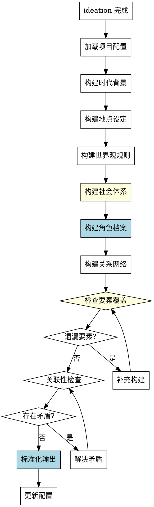

# 世界观构建Skill

## Overview
构建小说的世界观、时代背景、地点设定、世界观规则和角色档案，为后续创作提供基础。

**核心原则: 世界观构建 = 系统化要素覆盖 + 标准化角色档案 + 关联性检查。**

半系统化方法有分维度意识，但没有标准化模板，容易遗漏要素，缺乏关联性检查。系统化方法确保完整性和一致性。

## Pattern Recognition - 何时使用此skill

**使用此skill的场景**：
- 用户说"我想设定一下这个世界，比如时代背景、地点..." → **启动世界观构建**
- 用户说"我想创建一些角色档案" → **启动世界观构建**
- 用户说"我想定义一下魔法体系或科技水平" → **启动世界观构建**
- 用户说"我完成了创意构思，接下来做什么？" → **建议使用此skill**

**Red Flags - 必须使用此skill**：
- 尝试随意提问，没有系统化的世界观维度
- 尝试创建角色档案但没有标准化模板
- 尝试跳过某些世界观要素（如经济体系、政治背景）
- 尝试没有关联性检查（角色与世界观的一致性）
- 尝试在 ideation 未完成时构建世界观

**所有这些意味着：用户需要系统化的世界观构建过程，必须使用此skill。**

## 流程图



## 工作流程

### 1. 加载项目配置
- 读取 novel-project.yaml
- 确认 ideation 已完成
- 检查 world_building 部分的状态
- **完成标准**: 成功读取配置并确认前置条件满足

### 2. 系统化构建（7 个要素）

**禁止半系统化构建！必须按顺序构建以下要素：**

#### 2.1 时代背景
- 故事发生的时代（近未来/远未来/具体年份）
- 现实世界还是虚构世界
- 人类文明发展程度（有星际航行能力？）
- 地球现状（有太空殖民地？）
- **完成标准**: 明确故事时代背景和文明程度

#### 2.2 地点设定
- 主要故事发生地（飞船/空间站/星球？）
- 地理环境、气候、地形特征
- 关键场景的结构布局
- 是否有闪回或回忆场景回到地球
- **完成标准**: 确定主要地点及其特征

#### 2.3 世界观规则（关键！）
- 特殊现象的机制（时间回环的原因？技术事故/外星文明/宇宙现象？）
- 规则的限制（为什么是72小时？保留记忆？）
- 科技水平（已突破光速？）
- 魔法体系（如有）
- 其他特殊规则
- **完成标准**: 规则列表完整且自洽

#### 2.4 社会体系（易遗漏！）
- 政治制度（地球联邦/星际帝国？）
- 经济体系（资源分配？货币？）
- 社会阶层（贫富差距？）
- 文化风俗（节日？宗教？）
- **完成标准**: 社会体系完整

#### 2.5 角色档案（强制使用标准化模板）

**禁止非标准化角色档案！必须使用以下模板：**

```yaml
characters:
  - name: "角色名称"
    role: "protagonist/antagonist/supporting"
    age: "年龄"
    gender: "性别"
    appearance: "外貌特征"
    traits: ["性格特征1", "性格特征2", "性格特征3"]
    background: "背景故事"
    motivation: "核心动机"
    weakness: "性格缺陷/成长空间"
    expertise: "专业领域"
    family_status: "家庭状况"
    important_person: "重要人物（家人/爱人）"
    relationships: ["与其他角色的关系"]
    role_in_story: "在故事中的作用"
```

**每个主角必须有完整档案！**

#### 2.6 关系网络
- 角色之间的关系纽带
- 权力结构
- 情感纽带
- 冲突来源
- **完成标准**: 关系网络清晰

### 3. 检查要素覆盖

**必须检查的要素清单**（容易遗漏！）：
- □ 时代背景（文明程度）
- □ 地点设定（主要场景）
- □ 世界观规则（特殊机制）
- □ 社会体系（政治/经济）
- □ 角色档案（主角完整）
- □ 关系网络（清晰）
- □ 反派或对立力量（如有）

**如果有遗漏**: 补充构建该要素，然后重新检查

### 4. 关联性检查

**必须检查的一致性**：
- 角色特征是否与主题契合
- 世界观规则是否自洽（无矛盾）
- 角色专业是否符合时代背景
- 社会体系是否影响角色命运
- 世界观规则是否影响角色动机

**如果存在矛盾**: 解决矛盾，然后重新检查

### 5. 标准化输出

**禁止非标准化输出！必须使用以下格式：**

```yaml
world_building:
  setting:
    time_period: "时代背景"
    civilization_level: "文明程度"
    location: "地点设定"
    geography: "地理环境"
    key_scenes: ["关键场景"]
  rules:
    special_mechanism: "特殊现象机制"
    limitations: ["限制"]
    tech_level: "科技水平"
    magic_system: "魔法体系（如有）"
    other_rules: ["其他规则"]
  society:
    political_system: "政治制度"
    economic_system: "经济体系"
    social_classes: "社会阶层"
    culture: "文化风俗"
  characters:
    - name: "角色名"
      role: "protagonist/antagonist/supporting"
      age: "年龄"
      gender: "性别"
      appearance: "外貌特征"
      traits: ["性格特征"]
      background: "背景故事"
      motivation: "核心动机"
      weakness: "性格缺陷"
      expertise: "专业领域"
      family_status: "家庭状况"
      important_person: "重要人物"
      relationships: ["关系"]
      role_in_story: "故事作用"
  relationships:
    bonds: ["关系纽带"]
    power_structure: "权力结构"
    emotional_bonds: ["情感纽带"]
    conflicts: ["冲突来源"]
  status: "completed"
```

### 6. 更新配置
- 将以上内容写入 novel-project.yaml 的 world_building 部分
- 设置 world_building.status 为 "completed"
- **完成标准**: 配置文件成功更新

## 禁止行为

**以下行为被明确禁止：**

1. **禁止半系统化构建**
   - 不允许随意提问，必须按 7 个要素系统化构建
   - 必须检查要素覆盖

2. **禁止跳过要素**
   - 不允许跳过任何世界观要素
   - 特别容易遗漏：社会体系（政治/经济）

3. **禁止非标准化角色档案**
   - 不允许使用非标准格式的角色档案
   - 必须包含所有字段（appearance, traits, background, motivation, weakness, expertise, family_status, important_person, relationships, role_in_story）

4. **禁止遗漏关联性检查**
   - 不允许不检查角色与世界观的关联性
   - 必须检查一致性

5. **禁止在 ideation 未完成时构建**
   - ideation.status 必须为 "completed"
   - 否则提示用户先完成创意构思

## 常见错误

**Baseline 错误（无 skill 时会发生）**：

| 错误 | 后果 | Skill 如何防止 |
|------|------|---------------|
| 没有标准化角色档案模板 | 角色档案不完整，缺少重要字段 | 强制使用标准化角色档案模板 |
| 没有检查清单确保覆盖 | 遗漏世界观要素（经济体系、政治背景） | 检查要素覆盖清单（7 个要素） |
| 提问依赖直觉 | 探索不全面，遗漏关键信息 | 系统化 7 个要素构建流程 |
| 缺乏关联性检查 | 角色与世界观矛盾 | 强制关联性检查（5 个一致性） |
| 半系统化方法 | 质量不稳定 | 系统化方法确保完整性和一致性 |

## Quick Reference

**7 个世界观要素**：
1. 时代背景（文明程度）
2. 地点设定（主要场景）
3. 世界观规则（特殊机制）
4. 社会体系（政治/经济）⚠️ 易遗漏
5. 角色档案（标准化模板）
6. 关系网络（权力/情感）
7. 关联性检查（一致性）

**标准化角色档案模板**：
```yaml
- name: "角色名"
  role: "protagonist/antagonist/supporting"
  age: "年龄"
  gender: "性别"
  appearance: "外貌特征"
  traits: ["性格特征"]
  background: "背景故事"
  motivation: "核心动机"
  weakness: "性格缺陷"
  expertise: "专业领域"
  family_status: "家庭状况"
  important_person: "重要人物"
  relationships: ["关系"]
  role_in_story: "故事作用"
```

**检查要素覆盖清单**：
- □ 时代背景
- □ 地点设定
- □ 世界观规则
- □ 社会体系 ⚠️
- □ 角色档案
- □ 关系网络
- □ 反派或对立力量

**关联性检查**：
- 角色特征与主题契合
- 世界观规则自洽
- 角色专业符合时代
- 社会体系影响角色
- 世界观规则影响动机

## AI角色
协作伙伴模式 - 建议设定、提醒矛盾

## 注意事项
- 角色设定要具体，避免模糊描述
- 世界观规则要自洽，不能有矛盾
- 提醒用户角色特征与主题的关联
- 如需修改已完成的 world_building，可将 status 改为 "in_progress" 后重新执行此 skill

## 错误处理

- **配置文件不存在**: 提示用户先运行 novel-project skill 创建项目
- **前置条件不满足**: 如果 ideation.status 不是 completed，提示用户先完成创意构思阶段
- **角色设定冲突**: 发现角色特征矛盾时，提醒用户澄清