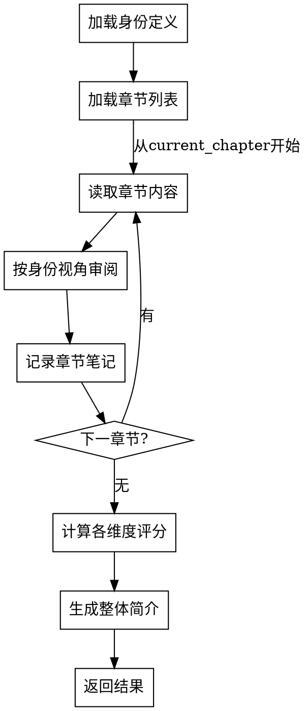
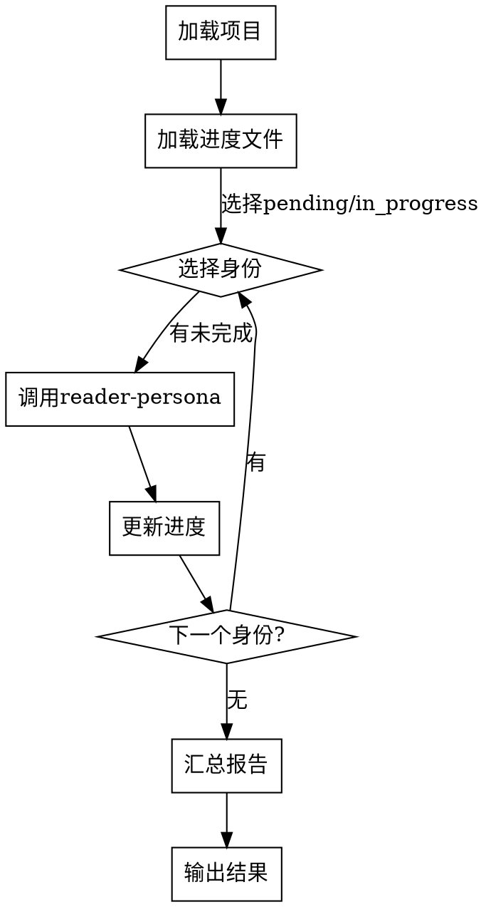

# 读者视角审阅 Skill 实现计划

> **For agentic workers:** REQUIRED SUB-SKILL: Use superpowers:subagent-driven-development (recommended) or superpowers:executing-plans to implement this plan task-by-task. Steps use checkbox (`- [ ]`) syntax for tracking.

**Goal:** 创建 reader-review 和 reader-persona 两个 skills，用于以多种读者身份审阅小说并生成评分报告。

**Architecture:** 主 skill (reader-review) 调度流程，子 skill (reader-persona) 执行单个身份审阅。采用 TDD 方式：先编写测试场景，观察失败行为，然后编写 skill 文档使其通过。

**Tech Stack:** Markdown SKILL.md + JSON 配置文件 + Graphviz flowchart

---

## 文件结构

```
.opencode/skills/reader-review/
    ├── SKILL.md                        # 主 skill 定义
    └── reference/
        ├── reader-profiles.json        # 身份定义文件
        └── scoring-method.md           # 评分方法说明

.opencode/skills/reader-persona/
    ├── SKILL.md                        # 子 skill 定义
    └── reference/
        └── review-template.md          # 审阅模板
```

---

### Task 1: 创建 reader-profiles.json 身份定义文件

**Files:**
- Create: `.opencode/skills/reader-review/reference/reader-profiles.json`

- [ ] **Step 1: 创建目录结构**

```bash
mkdir -p .opencode/skills/reader-review/reference
mkdir -p .opencode/skills/reader-persona/reference
```

- [ ] **Step 2: 创建身份定义文件**

```json
{
  "profiles": [
    {
      "id": "casual-reader",
      "name": "休闲读者",
      "description": "轻松娱乐、追求消遣的读者",
      "focus": ["情节是否有趣", "阅读是否轻松", "是否有放松感"],
      "scoring_bias": {
        "情节设计": 1.2,
        "语言风格": 1.0,
        "角色塑造": 0.8,
        "世界观设定": 0.6
      }
    },
    {
      "id": "adventure-reader",
      "name": "冒险型读者",
      "description": "喜欢冒险、刺激情节的读者",
      "focus": ["刺激感", "悬念设置", "冒险元素"],
      "scoring_bias": {
        "情节设计": 1.5,
        "世界观设定": 1.2,
        "角色塑造": 0.8,
        "语言风格": 0.6
      }
    },
    {
      "id": "deep-thinker",
      "name": "深度思考型读者",
      "description": "关注社会议题、人性探讨的读者",
      "focus": ["深层含义", "社会隐喻", "人性探讨"],
      "scoring_bias": {
        "世界观设定": 1.3,
        "角色塑造": 1.2,
        "情节设计": 0.9,
        "语言风格": 1.0
      }
    },
    {
      "id": "sf-fan",
      "name": "科幻小说爱好者",
      "description": "熟悉科幻类型、关注科幻元素的读者",
      "focus": ["科幻设定合理性", "科技想象力", "未来观"],
      "scoring_bias": {
        "世界观设定": 1.5,
        "情节设计": 1.1,
        "角色塑造": 0.9,
        "语言风格": 0.8
      }
    },
    {
      "id": "literary-reader",
      "name": "文学爱好者",
      "description": "注重文学性、语言风格的读者",
      "focus": ["语言美感", "叙事技巧", "文学价值"],
      "scoring_bias": {
        "语言风格": 1.5,
        "角色塑造": 1.2,
        "情节设计": 0.8,
        "世界观设定": 0.7
      }
    }
  ]
}
```

- [ ] **Step 3: 验证 JSON 格式**

```bash
python -c "import json; json.load(open('.opencode/skills/reader-review/reference/reader-profiles.json'))" && echo "JSON valid"
```
Expected: `JSON valid`

- [ ] **Step 4: Commit**

```bash
git add .opencode/skills/reader-review/reference/reader-profiles.json
git commit -m "feat: add reader profiles definition for reader-review skill"
```

---

### Task 2: 创建 scoring-method.md 评分方法说明

**Files:**
- Create: `.opencode/skills/reader-review/reference/scoring-method.md`

- [ ] **Step 1: 创建评分方法文档**

```markdown
# 评分方法说明

## 评分维度

| 维度 | 评价内容 | 评分标准 |
|------|----------|----------|
| 情节设计 | 悬念设置、节奏控制、转折合理性 | 情节吸引力、逻辑连贯性 |
| 角色塑造 | 角色形象、性格发展、人物关系 | 角色立体度、成长弧线 |
| 世界观设定 | 设定独特性、合理性、想象力 | 世界观完整性、新颖度 |
| 语言风格 | 语言流畅度、文学性、叙事技巧 | 语言美感、阅读体验 |

## 加权评分计算

每个身份对各维度有不同的重视权重（scoring_bias）：

**计算公式**：
1. 每个维度的原始评分（1-10分）
2. 原始评分 × scoring_bias 权重 = 加权评分
3. overall_score = 所有维度加权评分的平均值

**示例**（休闲读者）：
- 情节设计：7.5 × 1.2 = 9.0
- 角色塑造：6.8 × 0.8 = 5.44
- 世界观设定：7.0 × 0.6 = 4.2
- 语言风格：6.5 × 1.0 = 6.5
- overall_score = (9.0 + 5.44 + 4.2 + 6.5) / 4 = 6.29

## 评级映射

| 分数范围 | 评级 |
|----------|------|
| 8.0+ | 强烈推荐 |
| 6.0-7.9 | 推荐 |
| 4.0-5.9 | 中性 |
| <4.0 | 不推荐 |
```

- [ ] **Step 2: Commit**

```bash
git add .opencode/skills/reader-review/reference/scoring-method.md
git commit -m "docs: add scoring method explanation for reader-review skill"
```

---

### Task 3: 创建 reader-persona 子 Skill

**Files:**
- Create: `.opencode/skills/reader-persona/SKILL.md`
- Create: `.opencode/skills/reader-persona/reference/review-template.md`

- [ ] **Step 1: 创建审阅模板**

```markdown
# 审阅模板

## 章节审阅记录格式

审阅过程中，每章记录以下信息（内部笔记，不输出）：

**章节编号**: XX
**身份**: [身份名称]
**关注点记录**:
- [关注点1]: [观察记录]
- [关注点2]: [观察记录]
- [关注点3]: [观察记录]

**章节印象**: [一句话总结该章感受]

## 最终输出格式

```json
{
  "persona_id": "casual-reader",
  "persona_name": "休闲读者",
  "scores": {
    "情节设计": 7.5,
    "角色塑造": 6.8,
    "世界观设定": 7.0,
    "语言风格": 6.5
  },
  "overall_score": 6.29,
  "summary": "轻松有趣的科幻小说...",
  "rating": "推荐"
}
```
```

- [ ] **Step 2: 创建 SKILL.md**

```markdown
---
name: reader-persona
description: Use when reader-review skill 调用执行单个读者身份的审阅
---

# 单身份读者审阅 Skill

## Overview
执行单个读者身份的完整审阅流程：按章节阅读、记录笔记、计算评分、生成简介。

## 核心原则
**每章必读、每维度必评、权重必应用。**

## 流程图



## 工作流程

### 1. 加载身份定义
- 从 `reader-profiles.json` 读取指定身份
- 提取 `focus`（关注点）和 `scoring_bias`（权重）
- 完成标准：身份信息成功加载

### 2. 加载章节列表
- 读取 `novel-project.json` 的 `outline.chapters`
- 读取 `review-progress.json` 的 `current_chapter`（断点续读）
- 完成标准：章节列表和起始位置确定

### 3. 逐章审阅（循环）
- 读取章节文件 `chapters/chapter-XX.md`
- 按身份 `focus` 关注点审阅
- 记录内部笔记（不输出）
- 更新 `current_chapter`
- 完成标准：所有章节审阅完成

### 4. 计算评分
- 汇总所有章节笔记
- 按4维度评分（1-10分）
- 应用 `scoring_bias` 权重计算 overall_score
- 完成标准：评分计算完成

### 5. 生成简介
- 根据评分和笔记生成 50-100 字简介
- 确定 rating（强烈推荐/推荐/中性/不推荐）
- 完成标准：简介和评级生成

### 6. 返回结果
- 返回 JSON 格式结果给 reader-review
- 完成标准：结果成功返回

## 禁止行为

**以下行为被明确禁止：**

1. **禁止跳过章节** - 必须从第一章读到最后一章
2. **禁止省略维度** - 必须对所有4维度评分
3. **禁止忽略权重** - 必须应用 scoring_bias 计算 overall_score
4. **禁止直接输出** - 笔记仅供内部汇总，不输出给用户

## Red Flags

- 尝试跳过某章节 → STOP，必须完整阅读
- 尝试只评部分维度 → STOP，必须对所有维度评分
- 尝试直接输出笔记 → STOP，笔记仅供内部记录

## Quick Reference

| 步骤 | 输入 | 输出 |
|------|------|------|
| 加载身份 | persona_id | focus, scoring_bias |
| 加载章节 | novel-project.json | chapters[], current_chapter |
| 逐章审阅 | chapter-XX.md | 内部笔记 |
| 计算评分 | 所有笔记 | scores{}, overall_score |
| 生成简介 | scores + 笔记 | summary, rating |

## 输出格式

```json
{
  "persona_id": "casual-reader",
  "persona_name": "休闲读者",
  "scores": {
    "情节设计": 7.5,
    "角色塑造": 6.8,
    "世界观设定": 7.0,
    "语言风格": 6.5
  },
  "overall_score": 6.29,
  "summary": "轻松有趣的科幻小说...",
  "rating": "推荐"
}
```
```

- [ ] **Step 3: Commit**

```bash
git add .opencode/skills/reader-persona/
git commit -m "feat: add reader-persona sub skill for single persona review"
```

---

### Task 4: 创建 reader-review 主 Skill

**Files:**
- Create: `.opencode/skills/reader-review/SKILL.md`

- [ ] **Step 1: 创建 SKILL.md**

```markdown
---
name: reader-review
description: Use when 用户想要以多种读者身份审阅小说，获取评分和简介报告
---

# 读者视角审阅 Skill

## Overview
以多种读者身份审阅小说，调度 reader-persona 执行每个身份的审阅，汇总生成评分报告。支持进度记录和断点续读。

## 核心原则
**所有身份必审阅、进度必记录、报告必汇总。**

5个身份必须顺序完成，不可跳过。进度自动保存，支持断点续读和重置。

## Pattern Recognition

**使用此 skill 的场景**：
- 用户说"我想以读者角度审阅我的小说" → **启动审阅**
- 用户说"继续上次未完成的审阅" → **断点续读**
- 用户说"重新开始审阅" → **重置进度**
- 用户说"查看审阅进度" → **查看状态**

**Red Flags - 必须使用此 skill**：
- 尝试手动审阅小说（禁止，必须用此 skill）
- 尝试跳过某个身份（禁止，必须顺序完成）
- 尝试不记录进度（禁止，必须自动保存）

## 流程图



## 工作流程

### 1. 加载项目
- 读取 `novel-project.json`
- 读取 `outline.chapters` 确定总章节数
- 完成标准：项目信息成功加载

### 2. 加载进度文件
- 检查 `review-progress.json` 是否存在
- 如不存在，创建初始进度文件（所有身份 pending）
- 完成标准：进度文件成功加载或创建

### 3. 选择身份（循环）
- 从进度文件读取身份状态
- 选择第一个 pending 或 in_progress 身份
- 完成标准：身份选择完成

### 4. 调用 reader-persona
- 调用 `reader-persona` skill，传入 persona_id
- 等待审阅完成
- 接收返回结果
- 完成标准：reader-persona 返回结果

### 5. 更新进度
- 更新 `review-progress.json`：
  - status → completed
  - completed_at → 当前时间
  - result → 保存评分结果
- 完成标准：进度文件更新成功

### 6. 循环或结束
- 检查是否还有未完成身份
- 如有，返回步骤 3 继续
- 如无，进入汇总报告
- 完成标准：所有身份完成或继续下一身份

### 7. 汇总报告
- 汇总所有身份的 scores、summary、rating
- 计算平均 overall_score
- 确定整体评级和适合读者群
- 完成标准：汇总报告生成

### 8. 输出结果
- 输出 Markdown 格式汇总报告
- 保存到 `reader-review-report.md`
- 完成标准：报告输出和保存成功

## 功能入口

### 继续审阅（默认）
- 自动检测进度文件
- 从未完成身份继续
- 命令：`reader-review`

### 重置进度
- 清除 `review-progress.json`
- 从第一个身份重新开始
- 命令：`reader-review --reset`

### 查看进度
- 显示各身份状态和已完成结果
- 不执行审阅
- 命令：`reader-review --status`

## 禁止行为

**以下行为被明确禁止：**

1. **禁止跳过身份** - 必须顺序完成所有5个身份
2. **禁止并行执行** - 必须逐个身份顺序执行
3. **禁止不保存进度** - 每完成一个身份必须立即保存
4. **禁止省略报告** - 所有身份完成后必须输出汇总报告

## Red Flags

- 尝试跳过某个身份 → STOP，必须顺序完成
- 尝试不保存进度 → STOP，必须立即保存
- 尝试并行执行多个身份 → STOP，必须顺序执行

## Quick Reference

| 命令 | 功能 | 输出 |
|------|------|------|
| reader-review | 继续审阅 | 审阅结果 |
| reader-review --reset | 重置进度 | 从头开始 |
| reader-review --status | 查看进度 | 进度状态 |

## 进度文件格式

```json
{
  "project_name": "星尘回声",
  "total_chapters": 22,
  "reviews": {
    "casual-reader": {
      "status": "completed",
      "current_chapter": 22,
      "started_at": "2026-05-09T10:00:00",
      "completed_at": "2026-05-09T12:00:00",
      "result": {
        "scores": {...},
        "overall_score": 6.95,
        "summary": "...",
        "rating": "推荐"
      }
    }
  }
}
```

## 输出报告格式

```markdown
# 《小说名》读者审阅报告

## 项目信息
- 类型：[类型]
- 总章节：[章节数]
- 审阅身份：5位

## 身份审阅结果

### [身份名称]
- **评分**：[overall_score]/10
- **评级**：[评级]
- **简介**：[summary]

## 综合评价
- **平均评分**：[平均值]/10
- **整体评级**：[评级]
- **适合读者**：[适合人群]
- **不适合读者**：[不适合人群]
```
```

- [ ] **Step 2: Commit**

```bash
git add .opencode/skills/reader-review/SKILL.md
git commit -m "feat: add reader-review main skill for multi-persona review"
```

---

### Task 5: 验证 Skill 可用性

**Files:**
- Verify: `.opencode/skills/reader-review/SKILL.md`
- Verify: `.opencode/skills/reader-persona/SKILL.md`

- [ ] **Step 1: 验证文件结构**

```bash
ls -la .opencode/skills/reader-review/
ls -la .opencode/skills/reader-persona/
```
Expected: 两个目录都存在，包含 SKILL.md 和 reference/

- [ ] **Step 2: 验证 JSON 格式**

```bash
python -c "import json; json.load(open('.opencode/skills/reader-review/reference/reader-profiles.json')); print('Profiles valid')"
```
Expected: `Profiles valid`

- [ ] **Step 3: 验证 Graphviz 语法**

检查 SKILL.md 中的 `digraph` 代码块是否正确闭合。预期两个 flowchart 都有完整的 `}` 结尾。

- [ ] **Step 4: 最终 Commit（如需要）**

如有遗漏文件：
```bash
git add .opencode/skills/reader-review/ .opencode/skills/reader-persona/
git commit -m "chore: ensure all reader-review skill files committed"
```

---

## 实现检查清单

- [ ] reader-profiles.json 创建（5个身份定义）
- [ ] scoring-method.md 创建（评分方法说明）
- [ ] reader-persona/SKILL.md 创建（子 skill）
- [ ] reader-persona/reference/review-template.md 创建（审阅模板）
- [ ] reader-review/SKILL.md 创建（主 skill）
- [ ] 所有 JSON 格式验证通过
- [ ] 所有 Graphviz flowchart 验证通过
- [ ] 所有文件已 commit

---

## 自检清单

**1. Spec coverage:** 
- ✓ 身份定义文件 → Task 1
- ✓ 评分方法 → Task 2
- ✓ 子 skill → Task 3
- ✓ 主 skill → Task 4
- ✓ 进度文件格式 → Task 4 (SKILL.md 中说明)
- ✓ 输出报告格式 → Task 4 (SKILL.md 中说明)

**2. Placeholder scan:** 无 TBD、TODO、"implement later" 等占位符。

**3. Type consistency:** persona_id 使用一致（casual-reader 等），字段名一致（scores, overall_score, summary, rating）。