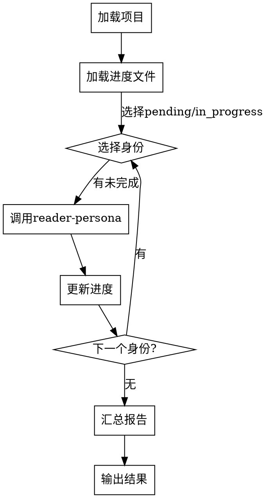
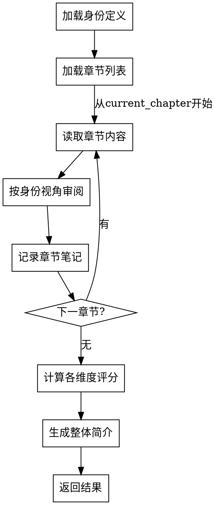

# 读者视角审阅 Skill 设计规范

## 概述

创建两个 skills：`reader-review`（主 skill）和 `reader-persona`（子 skill），用于以多种读者身份审阅小说，生成评分和简介。

**目标**：从不同读者视角获取读后感受和评价，帮助作者了解作品在不同人群中的表现。

## 架构设计

### 总体架构

```
reader-review (主 skill)
    ├── 职责：加载进度、调度身份、汇总结果、管理进度文件
    ├── 流程：循环调用 reader-persona 处理每个身份
    └── 输出：汇总报告 + 更新进度文件

reader-persona (子 skill)
    ├── 职责：执行单个身份的审阅
    ├── 流程：按章节审阅、评分、生成简介
    └── 输出：该身份的评分和简介

数据文件：
    ├── .opencode/skills/reader-review/reference/reader-profiles.json (身份定义)
    └── novels/<项目>/review-progress.json (进度记录)
```

### 调用关系

```
reader-review 启动
    → 加载进度文件
    → 对每个未完成的身份：
        → 调用 reader-persona(身份ID)
        → reader-persona 返回结果
        → 更新进度文件
    → 汇总所有身份结果
    → 输出最终报告
```

## 数据文件设计

### 身份定义文件

**文件路径**：`.opencode/skills/reader-review/reference/reader-profiles.json`

```json
{
  "profiles": [
    {
      "id": "casual-reader",
      "name": "休闲读者",
      "description": "轻松娱乐、追求消遣的读者",
      "focus": ["情节是否有趣", "阅读是否轻松", "是否有放松感"],
      "scoring_bias": {
        "情节设计": 1.2,
        "语言风格": 1.0,
        "角色塑造": 0.8,
        "世界观设定": 0.6
      }
    },
    {
      "id": "adventure-reader",
      "name": "冒险型读者",
      "description": "喜欢冒险、刺激情节的读者",
      "focus": ["刺激感", "悬念设置", "冒险元素"],
      "scoring_bias": {
        "情节设计": 1.5,
        "世界观设定": 1.2,
        "角色塑造": 0.8,
        "语言风格": 0.6
      }
    },
    {
      "id": "deep-thinker",
      "name": "深度思考型读者",
      "description": "关注社会议题、人性探讨的读者",
      "focus": ["深层含义", "社会隐喻", "人性探讨"],
      "scoring_bias": {
        "世界观设定": 1.3,
        "角色塑造": 1.2,
        "情节设计": 0.9,
        "语言风格": 1.0
      }
    },
    {
      "id": "sf-fan",
      "name": "科幻小说爱好者",
      "description": "熟悉科幻类型、关注科幻元素的读者",
      "focus": ["科幻设定合理性", "科技想象力", "未来观"],
      "scoring_bias": {
        "世界观设定": 1.5,
        "情节设计": 1.1,
        "角色塑造": 0.9,
        "语言风格": 0.8
      }
    },
    {
      "id": "literary-reader",
      "name": "文学爱好者",
      "description": "注重文学性、语言风格的读者",
      "focus": ["语言美感", "叙事技巧", "文学价值"],
      "scoring_bias": {
        "语言风格": 1.5,
        "角色塑造": 1.2,
        "情节设计": 0.8,
        "世界观设定": 0.7
      }
    }
  ]
}
```

**字段说明**：
- `scoring_bias`：该身份对各维度的重视权重（>1 表示更重视，<1 表示较轻视）
- 用于计算加权评分

### 进度记录文件

**文件路径**：`novels/<项目>/review-progress.json`

```json
{
  "project_name": "星尘回声",
  "total_chapters": 22,
  "reviews": {
    "casual-reader": {
      "status": "completed",
      "current_chapter": 22,
      "started_at": "2026-05-09T10:00:00",
      "completed_at": "2026-05-09T12:00:00",
      "result": {
        "scores": {
          "情节设计": 7.5,
          "角色塑造": 6.8,
          "世界观设定": 7.0,
          "语言风格": 6.5
        },
        "overall_score": 6.95,
        "summary": "轻松有趣的科幻小说，情节紧凑，适合消遣阅读。世界观设定新颖但不复杂，适合入门科幻读者。",
        "rating": "推荐"
      }
    },
    "adventure-reader": {
      "status": "in_progress",
      "current_chapter": 15,
      "started_at": "2026-05-09T12:30:00",
      "completed_at": "",
      "result": {}
    },
    "deep-thinker": {
      "status": "pending",
      "current_chapter": 0,
      "started_at": "",
      "completed_at": "",
      "result": {}
    },
    "sf-fan": {
      "status": "pending",
      "current_chapter": 0,
      "started_at": "",
      "completed_at": "",
      "result": {}
    },
    "literary-reader": {
      "status": "pending",
      "current_chapter": 0,
      "started_at": "",
      "completed_at": "",
      "result": {}
    }
  }
}
```

**状态值**：
- `pending`：未开始
- `in_progress`：进行中（断点续读位置）
- `completed`：已完成（包含评分结果）

**功能支持**：
- 断点续读：记录 `current_chapter`，从该章节继续
- 重置：清除进度文件或某身份的进度

## Skill 流程设计

### reader-review (主 Skill) 流程

**文件**：`.opencode/skills/reader-review/SKILL.md`

**核心流程**：



**功能入口**：
1. **继续审阅**：从进度文件读取，继续未完成的身份
2. **重置进度**：清除进度文件，从头开始
3. **查看进度**：显示各身份状态和已完成的结果

### reader-persona (子 Skill) 流程

**文件**：`.opencode/skills/reader-persona/SKILL.md`

**核心流程**：



**审阅方式**：
- 每读一章，记录该身份的关注点笔记（不输出给用户，内部记录）
- 读完所有章节后，汇总笔记，计算各维度评分（考虑 `scoring_bias`）
- 生成该身份视角的整体简介和评级

**返回格式**：
```json
{
  "persona_id": "casual-reader",
  "persona_name": "休闲读者",
  "scores": {
    "情节设计": 7.5,
    "角色塑造": 6.8,
    "世界观设定": 7.0,
    "语言风格": 6.5
  },
  "overall_score": 6.95,
  "summary": "...",
  "rating": "推荐/中性/不推荐"
}
```

## 输出报告格式

### 汇总报告示例

```markdown
# 《星尘回声》读者审阅报告

## 项目信息
- 类型：轻科幻
- 总章节：22章
- 审阅身份：5位

## 身份审阅结果

### 休闲读者
- **评分**：6.95/10
- **评级**：推荐
- **简介**：轻松有趣的科幻小说，情节紧凑，适合消遣阅读。世界观设定新颖但不复杂，适合入门科幻读者。

### 冒险型读者
- **评分**：7.8/10
- **评级**：推荐
- **简介**：悬念设置出色，冒险元素丰富，节奏紧凑刺激。科幻设定为冒险提供了独特的舞台。

### 深度思考型读者
- **评分**：7.2/10
- **评级**：推荐
- **简介**：探讨了意识自由与系统控制的深层议题，角色成长弧线清晰，社会隐喻值得深思。

### 科幻小说爱好者
- **评分**：8.1/10
- **评级**：强烈推荐
- **简介**：世界观设定严谨且新颖，科技想象力丰富，归零协议和灵络的概念设计出色。

### 文学爱好者
- **评分**：6.5/10
- **评级**：中性
- **简介**：叙事流畅但文学性不足，语言风格偏向简洁实用，角色塑造有一定深度但不够细腻。

## 综合评价
- **平均评分**：7.12/10
- **整体评级**：推荐
- **适合读者**：科幻爱好者、冒险型读者、追求刺激情节的读者
- **不适合读者**：追求文学性、语言美感的读者
```

## 实现要求

### Skill 结构

**reader-review 目录结构**：
```
.opencode/skills/reader-review/
    ├── SKILL.md                        # 主 skill 定义
    └── reference/
        ├── reader-profiles.json        # 身份定义文件
        └── scoring-method.md           # 评分方法说明
```

**reader-persona 目录结构**：
```
.opencode/skills/reader-persona/
    ├── SKILL.md                        # 子 skill 定义
    └── reference/
        └── review-template.md          # 审阅模板
```

### 功能要求

1. **进度管理**：
   - 自动创建进度文件（如不存在）
   - 支持断点续读（读取 `current_chapter`）
   - 支持重置（清除进度文件或单个身份）

2. **身份调度**：
   - 顺序执行所有身份（不可跳过）
   - 每个身份完成后立即更新进度文件
   - 支持中途停止（保存当前进度）

3. **评分机制**：
   - 各维度评分：1-10 分
   - 加权评分计算：
     - 每个维度的原始评分 × scoring_bias 权重
     - 加权后各维度平均值 = overall_score
     - 示例：休闲读者评情节7.5、角色6.8、世界观7.0、语言6.5
       - 加权后：情节7.5×1.2=9.0、角色6.8×0.8=5.44、世界观7.0×0.6=4.2、语言6.5×1.0=6.5
       - overall_score = (9.0+5.44+4.2+6.5) / 4 = 6.29
   - 评级映射：
     - 8.0+ → 强烈推荐
     - 6.0-7.9 → 推荐
     - 4.0-5.9 → 中性
     - <4.0 → 不推荐

4. **报告生成**：
   - 每个身份完成后输出该身份结果
   - 所有身份完成后输出汇总报告
   - 报告保存到 `novels/<项目>/reader-review-report.md`

## 评分维度说明

| 维度 | 评价内容 | 评分标准 |
|------|----------|----------|
| 情节设计 | 悬念设置、节奏控制、转折合理性 | 情节吸引力、逻辑连贯性 |
| 角色塑造 | 角色形象、性格发展、人物关系 | 角色立体度、成长弧线 |
| 世界观设定 | 设定独特性、合理性、想象力 | 世界观完整性、新颖度 |
| 语言风格 | 语言流畅度、文学性、叙事技巧 | 语言美感、阅读体验 |

## 约束条件

1. **不可跳过身份**：必须顺序完成所有身份审阅
2. **进度自动保存**：每完成一章或一个身份立即保存
3. **独立于技术审阅**：与现有 `review-revision` skill（技术审阅）完全独立
4. **JSON 格式统一**：所有配置文件使用 JSON 格式（与现有项目一致）