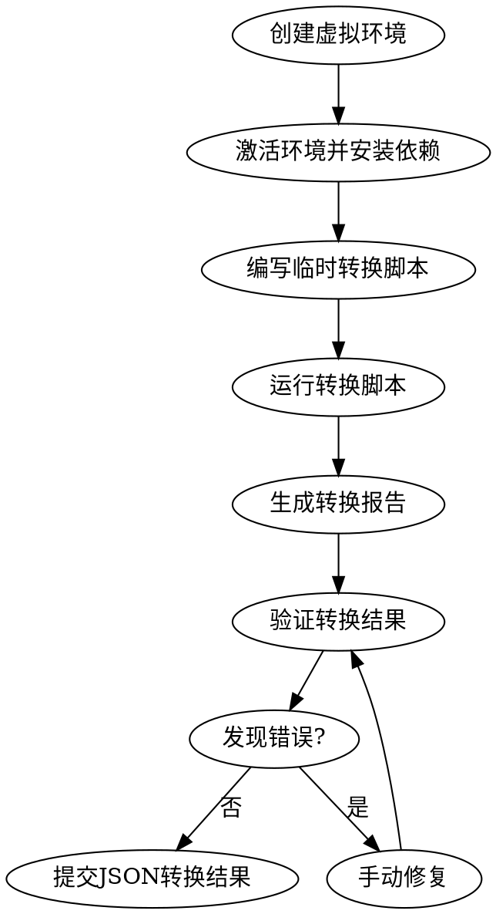

# YAML to JSON Conversion Design

**Date**: 2026-05-09
**Status**: Draft
**Context**: AI processing YAML templates prone to format errors (indentation, missing fields, invalid syntax)

---

## Problem

AI generates YAML with format errors when processing templates in `.opencode/skills`:
- Indentation errors (2-space vs 4-space confusion)
- Missing required fields
- Invalid YAML syntax (quotes, special chars)
- Multi-line text handling issues

**Current state**: 27 YAML code blocks across 19 files in `.opencode/skills/*/reference/*.md` and `SKILL.md`

---

## Solution

Convert all YAML templates to JSON format using a temporary Python script.

---

## Design

### 1. Conversion Scope

**Files to convert**: 27 YAML blocks in 19 Markdown files

| Category | Files | YAML Blocks |
|----------|-------|-------------|
| Check dimensions | 4 | 4 |
| Scoring criteria | 4 | 4 |
| Templates | 6 | 8 |
| Output formats | 5 | 5 |
| Other | 3 | 6 |

**Conversion target**:
- Eliminate AI format errors (JSON has strict structure, no indentation ambiguity)
- Improve parsing reliability (JSON parsers mature, AI reads JSON reliably)
- Standardize data format (all templates/configs use JSON)
- Maintain readability (format with indent=2)

---

### 2. JSON Structure

**Format standard**:
- Indent: 2 spaces
- Field order: logical ordering (for readability)
- No comments: JSON doesn't support comments, explanations in Markdown text
- Field naming: snake_case (consistent with original YAML)

**Conversion example**:

YAML (original):
```yaml
characters:
  - name: "角色名称"
    role: "protagonist"
    traits: ["性格特征1", "性格特征2"]
```

JSON (converted):
```json
{
  "characters": [
    {
      "name": "角色名称",
      "role": "protagonist",
      "traits": ["性格特征1", "性格特征2"]
    }
  ]
}
```

**Special YAML handling**:

| YAML Feature | JSON Strategy |
|--------------|---------------|
| Multi-line text | String with `\n` preserved |
| Comments `#` | Remove (explanations in Markdown) |
| Anchors `&` / `*` | Expand to full objects (no references) |
| Boolean `true/false` | JSON boolean `true/false` |
| Null `null` | JSON `null` |

---

### 3. Conversion Script

**Location**: `C:\Users\blue_\AppData\Local\Temp\opencode\yaml_to_json.py` (temporary directory, not tracked by git)

**Script core logic** (pseudo-code):

```python
def convert_yaml_to_json():
    # 1. Scan all Markdown files
    md_files = find_all_md_files(".opencode/skills")
    
    # 2. For each file
    for file in md_files:
        content = read_file(file)
        
        # 3. Extract YAML blocks (regex match)
        yaml_blocks = extract_yaml_blocks(content)
        
        # 4. For each YAML block
        for yaml_block in yaml_blocks:
            # Parse YAML
            yaml_data = yaml.safe_load(yaml_block)
            
            # Convert to JSON (indent=2)
            json_str = json.dumps(yaml_data, indent=2, ensure_ascii=False)
            
            # Replace YAML block with JSON block
            content = replace_yaml_with_json(content, yaml_block, json_str)
        
        # 5. Write back file
        write_file(file, content)
    
    # 6. Generate report
    generate_report(modified_files)
```

**Dependencies**:
- `yaml` (PyYAML) - Parse YAML
- `json` (stdlib) - Generate JSON
- `re` (stdlib) - Regex match code blocks
- `pathlib` (stdlib) - File path handling

**Script features**:
- Batch convert all files in one run
- Preserve Markdown structure and context text
- Auto-handle special YAML features
- Generate conversion report for validation

---

### 4. File Organization

**No file renaming**: Markdown files keep `.md` extension

**JSON embedding**: JSON stays in ` ```json ` code blocks within Markdown

**Structure after conversion**:

```
.opencode/skills/
  check-character/
    SKILL.md              (contains JSON blocks)
    reference/
      check-dimensions.md (contains JSON blocks)
      scoring-criteria.md (contains JSON blocks)
      check-methods.md
      report-template.md  (contains JSON blocks)
```

**Only new file**: Temporary conversion script (deleted after execution)

---

### 5. Execution Process

**Environment setup**:

```powershell
# Create virtual environment
python -m venv .venv

# Activate environment
.venv\Scripts\Activate.ps1  # Windows
# source .venv/bin/activate  # Linux/Mac

# Install dependency
pip install pyyaml
```

**Ensure script not committed to git**:

Add to `.gitignore`:
```
.venv/
scripts/yaml_to_json.py
*.pyc
__pycache__/
```

**Execution steps**:

1. Prepare virtual environment (create, activate, install PyYAML)
2. Write temporary conversion script to temp directory
3. Run script: `python C:\Users\blue_\AppData\Local\Temp\opencode\yaml_to_json.py`
4. Check conversion report (which files modified)
5. Validate results (manual inspection, test skills)
6. Commit JSON conversion: `git add .opencode/skills/ && git commit -m "refactor: convert all YAML templates to JSON"`

**Flow diagram**:



---

### 6. Error Handling

**Validation after conversion**:

- Manual inspection: Check 3-5 random files for correct JSON format
- Skill testing: Verify skill references still work
- JSON parsing test: Ensure all JSON blocks parse without errors

**Potential issues**:

| Issue | Solution |
|-------|----------|
| YAML parse error | Fix YAML manually before conversion |
| JSON format error | Adjust script's YAML-to-JSON conversion logic |
| Lost multi-line text | Ensure script preserves `\n` in strings |
| Missing fields | Validate JSON has all required fields after conversion |

---

### 7. Success Criteria

- ✅ All 27 YAML blocks converted to valid JSON
- ✅ No YAML blocks remain in `.opencode/skills` Markdown files
- ✅ All JSON blocks parse successfully
- ✅ Skill functionality unchanged (references work)
- ✅ Conversion script NOT committed to git
- ✅ Git commit message: "refactor: convert all YAML templates to JSON"

---

## Implementation

**Next step**: Invoke `writing-plans` skill to create detailed implementation plan.

**Estimated effort**: 1-2 hours (script writing + execution + validation)

---

## Notes

- Script is temporary, not part of project codebase
- Virtual environment prevents dependency pollution
- JSON blocks embedded in Markdown (no separate JSON files created)
- Future AI processing will benefit from strict JSON structure